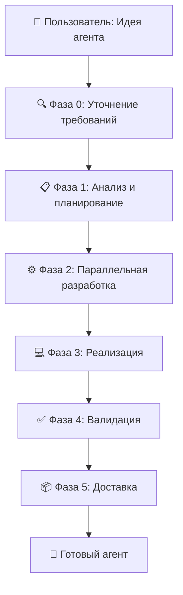

# 🏭 AI Agent Factory

> **Универсальная фабрика для создания специализированных AI агентов на Pydantic AI**
> *Основано на [Context Engineering](https://github.com/coleam00/context-engineering-intro) от Cole Medin*

[](https://opensource.org/licenses/MIT)
[](https://www.python.org/downloads/)
[](https://github.com/pydantic/pydantic-ai)
[](https://github.com/Lambertain/ai-agent-factory)

## 🚀 Что это такое?

**AI Agent Factory** — это революционная система для автоматического создания специализированных AI агентов. Вместо ручного создания каждого агента, фабрика использует субагентов для автономного создания готовых к использованию AI решений.

### ✨ Ключевые особенности

- 🏭 **Автоматическая фабрика** — от идеи до готового агента за минуты
- 🎯 **32 готовых специализированных агента** — Security, UI/UX, Performance, Analytics и др.
- 🤝 **Продвинутая коллективная работа** — микрозадачи, делегирование, рефлексия
- 🔧 **Универсальные декораторы** — автоматическое добавление всех интеграций
- 📋 **Интеграция с Archon** — управление задачами из коробки
- 🌐 **100% универсальность** — 0% привязки к конкретным проектам

## 🎯 Для кого этот проект?

- **AI разработчики** — быстрое создание специализированных агентов
- **DevOps инженеры** — автоматизация процессов разработки
- **Продуктовые команды** — внедрение AI в рабочие процессы
- **Стартапы** — MVP с AI функциональностью за часы, не недели
- **Enterprise** — масштабируемые AI решения

## 🛠️ Архитектура

### Процесс создания агента (5 фаз):



### Субагенты фабрики:
- **pydantic-ai-planner** — анализ требований и планирование
- **pydantic-ai-prompt-engineer** — создание системных промптов
- **pydantic-ai-tool-integrator** — разработка инструментов
- **pydantic-ai-dependency-manager** — управление зависимостями
- **pydantic-ai-validator** — тестирование и валидация

## 🚀 Быстрый старт

### 1. Установка

```bash
git clone https://github.com/Lambertain/ai-agent-factory.git
cd ai-agent-factory
python -m venv venv
source venv/bin/activate  # Linux/Mac
# или
venv\Scripts\activate     # Windows

pip install -r use-cases/agent-factory-with-subagents/requirements.txt
```

### 2. Настройка

Создайте `.env` файл:
```bash
cp use-cases/agent-factory-with-subagents/.env.example .env
```

Заполните переменные окружения:
```env
LLM_API_KEY=your-api-key-here
LLM_BASE_URL=https://your-llm-provider.com/v1
LLM_MODEL=your-model-name
```

### 3. Создание первого агента

```python
from use_cases.agent_factory_with_subagents import create_agent

# Запуск фабрики агентов
agent_spec = """
Создай агента для анализа кода Python который:
- Находит потенциальные баги
- Предлагает оптимизации
- Проверяет соответствие PEP8
"""

# Фабрика автоматически создаст специализированного агента
result = await create_agent(agent_spec)
print(f"Агент создан: {result.agent_path}")
```

## 📚 Готовые агенты

Фабрика включает 32 готовых специализированных агента:

### 🔐 Безопасность
- **Security Audit Agent** — аудит безопасности кода
- **MCP Configuration Agent** — управление MCP серверами

### 🎨 UI/UX и Frontend
- **UI/UX Enhancement Agent** — улучшение интерфейсов
- **PWA Mobile Agent** — Progressive Web Apps

### ⚡ Производительность
- **Performance Optimization Agent** — оптимизация производительности
- **TypeScript Architecture Agent** — архитектура TypeScript

### 📊 Аналитика и данные
- **Analytics Tracking Agent** — системы аналитики
- **RAG Agent** — семантический поиск

### 🗄️ Базы данных
- **Prisma Database Agent** — работа с Prisma ORM

### 🧠 NLP и психология
- **NLP Content Quality Guardian** — контроль качества контента
- **Psychology Content Architect** — архитектура психологического контента
- **Psychology Test Generator** — генерация психологических тестов

### 💳 Интеграции
- **Payment Integration Agent** — платежные системы
- **API Development Agent** — разработка API
- **Queue Worker Agent** — фоновые процессы

[Полный список агентов →](use-cases/agent-factory-with-subagents/agents/)

## 🔧 Продвинутое использование

### Создание агента с кастомизацией

```python
from use_cases.agent_factory_with_subagents.agents.common import create_universal_pydantic_agent

# Создание агента с полными интеграциями
agent = create_universal_pydantic_agent(
    model=get_llm_model(),
    deps_type=YourDependencies,
    system_prompt="Ваш системный промпт",
    agent_type="your_agent_type",
    knowledge_tags=["domain", "specialization"],
    with_collective_tools=True,
    with_knowledge_tool=True
)
```

### Использование коллективных инструментов

```python
# Автоматическое планирование микрозадач
@agent.tool
async def break_down_to_microtasks(
    ctx: RunContext,
    main_task: str,
    complexity_level: str = "medium"
) -> str:
    # Автоматически разбивает задачу на 3-7 микрозадач
    pass

# Рефлексия и улучшение результатов
@agent.tool
async def reflect_and_improve(
    ctx: RunContext,
    completed_work: str,
    work_type: str = "implementation"
) -> str:
    # Критический анализ и улучшение работы
    pass
```

## 🏗️ Архитектура проекта

```
ai-agent-factory/
├── use-cases/agent-factory-with-subagents/     # Основная фабрика
│   ├── agents/                                 # 32 готовых агента
│   │   ├── common/                            # Общие компоненты
│   │   │   ├── pydantic_ai_integrations.py   # Система интеграций
│   │   │   ├── pydantic_ai_decorators.py     # Универсальные декораторы
│   │   │   └── collective_work_tools.py       # Инструменты коллективной работы
│   │   ├── security_audit_agent/             # Агент аудита безопасности
│   │   ├── uiux_enhancement_agent/           # UI/UX агент
│   │   └── ...                               # Остальные 30 агентов
│   ├── .claude/                              # Настройки Claude
│   │   ├── agents/                           # Субагенты фабрики
│   │   └── rules.md                          # Правила работы
│   └── CLAUDE.md                             # Документация фабрики
├── claude-code-full-guide/                   # Руководство по Claude Code
├── PRPs/                                     # Planning Request Prompts
└── examples/                                 # Примеры использования
```

## 🤝 Коллективная работа агентов

Агенты поддерживают продвинутые паттерны коллективной работы:

### 🔄 Reflection (Рефлексия)
- Критический анализ выполненной работы
- Автоматическое выявление недостатков
- Создание улучшенных версий результата

### 🛠️ Tool Use (Использование инструментов)
- Интеграция с RAG, веб-поиском, выполнением кода
- Принятие решений о вызове API на основе контекста

### 📋 Planning (Планирование)
- Автоматическое разбиение задач на микрозадачи (3-7 пунктов)
- Адаптивное планирование по ходу выполнения

### 👥 Multi-Agent Collaboration
- Специализация агентов на разных аспектах задачи
- Автоматическое делегирование через Archon
- Итеративное взаимодействие между агентами

## 🔌 Интеграции

### Archon MCP Server
```python
# Автоматическое управление задачами
await mcp__archon__manage_task(
    action="create",
    title="Анализ безопасности API",
    assignee="Security Audit Agent"
)
```

### Git интеграция
```python
# Автоматические коммиты с улучшениями
git commit -m "feat: новый security агент
🤖 Generated with [Claude Code](https://claude.ai/code)
Co-Authored-By: Claude <noreply@anthropic.com>"
```

### Knowledge Base
```python
# Поиск в базе знаний агента
await search_agent_knowledge(
    query="security audit patterns",
    match_count=5
)
```

## 📊 Производительность

- ⚡ **Время создания агента**: 5-15 минут
- 🎯 **Готовых агентов**: 32 специализированных
- 🔧 **Автоматизация**: 95% процесса создания
- 🌐 **Универсальность**: 0% привязки к проектам

## 🛣️ Roadmap

### Q1 2025
- [ ] Веб-интерфейс для фабрики агентов
- [ ] Marketplace готовых агентов
- [ ] Docker контейнеризация
- [ ] CI/CD пайплайны

### Q2 2025
- [ ] VS Code расширение
- [ ] Интеграция с популярными IDE
- [ ] Облачное развертывание
- [ ] Enterprise версия

### Q3 2025
- [ ] Визуальный редактор агентов
- [ ] Мониторинг и аналитика
- [ ] Multi-language поддержка
- [ ] API для внешних интеграций

## 🤝 Вклад в проект

Мы приветствуем вклад сообщества! Как помочь:

1. **🐛 Сообщайте о багах** через GitHub Issues
2. **💡 Предлагайте новые агенты** через Pull Requests
3. **📚 Улучшайте документацию**
4. **⭐ Ставьте звезду** проекту

### Разработка

```bash
# Форк и клонирование
git clone https://github.com/your-username/ai-agent-factory.git
cd ai-agent-factory

# Создание ветки для фичи
git checkout -b feature/new-agent

# Разработка и тестирование
python -m pytest use-cases/agent-factory-with-subagents/tests/

# Создание Pull Request
```

## 📄 Лицензия

Этот проект распространяется под лицензией MIT. См. [LICENSE](LICENSE) для подробностей.

```
Copyright (c) 2025 Cole Medin
Copyright (c) 2025 Lambertain
```

## 🙏 Благодарности

- **[Cole Medin](https://github.com/coleam00)** — за оригинальную концепцию [Context Engineering](https://github.com/coleam00/context-engineering-intro) и основу фабрики агентов
- **[Pydantic Team](https://github.com/pydantic)** — за потрясающий фреймворк [Pydantic AI](https://github.com/pydantic/pydantic-ai)
- **Open Source сообщество** — за инструменты и вдохновение

## 📞 Контакты

- 🌐 **Website**: [lambertain.agency](https://lambertain.agency)
- 📧 **Email**: support@lambertain.agency
- 💬 **Telegram**: [t.me/lambertain](https://t.me/lambertain)

---

<div align="center">

**🚀 Создавайте AI агентов будущего с Lambertain AI Agent Factory! 🚀**

[⭐ Star на GitHub](https://github.com/Lambertain/ai-agent-factory) • [📖 Документация](use-cases/agent-factory-with-subagents/CLAUDE.md) • [🐛 Сообщить о баге](https://github.com/Lambertain/ai-agent-factory/issues)

</div>