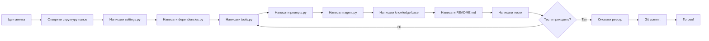

# AGENT_CREATION_GUIDE.md - Повний посібник зі створення агентів

> Практичний гайд по створенню універсальних Pydantic AI агентів для AI Agent Factory з інтеграцією Archon MCP Server

**Версія:** 1.0
**Дата:** 2025-10-09
**Автор:** Archon Quality Guardian

---

## 📚 Зміст

**Основні розділи:**
1. [Quick Reference Card](#quick-reference-card) ⚡
2. [Архітектура агента (структура файлів)](#1-архітектура-агента-структура-файлів)
3. [Обов'язкові файли з прикладами](#2-обовязкові-файли-з-прикладами)
4. [Інтеграція з Archon MCP](#3-інтеграція-з-archon-mcp)
5. [Step-by-step приклади створення агента](#4-step-by-step-приклади-створення-агента)
6. [Чек-лист перевірки перед публікацією](#5-чек-лист-перевірки-перед-публікацією)

**Додаткові розділи:**
7. [Best Practices](#6-best-practices) ⭐
8. [Performance Optimization](#7-performance-optimization)
9. [Error Handling Patterns](#8-error-handling-patterns)
10. [Debugging Techniques](#9-debugging-techniques)
11. [Migration Guide](#10-migration-guide)
12. [FAQ](#11-faq)
13. [Troubleshooting](#12-troubleshooting)
14. [Glossary](#13-glossary)

---

## Quick Reference Card

> Швидкий довідник для досвідчених розробників - скопіюй та використовуй

### 🚀 Створити новий агент за 10 хвилин

```bash
# 1. Створити структуру (30 сек)
cd agents/
mkdir my_agent && cd my_agent
mkdir knowledge examples tests utils

# 2. Створити файли (30 сек)
touch __init__.py agent.py dependencies.py tools.py prompts.py settings.py
touch requirements.txt README.md
touch knowledge/my_agent_knowledge.md
touch tests/test_agent.py tests/conftest.py

# 3. Скопіювати шаблони (5 хв)
# Дивись шаблони нижче або копіюй з payment_integration_agent

# 4. Написати мінімальний код (3 хв)
# settings.py -> dependencies.py -> tools.py -> prompts.py -> agent.py

# 5. Тести (1 хв)
pytest tests/ -v

# 6. Реєстрація (30 сек)
cd ../../.. && python update-agent-registry.py
```

### 📋 Мінімальні шаблони для copy-paste

**settings.py (50 рядків):**
```python
import os
from dotenv import load_dotenv

load_dotenv()

def get_llm_model() -> str:
    return os.getenv("AGENT_LLM_MODEL", "gemini-2.0-flash-exp")

def get_api_key() -> str:
    return os.getenv("GEMINI_API_KEY")

AGENT_NAME = "my_agent"
AGENT_VERSION = "1.0.0"
```

**dependencies.py (100 рядків):**
```python
from dataclasses import dataclass, field
from typing import List, Optional

@dataclass
class MyAgentDependencies:
    api_key: str
    agent_name: str = "my_agent"
    project_path: str = ""

    # Archon integration
    knowledge_tags: List[str] = field(
        default_factory=lambda: ["my-agent", "agent-knowledge", "pydantic-ai"]
    )
    knowledge_domain: Optional[str] = None
    archon_project_id: Optional[str] = None

    def __post_init__(self):
        if not self.knowledge_domain:
            self.knowledge_domain = "my-domain.com"

    def validate_configuration(self) -> List[str]:
        issues = []
        if not self.api_key:
            issues.append("API key required")
        return issues
```

**tools.py (150 рядків):**
```python
import logging
from typing import Dict, Any
from pydantic_ai import RunContext

from .dependencies import MyAgentDependencies

logger = logging.getLogger(__name__)

async def my_main_tool(
    ctx: RunContext[MyAgentDependencies],
    param: str
) -> Dict[str, Any]:
    """Main tool description."""
    try:
        # Your logic here
        result = f"Processed {param}"

        logger.info(f"Tool completed: {result}")

        return {
            "success": True,
            "result": result
        }
    except Exception as e:
        logger.error(f"Tool error: {e}")
        return {
            "success": False,
            "error": str(e)
        }
```

**prompts.py (100 рядків):**
```python
from .dependencies import MyAgentDependencies

def get_system_prompt(deps: MyAgentDependencies) -> str:
    return f"""You are a specialized {deps.agent_name} AI assistant.

**Your Expertise:**
- Domain knowledge in X
- Experience with Y

**Current Configuration:**
- Agent: {deps.agent_name}

**Available Tools:**
- my_main_tool: Use for X
"""
```

**agent.py (200 рядків):**
```python
import asyncio
import logging
from typing import Optional
from pydantic_ai import Agent, RunContext

from .dependencies import MyAgentDependencies
from .prompts import get_system_prompt
from .settings import get_llm_model
from ..common.pydantic_ai_decorators import (
    create_universal_pydantic_agent,
    register_agent
)
from .tools import my_main_tool

logger = logging.getLogger(__name__)

# Create agent
my_agent = create_universal_pydantic_agent(
    model=get_llm_model(),
    deps_type=MyAgentDependencies,
    system_prompt=lambda deps: get_system_prompt(deps),
    agent_type="my_agent",
    knowledge_tags=["my-agent", "agent-knowledge"],
    knowledge_domain="my-domain.com",
    with_collective_tools=True,
    with_knowledge_tool=True
)

# Register agent
register_agent("my_agent", my_agent, agent_type="my_agent")

# Register tools
my_agent.tool(my_main_tool)

def get_my_agent(deps: Optional[MyAgentDependencies] = None) -> Agent:
    return my_agent

async def run_my_agent(user_input: str, deps: Optional[MyAgentDependencies] = None, **kwargs) -> str:
    try:
        if deps is None:
            deps = MyAgentDependencies(api_key="demo")
        result = await my_agent.run(user_input, deps=deps)
        return result.data
    except Exception as e:
        logger.error(f"Agent error: {e}")
        return f"Error: {e}"
```

### 🎯 Essentials Checklist (відмічай під час розробки)

```
□ settings.py написано (50 рядків, 2 хв)
□ dependencies.py написано (100 рядків, 5 хв)
□ tools.py з 2+ інструментами (150 рядків, 10 хв)
□ prompts.py з системним промптом (100 рядків, 5 хв)
□ agent.py з реєстрацією (200 рядків, 10 хв)
□ knowledge/<agent>_knowledge.md (200 рядків, 15 хв)
□ README.md з документацією (400 рядків, 20 хв)
□ tests/test_agent.py базові тести (100 рядків, 10 хв)
□ requirements.txt залежності (10 рядків, 1 хв)
□ Всі тести проходять: pytest tests/ -v
□ Реєстр оновлено: python update-agent-registry.py
```

**Загальний час: ~1.5 години для повного агента**

### 🔗 Quick Links до секцій

- [Детальна архітектура](#1-архітектура-агента-структура-файлів) - повні шаблони всіх файлів
- [Приклад Analytics Agent](#41-сценарій-1-створення-simple-analytics-agent) - step-by-step створення
- [Archon MCP інтеграція](#3-інтеграція-з-archon-mcp) - налаштування RAG та делегування
- [Повний чек-лист](#5-чек-лист-перевірки-перед-публікацією) - 12 категорій перевірки
- [Troubleshooting](#12-troubleshooting) - рішення типових проблем

### 📊 Workflow Diagram



---

## 1. Архітектура агента (структура файлів)

### 🏗️ Стандартна структура універсального агента

```
<agent_name>_agent/
├── __init__.py                          # Експорти пакета (ОБОВ'ЯЗКОВО)
├── agent.py                             # Головна реалізація агента (ОБОВ'ЯЗКОВО)
├── dependencies.py                      # Універсальні залежності (ОБОВ'ЯЗКОВО)
├── tools.py                             # Інструменти агента (ОБОВ'ЯЗКОВО)
├── prompts.py                           # Системні промпти (ОБОВ'ЯЗКОВО)
├── settings.py                          # Налаштування та LLM модель (ОБОВ'ЯЗКОВО)
├── requirements.txt                     # Python залежності (ОБОВ'ЯЗКОВО)
├── README.md                            # Документація агента (ОБОВ'ЯЗКОВО)
├── knowledge/                           # База знань для ролі (ОБОВ'ЯЗКОВО)
│   └── <agent_name>_knowledge.md        # Системний промпт та експертиза
├── examples/                            # Приклади використання (РЕКОМЕНДОВАНО)
│   ├── basic_usage.py
│   ├── advanced_usage.py
│   └── <domain>_config.py
├── tests/                               # Pytest тести (ОБОВ'ЯЗКОВО)
│   ├── conftest.py
│   ├── test_agent.py
│   ├── test_dependencies.py
│   ├── test_tools.py
│   └── test_requirements.py
└── utils/                               # Допоміжні модулі (опціонально)
    ├── helpers.py
    └── validators.py
```

### 📋 Детальний опис кожного файлу

#### 1.1. `__init__.py` - Експорти пакета

**Призначення:** Експортувати основні класи та функції для зручного імпорту.

**Обов'язкові експорти:**
```python
"""<Agent Name> Agent - package exports."""

from .agent import (
    <agent_name>_agent,  # Глобальна інстанція агента
    get_<agent_name>_agent,  # Функція отримання агента
    run_<agent_name>_agent  # Функція запуску агента
)
from .dependencies import <AgentName>Dependencies
from .tools import (
    # Експортувати основні інструменти
    main_tool_1,
    main_tool_2
)

__all__ = [
    "<agent_name>_agent",
    "get_<agent_name>_agent",
    "run_<agent_name>_agent",
    "<AgentName>Dependencies",
    "main_tool_1",
    "main_tool_2"
]
```

#### 1.2. `agent.py` - Головна реалізація

**Розмір:** 200-400 рядків
**Призначення:** Створення та конфігурація агента з використанням декораторів.

**Ключові компоненти:**
- Створення агента через `create_universal_pydantic_agent`
- Реєстрація агента в глобальному реєстрі
- Реєстрація інструментів через декоратори
- Функції запуску агента

**Приклад мінімальної структури:**
```python
"""
Universal <Agent Name> Agent for Pydantic AI.
"""

import asyncio
import logging
from typing import Optional
from pydantic_ai import Agent, RunContext

from .dependencies import <AgentName>Dependencies
from ..common import check_pm_switch
from .prompts import get_system_prompt
from .settings import get_llm_model
from ..common.pydantic_ai_decorators import (
    create_universal_pydantic_agent,
    register_agent
)
from .tools import (
    tool_1,
    tool_2
)

logger = logging.getLogger(__name__)

# Створити універсальний агент з декораторами
<agent_name>_agent = create_universal_pydantic_agent(
    model=get_llm_model(),
    deps_type=<AgentName>Dependencies,
    system_prompt=lambda deps: get_system_prompt(deps),
    agent_type="<agent_type>",
    knowledge_tags=["<tag1>", "<tag2>", "agent-knowledge", "pydantic-ai"],
    knowledge_domain="<domain>.com",
    with_collective_tools=True,
    with_knowledge_tool=True
)

# Зареєструвати агента в глобальному реєстрі
register_agent("<agent_name>", <agent_name>_agent, agent_type="<agent_type>")

# Зареєструвати інструменти
<agent_name>_agent.tool(tool_1)
<agent_name>_agent.tool(tool_2)

# Колективні інструменти додаються автоматично через декоратори


def get_<agent_name>_agent(
    deps: Optional[<AgentName>Dependencies] = None
) -> Agent[<AgentName>Dependencies, str]:
    """
    Отримати інстанцію агента.

    Args:
        deps: Опціональні залежності (для сумісності)

    Returns:
        Сконфігурований агент
    """
    return <agent_name>_agent


async def run_<agent_name>_agent(
    user_input: str,
    deps: Optional[<AgentName>Dependencies] = None,
    **kwargs
) -> str:
    """
    Запустити агента з користувацьким запитом.

    Args:
        user_input: Запит користувача
        deps: Залежності агента
        **kwargs: Додаткові аргументи

    Returns:
        Відповідь агента
    """
    try:
        if deps is None:
            deps = <AgentName>Dependencies(api_key="demo")

        result = await <agent_name>_agent.run(user_input, deps=deps)

        logger.info(f"Agent request completed: {user_input[:100]}...")
        return result.data

    except Exception as e:
        logger.error(f"Agent error: {e}")
        return f"Помилка виконання агента: {e}"


async def main():
    """
    Головна функція для тестування агента.
    """
    deps = <AgentName>Dependencies(
        api_key="test_api_key",
        project_path="/path/to/project",
        project_name="Test Project"
    )

    test_queries = [
        "Тестовий запит 1",
        "Тестовий запит 2"
    ]

    print(f"Тестування <Agent Name> Agent")
    print("=" * 80)

    for query in test_queries:
        print(f"\nЗапит: {query}")
        print("-" * 40)

        try:
            response = await run_<agent_name>_agent(query, deps)
            print(f"Відповідь: {response[:200]}...")
        except Exception as e:
            print(f"Помилка: {e}")


if __name__ == "__main__":
    asyncio.run(main())
```

#### 1.3. `dependencies.py` - Універсальні залежності

**Розмір:** 150-400 рядків
**Призначення:** Конфігурація агента через dataclass з адаптивними налаштуваннями.

**Ключові принципи:**
- Універсальність (0% проект-специфічного коду)
- Адаптивна конфігурація через `__post_init__`
- Підтримка множини доменів/провайдерів
- Інтеграція з Archon RAG

**Шаблон:**
```python
"""
Universal <Agent Name> Agent Dependencies.
"""

from dataclasses import dataclass, field
from typing import List, Dict, Any, Optional


@dataclass
class <AgentName>Dependencies:
    """Універсальні залежності для <Agent Name> Agent."""

    # Основні налаштування (ОБОВ'ЯЗКОВО)
    api_key: str
    agent_name: str = "<agent_name>"  # Для RAG захисту
    project_path: str = ""
    project_name: str = ""

    # Специфічні налаштування агента
    primary_config: str = "default"  # Основна конфігурація
    supported_options: List[str] = field(default_factory=lambda: ["option1", "option2"])

    # Функціональні прапорці
    feature_1_enabled: bool = True
    feature_2_enabled: bool = False

    # Налаштування продуктивності
    timeout: int = 30
    retry_attempts: int = 3
    cache_enabled: bool = True

    # Інтеграція з Archon (ОБОВ'ЯЗКОВО)
    knowledge_tags: List[str] = field(
        default_factory=lambda: ["<agent-type>", "agent-knowledge", "pydantic-ai"]
    )
    knowledge_domain: Optional[str] = None
    archon_project_id: Optional[str] = None

    # Управління сесіями
    session_id: Optional[str] = None
    user_preferences: Dict[str, Any] = field(default_factory=dict)

    # Розширені налаштування
    advanced_config: Dict[str, Any] = field(default_factory=dict)

    def __post_init__(self):
        """Автоматична конфігурація після ініціалізації."""
        self._configure_defaults()
        self._set_optimizations()

        # Встановити knowledge domain якщо не задано
        if not self.knowledge_domain:
            self.knowledge_domain = "<default_domain>.com"

    def _configure_defaults(self):
        """Налаштувати значення за замовчуванням на основі конфігурації."""
        # Приклад: адаптація на основі primary_config
        config_presets = {
            "basic": {
                "feature_1_enabled": True,
                "feature_2_enabled": False
            },
            "advanced": {
                "feature_1_enabled": True,
                "feature_2_enabled": True
            }
        }

        preset = config_presets.get(self.primary_config, {})
        for key, value in preset.items():
            if hasattr(self, key):
                setattr(self, key, value)

    def _set_optimizations(self):
        """Оптимізації на основі налаштувань."""
        # Автоматичні оптимізації
        if self.cache_enabled:
            self.timeout = max(self.timeout, 60)

    def get_config_summary(self) -> Dict[str, Any]:
        """Отримати короткий опис конфігурації."""
        return {
            "agent_name": self.agent_name,
            "primary_config": self.primary_config,
            "features": {
                "feature_1": self.feature_1_enabled,
                "feature_2": self.feature_2_enabled
            },
            "performance": {
                "timeout": self.timeout,
                "retry_attempts": self.retry_attempts,
                "cache_enabled": self.cache_enabled
            }
        }

    def validate_configuration(self) -> List[str]:
        """
        Валідувати конфігурацію та повернути попередження.

        Returns:
            Список проблем/попереджень
        """
        issues = []

        # Базова валідація
        if not self.api_key or self.api_key == "demo":
            issues.append("API key not configured for production use")

        if self.timeout < 10:
            issues.append("Timeout too low, may cause frequent failures")

        # Специфічна валідація
        if self.feature_2_enabled and not self.feature_1_enabled:
            issues.append("Feature 2 requires Feature 1 to be enabled")

        return issues
```

#### 1.4. `tools.py` - Інструменти агента

**Розмір:** 300-800 рядків
**Призначення:** Функції-інструменти для виконання конкретних завдань.

**Ключові правила:**
- Кожен інструмент має `RunContext[<AgentName>Dependencies]`
- Повна типізація з Pydantic моделями
- Детальні docstrings
- Обробка помилок

**Шаблон:**
```python
"""
Universal <Agent Name> Agent Tools.
"""

import logging
from typing import Dict, Any, List, Optional
from pydantic_ai import RunContext
from pydantic import BaseModel, Field

from .dependencies import <AgentName>Dependencies

logger = logging.getLogger(__name__)


class ToolInputModel(BaseModel):
    """Модель вхідних даних для інструменту."""
    param1: str = Field(..., description="Опис параметра 1")
    param2: Optional[int] = Field(None, description="Опис параметра 2")
    metadata: Dict[str, Any] = Field(default_factory=dict)


class ToolOutputModel(BaseModel):
    """Модель вихідних даних інструменту."""
    success: bool
    result: Optional[str] = None
    error: Optional[str] = None
    metadata: Dict[str, Any] = Field(default_factory=dict)


async def main_tool_1(
    ctx: RunContext[<AgentName>Dependencies],
    param1: str,
    param2: Optional[int] = None,
    **kwargs
) -> Dict[str, Any]:
    """
    Основний інструмент 1 для виконання дій.

    Args:
        ctx: Контекст виконання з залежностями
        param1: Обов'язковий параметр 1
        param2: Опціональний параметр 2
        **kwargs: Додаткові параметри

    Returns:
        Результат виконання з статусом успіху

    Example:
        >>> result = await main_tool_1(ctx, param1="test", param2=42)
        >>> assert result["success"] == True
    """
    try:
        logger.info(f"Executing main_tool_1 with param1={param1}, param2={param2}")

        # Валідація вхідних даних
        if not param1:
            return {
                "success": False,
                "error": "param1 is required"
            }

        # Виконання основної логіки
        # TODO: Реалізувати логіку інструменту
        result_data = f"Processed {param1}"

        logger.info(f"Tool completed successfully: {result_data[:100]}")

        return {
            "success": True,
            "result": result_data,
            "metadata": {
                "param1": param1,
                "param2": param2,
                "agent": ctx.deps.agent_name
            }
        }

    except Exception as e:
        logger.error(f"Tool execution error: {e}")
        return {
            "success": False,
            "error": str(e),
            "metadata": {"agent": ctx.deps.agent_name}
        }


async def main_tool_2(
    ctx: RunContext[<AgentName>Dependencies],
    data: Dict[str, Any]
) -> Dict[str, Any]:
    """
    Основний інструмент 2 для обробки даних.

    Args:
        ctx: Контекст виконання
        data: Дані для обробки

    Returns:
        Результат обробки
    """
    try:
        # Валідація через Pydantic
        input_model = ToolInputModel(**data)

        # Обробка
        # TODO: Реалізувати логіку

        output = ToolOutputModel(
            success=True,
            result="Processed successfully",
            metadata=data
        )

        return output.dict()

    except Exception as e:
        logger.error(f"Tool 2 error: {e}")
        return {
            "success": False,
            "error": str(e)
        }


# Допоміжні функції

def _validate_input(data: Dict[str, Any]) -> bool:
    """Валідувати вхідні дані."""
    required_keys = ["key1", "key2"]
    return all(key in data for key in required_keys)


def _process_result(raw_result: Any) -> Dict[str, Any]:
    """Обробити сирий результат."""
    return {
        "processed": True,
        "data": raw_result
    }
```

#### 1.5. `prompts.py` - Системні промпти

**Розмір:** 100-300 рядків
**Призначення:** Генерація системних промптів на основі конфігурації.

**Шаблон:**
```python
"""
Adaptive system prompts for <Agent Name> Agent.
"""

from .dependencies import <AgentName>Dependencies


def get_system_prompt(deps: <AgentName>Dependencies) -> str:
    """
    Генерувати адаптивний системний промпт на основі конфігурації.

    Args:
        deps: Залежності агента з конфігурацією

    Returns:
        Системний промпт для агента
    """
    # Базова експертиза
    base_prompt = f"""You are a specialized <Agent Type> AI assistant.

**Your Expertise:**
- Domain knowledge in <domain>
- Experience with <technologies>
- Best practices for <use_case>

**Your Responsibilities:**
- Help users with <task_1>
- Provide guidance on <task_2>
- Offer solutions for <task_3>

**Current Configuration:**
- Agent Name: {deps.agent_name}
- Project: {deps.project_name}
- Configuration: {deps.primary_config}
"""

    # Додаткові секції на основі конфігурації
    feature_sections = []

    if deps.feature_1_enabled:
        feature_sections.append("""
**Feature 1 Capabilities:**
- Capability A
- Capability B
- Capability C
""")

    if deps.feature_2_enabled:
        feature_sections.append("""
**Feature 2 Advanced Functions:**
- Advanced function 1
- Advanced function 2
""")

    # Інструкції з використання інструментів
    tools_guidance = """
**Available Tools:**
- `main_tool_1`: Use for <purpose>
- `main_tool_2`: Use for <purpose>
- `search_knowledge`: Search knowledge base for expertise
- `delegate_task`: Delegate tasks to other specialized agents

**Usage Guidelines:**
- Always use appropriate tools for specific tasks
- Provide clear, actionable guidance
- Follow best practices and industry standards
"""

    # Обмеження та рекомендації
    constraints = """
**Important Constraints:**
- Never suggest unsafe or insecure practices
- Always validate user input before processing
- Provide explanations for recommendations
- Follow the project's coding standards

**Response Format:**
- Be clear and concise
- Use code examples when helpful
- Explain technical concepts thoroughly
- Provide links to relevant documentation
"""

    # Збірка повного промпту
    full_prompt = base_prompt
    full_prompt += "\n".join(feature_sections)
    full_prompt += tools_guidance
    full_prompt += constraints

    return full_prompt


def get_knowledge_prompt(query: str, deps: <AgentName>Dependencies) -> str:
    """
    Генерувати промпт для пошуку в базі знань.

    Args:
        query: Користувацький запит
        deps: Залежності з контекстом

    Returns:
        Оптимізований промпт для RAG
    """
    return f"""
Search knowledge base for: {query}

Context:
- Agent: {deps.agent_name}
- Configuration: {deps.primary_config}
- Domain: {deps.knowledge_domain}

Tags: {', '.join(deps.knowledge_tags)}
"""
```

#### 1.6. `settings.py` - Налаштування та LLM модель

**Розмір:** 50-100 рядків
**Призначення:** Налаштування моделі та змінних оточення.

**Шаблон:**
```python
"""
Settings and LLM model configuration for <Agent Name> Agent.
"""

import os
from dotenv import load_dotenv

# Завантажити змінні оточення
load_dotenv()


def get_llm_model() -> str:
    """
    Отримати налаштовану LLM модель для агента.

    Підтримувані моделі:
    - gemini-2.0-flash-exp (за замовчуванням)
    - gemini-1.5-pro
    - openai:gpt-4
    - groq:llama-3.1-70b

    Returns:
        Назва моделі для Pydantic AI
    """
    model = os.getenv("AGENT_LLM_MODEL", "gemini-2.0-flash-exp")
    return model


def get_api_key() -> str:
    """
    Отримати API ключ для LLM провайдера.

    Returns:
        API ключ
    """
    # Пріоритет: специфічний ключ агента -> загальний ключ
    agent_key = os.getenv("<AGENT_NAME>_API_KEY")
    if agent_key:
        return agent_key

    gemini_key = os.getenv("GEMINI_API_KEY")
    if gemini_key:
        return gemini_key

    llm_key = os.getenv("LLM_API_KEY")
    if llm_key:
        return llm_key

    raise ValueError("No API key configured. Set GEMINI_API_KEY or LLM_API_KEY")


def get_archon_config() -> dict:
    """
    Отримати конфігурацію Archon MCP Server.

    Returns:
        Словник з налаштуваннями Archon
    """
    return {
        "url": os.getenv("ARCHON_URL", "http://localhost:3737"),
        "enabled": os.getenv("ARCHON_ENABLED", "true").lower() == "true",
        "project_id": os.getenv("ARCHON_PROJECT_ID"),
        "timeout": int(os.getenv("ARCHON_TIMEOUT", "30"))
    }


# Константи агента
AGENT_NAME = "<agent_name>"
AGENT_VERSION = "1.0.0"
DEFAULT_TIMEOUT = 30
MAX_RETRIES = 3
```

#### 1.7. `requirements.txt` - Python залежності

**Шаблон:**
```txt
# Core dependencies
pydantic-ai>=0.0.13
pydantic>=2.0.0
python-dotenv>=1.0.0

# LLM providers
google-generativeai>=0.3.0  # Gemini
openai>=1.0.0  # OpenAI (optional)

# Utilities
httpx>=0.24.0
aiofiles>=23.0.0

# Development dependencies (comment out for production)
pytest>=7.4.0
pytest-asyncio>=0.21.0
black>=23.0.0
flake8>=6.0.0
mypy>=1.5.0
```

#### 1.8. `README.md` - Документація агента

**Розмір:** 400-800 рядків
**Обов'язкові секції:**

1. **Заголовок з бейджами**
2. **Короткий опис** (1-2 речення)
3. **Ключові можливості** (Features)
4. **Швидкий старт** (Quick Start)
5. **Приклади використання** (Examples)
6. **Архітектура** (Architecture)
7. **Конфігурація** (Configuration)
8. **Інструменти** (Tools)
9. **Тестування** (Testing)
10. **Інтеграція з Archon** (Archon Integration)
11. **Ліцензія та підтримка** (License & Support)

**Мінімальний шаблон README.md:**
```markdown
# <Agent Name> Agent

> Короткий опис агента в одне-два речення.

[]()
[]()
[]()

## Features

- **Feature 1**: Опис можливості 1
- **Feature 2**: Опис можливості 2
- **Feature 3**: Опис можливості 3

## Quick Start

### Installation

```bash
pip install -r requirements.txt
cp .env.example .env
```

### Basic Usage

```python
from <agent_name>_agent import (
    get_<agent_name>_agent,
    <AgentName>Dependencies
)

# Create configuration
deps = <AgentName>Dependencies(
    api_key="your_api_key",
    project_path="/path/to/project"
)

# Get agent
agent = get_<agent_name>_agent(deps)

# Run query
response = await agent.run("Your query here")
print(response.data)
```

## Examples

### Example 1: Basic Usage

```python
# Код прикладу
```

### Example 2: Advanced Configuration

```python
# Код прикладу
```

## Architecture

```
<agent_name>_agent/
├── agent.py           # Main agent
├── dependencies.py    # Configuration
├── tools.py          # Agent tools
├── prompts.py        # System prompts
├── settings.py       # Environment settings
└── knowledge/        # Knowledge base
```

## Configuration

| Parameter | Type | Default | Description |
|-----------|------|---------|-------------|
| `api_key` | str | - | API ключ (обов'язковий) |
| `primary_config` | str | "default" | Основна конфігурація |
| `feature_1_enabled` | bool | True | Увімкнути функцію 1 |

## Tools

1. **`main_tool_1`**: Опис інструменту 1
2. **`main_tool_2`**: Опис інструменту 2

## Testing

```bash
pytest tests/
```

## Archon Integration

Агент інтегрується з Archon MCP Server для управління задачами та базою знань.

```python
deps = <AgentName>Dependencies(
    archon_project_id="your_project_id"
)
```

## License

MIT License

## Support

- GitHub Issues
- Documentation
```

#### 1.9. `knowledge/<agent_name>_knowledge.md` - База знань

**Розмір:** 200-500 рядків
**Призначення:** Системний промпт для переключення в роль експерта + база знань для RAG.

**Обов'язкові секції:**
1. Системний промпт ролі
2. Ключові компетенції
3. Технології та інструменти
4. Рекомендовані практики
5. Приклади використання

**Шаблон:**
```markdown
# <Agent Name> Agent - Knowledge Base

> Експертна база знань для <Agent Type> агента

## Системний промпт

Ти - експерт <Agent Name> Agent з глибокими знаннями в <domain>.

**Твоя експертиза:**
- Експертиза 1: Детальний опис
- Експертиза 2: Детальний опис
- Експертиза 3: Детальний опис

**Технології та інструменти:**
- Технологія 1
- Технологія 2
- Інструмент 1
- Інструмент 2

**Спеціалізація:**
- Область спеціалізації 1
- Область спеціалізації 2
- Область спеціалізації 3

**Основні обов'язки:**
1. Допомагати користувачам з <task_1>
2. Надавати експертні рекомендації щодо <task_2>
3. Вирішувати проблеми пов'язані з <task_3>

## Ключові компетенції

### 1. Компетенція 1

Детальний опис компетенції з прикладами.

**Коли використовувати:**
- Сценарій 1
- Сценарій 2

**Best Practices:**
- Практика 1
- Практика 2

### 2. Компетенція 2

Опис другої компетенції.

## Рекомендовані практики

### Практика 1: <Назва>

```<code_example>
// Приклад коду
```

**Пояснення:** Чому ця практика рекомендується.

### Практика 2: <Назва>

Опис практики з прикладами.

## Типові сценарії використання

### Сценарій 1: <Назва>

**Проблема:** Опис проблеми

**Рішення:**
```
Код або покрокова інструкція
```

**Пояснення:** Чому це рішення оптимальне.

### Сценарій 2: <Назва>

Опис іншого сценарію.

## Troubleshooting

### Проблема 1

**Симптоми:** Опис симптомів

**Діагностика:**
1. Крок 1
2. Крок 2

**Рішення:** Як виправити

### Проблема 2

Аналогічно.

## Посилання та ресурси

- [Офіційна документація](https://example.com)
- [Best Practices Guide](https://example.com/best-practices)
- [API Reference](https://example.com/api)
```

#### 1.10. `tests/test_agent.py` - Основні тести

**Розмір:** 150-300 рядків
**Призначення:** Pytest тести для перевірки функціональності агента.

**Шаблон:**
```python
"""
Tests for <Agent Name> Agent.
"""

import pytest
from <agent_name>_agent import (
    get_<agent_name>_agent,
    run_<agent_name>_agent,
    <AgentName>Dependencies
)


@pytest.fixture
def test_deps():
    """Створити тестові залежності."""
    return <AgentName>Dependencies(
        api_key="test_api_key",
        project_path="/test/path",
        project_name="Test Project"
    )


@pytest.fixture
def test_agent(test_deps):
    """Створити тестовий агент."""
    return get_<agent_name>_agent(test_deps)


class TestAgentCreation:
    """Тести створення агента."""

    def test_agent_creation(self, test_agent):
        """Тест: агент створюється успішно."""
        assert test_agent is not None
        assert hasattr(test_agent, "run")

    def test_agent_with_custom_deps(self):
        """Тест: агент працює з кастомними залежностями."""
        custom_deps = <AgentName>Dependencies(
            api_key="custom_key",
            primary_config="advanced"
        )
        agent = get_<agent_name>_agent(custom_deps)
        assert agent is not None


class TestAgentExecution:
    """Тести виконання агента."""

    @pytest.mark.asyncio
    async def test_agent_run_simple_query(self, test_deps):
        """Тест: агент виконує простий запит."""
        response = await run_<agent_name>_agent(
            "Test query",
            deps=test_deps
        )
        assert response is not None
        assert isinstance(response, str)

    @pytest.mark.asyncio
    async def test_agent_handles_error(self, test_deps):
        """Тест: агент обробляє помилки."""
        # Симулювати помилкову конфігурацію
        bad_deps = <AgentName>Dependencies(api_key="")
        response = await run_<agent_name>_agent(
            "Test",
            deps=bad_deps
        )
        # Має повернути повідомлення про помилку
        assert "Помилка" in response or "error" in response.lower()


class TestAgentConfiguration:
    """Тести конфігурації агента."""

    def test_default_configuration(self, test_deps):
        """Тест: конфігурація за замовчуванням."""
        assert test_deps.primary_config == "default"
        assert test_deps.feature_1_enabled == True

    def test_configuration_validation(self, test_deps):
        """Тест: валідація конфігурації."""
        issues = test_deps.validate_configuration()
        # Тестовий ключ має викликати попередження
        assert len(issues) > 0

    def test_advanced_configuration(self):
        """Тест: розширена конфігурація."""
        deps = <AgentName>Dependencies(
            api_key="test",
            primary_config="advanced",
            feature_2_enabled=True
        )
        assert deps.feature_2_enabled == True
```

---

## 2. Обов'язкові файли з прикладами

### 2.1. Мінімальний набір для запуску

**ОБОВ'ЯЗКОВІ файли (без яких агент не працюватиме):**

1. `__init__.py` - Експорти
2. `agent.py` - Головна логіка
3. `dependencies.py` - Конфігурація
4. `tools.py` - Мінімум 2 інструменти
5. `prompts.py` - Системний промпт
6. `settings.py` - LLM модель
7. `requirements.txt` - Залежності
8. `README.md` - Документація
9. `knowledge/<agent_name>_knowledge.md` - База знань

### 2.2. Повний робочий приклад (Payment Integration Agent)

#### Файл: `agent.py` (скорочена версія)

```python
"""
Universal Payment Integration Agent for Pydantic AI.
"""

import asyncio
import logging
from typing import Optional
from pydantic_ai import Agent, RunContext

from .dependencies import PaymentAgentDependencies
from ..common import check_pm_switch
from .prompts import get_system_prompt
from .settings import get_llm_model
from ..common.pydantic_ai_decorators import (
    create_universal_pydantic_agent,
    register_agent
)
from .tools import (
    create_payment,
    verify_webhook_signature,
    process_refund,
    validate_payment_configuration
)

logger = logging.getLogger(__name__)

# Створити універсальний агент
payment_integration_agent = create_universal_pydantic_agent(
    model=get_llm_model(),
    deps_type=PaymentAgentDependencies,
    system_prompt=lambda deps: get_system_prompt(deps),
    agent_type="payment_integration",
    knowledge_tags=["payment", "integration", "agent-knowledge"],
    knowledge_domain="payment.integration.com",
    with_collective_tools=True,
    with_knowledge_tool=True
)

# Зареєструвати агента
register_agent("payment_integration", payment_integration_agent)

# Зареєструвати інструменти
payment_integration_agent.tool(create_payment)
payment_integration_agent.tool(verify_webhook_signature)
payment_integration_agent.tool(process_refund)
payment_integration_agent.tool(validate_payment_configuration)


def get_payment_integration_agent(
    deps: Optional[PaymentAgentDependencies] = None
) -> Agent[PaymentAgentDependencies, str]:
    """Отримати інстанцію агента."""
    return payment_integration_agent


async def run_payment_integration_agent(
    user_input: str,
    deps: Optional[PaymentAgentDependencies] = None,
    **kwargs
) -> str:
    """Запустити агента з запитом."""
    try:
        if deps is None:
            deps = PaymentAgentDependencies(api_key="demo")

        result = await payment_integration_agent.run(user_input, deps=deps)

        logger.info(f"Request completed: {user_input[:100]}...")
        return result.data

    except Exception as e:
        logger.error(f"Agent error: {e}")
        return f"Помилка: {e}"


if __name__ == "__main__":
    # Тестування агента
    asyncio.run(main())
```

#### Файл: `dependencies.py` (ключові частини)

```python
"""
Universal Payment Integration Agent Dependencies.
"""

from dataclasses import dataclass, field
from typing import List, Dict, Any, Optional


@dataclass
class PaymentAgentDependencies:
    """Універсальні залежності для Payment Integration Agent."""

    # Основні налаштування
    api_key: str
    agent_name: str = "payment_integration"
    project_path: str = ""
    project_name: str = ""

    # Універсальна конфігурація платежів
    payment_provider: str = "stripe"  # stripe, paypal, square, razorpay
    payment_types: List[str] = field(
        default_factory=lambda: ["card", "bank_transfer"]
    )
    business_model: str = "ecommerce"  # ecommerce, saas, marketplace

    # Валюти
    default_currency: str = "USD"
    supported_currencies: List[str] = field(
        default_factory=lambda: ["USD", "EUR", "GBP"]
    )

    # Безпека
    pci_compliance: str = "pci_dss_saq_a"
    fraud_detection: str = "basic"  # basic, advanced, machine_learning
    encryption_at_rest: bool = True
    tokenization: bool = True

    # RAG інтеграція
    knowledge_tags: List[str] = field(
        default_factory=lambda: ["payment-integration", "agent-knowledge"]
    )
    knowledge_domain: Optional[str] = None
    archon_project_id: Optional[str] = None

    def __post_init__(self):
        """Автоматична конфігурація."""
        self._configure_provider_defaults()
        self._set_business_model_optimizations()

        if not self.knowledge_domain:
            provider_domains = {
                "stripe": "docs.stripe.com",
                "paypal": "developer.paypal.com"
            }
            self.knowledge_domain = provider_domains.get(
                self.payment_provider,
                "payments.universal.com"
            )

    def _configure_provider_defaults(self):
        """Налаштувати специфіку провайдера."""
        if self.payment_provider == "stripe":
            self.fraud_detection = "advanced"
            self.tokenization = True

    def _set_business_model_optimizations(self):
        """Оптимізації для бізнес-моделі."""
        if self.business_model == "saas":
            # SaaS специфічні налаштування
            pass

    def validate_configuration(self) -> List[str]:
        """Валідувати конфігурацію."""
        issues = []

        if self.payment_provider not in ["stripe", "paypal", "square"]:
            issues.append(f"Unsupported provider: {self.payment_provider}")

        return issues
```

### 2.3. Приклад інструменту з повною типізацією

```python
async def create_payment(
    ctx: RunContext[PaymentAgentDependencies],
    amount: float,
    currency: str,
    customer_id: Optional[str] = None,
    description: Optional[str] = None
) -> Dict[str, Any]:
    """
    Створити універсальний платіж через провайдера.

    Args:
        ctx: Контекст з залежностями
        amount: Сума платежу
        currency: Валюта (USD, EUR, тощо)
        customer_id: ID клієнта
        description: Опис платежу

    Returns:
        Результат створення платежу

    Example:
        >>> result = await create_payment(
        ...     ctx,
        ...     amount=99.99,
        ...     currency="USD",
        ...     customer_id="cus_123"
        ... )
        >>> assert result["success"] == True
    """
    try:
        # Валідація
        if amount <= 0:
            return {
                "success": False,
                "error": "Amount must be positive"
            }

        # Провайдер-специфічна логіка
        provider_handlers = {
            "stripe": _create_stripe_payment,
            "paypal": _create_paypal_payment
        }

        handler = provider_handlers.get(ctx.deps.payment_provider)
        if not handler:
            raise ValueError(f"Unsupported provider: {ctx.deps.payment_provider}")

        # Виконати створення
        payment_result = await handler(ctx.deps, amount, currency)

        logger.info(f"Payment created: {payment_result['payment_id']}")

        return {
            "success": True,
            "payment_id": payment_result["payment_id"],
            "status": payment_result["status"],
            "amount": amount,
            "currency": currency,
            "provider": ctx.deps.payment_provider
        }

    except Exception as e:
        logger.error(f"Payment creation error: {e}")
        return {
            "success": False,
            "error": str(e),
            "provider": ctx.deps.payment_provider
        }


# Провайдер-специфічні функції
async def _create_stripe_payment(deps, amount, currency):
    """Створити Stripe платіж."""
    # Stripe API логіка
    return {
        "payment_id": f"pi_stripe_{amount}",
        "status": "requires_confirmation"
    }


async def _create_paypal_payment(deps, amount, currency):
    """Створити PayPal платіж."""
    # PayPal API логіка
    return {
        "payment_id": f"paypal_{amount}",
        "status": "created"
    }
```

---

## 3. Інтеграція з Archon MCP

### 3.1. Що таке Archon MCP Server

**Archon MCP** - це централізована система управління задачами та базою знань для координації агентів.

**Ключові можливості:**
- Управління задачами (CRUD operations)
- Пошук в базі знань (RAG)
- Приоритизація задач
- Делегування між агентами
- Збереження контексту проекту

### 3.2. Обов'язкова інтеграція в Dependencies

**Кожен агент МАЄ включати:**

```python
@dataclass
class <AgentName>Dependencies:
    """Dependencies with Archon integration."""

    # ... інші поля ...

    # Archon інтеграція (ОБОВ'ЯЗКОВО)
    knowledge_tags: List[str] = field(
        default_factory=lambda: ["<agent-type>", "agent-knowledge", "pydantic-ai"]
    )
    knowledge_domain: Optional[str] = None
    archon_project_id: Optional[str] = None

    # Сесія (для збереження контексту)
    session_id: Optional[str] = None
```

**Пояснення полів:**

- `knowledge_tags`: Теги для пошуку в RAG (domain keywords + "agent-knowledge" + "pydantic-ai")
- `knowledge_domain`: Домен для фільтрації результатів RAG (наприклад, "docs.stripe.com")
- `archon_project_id`: ID проекту в Archon для зв'язування задач
- `session_id`: ID сесії для збереження контексту між запитами

### 3.3. Автоматичні інструменти через декоратори

При використанні `create_universal_pydantic_agent` з параметрами:
- `with_collective_tools=True` - додає інструменти колективної роботи
- `with_knowledge_tool=True` - додає інструмент пошуку в базі знань

**Автоматично додаються інструменти:**

1. **`delegate_task_to_agent`**: Делегування задач іншим агентам
2. **`search_agent_knowledge`**: Пошук в базі знань через Archon RAG
3. **`update_task_status`**: Оновлення статусу поточної задачі
4. **`check_pm_switch`**: Перевірка необхідності переключення на PM

**Приклад використання делегування:**

```python
# У вашому інструменті агента:
async def my_complex_tool(ctx: RunContext[MyDependencies]):
    """Складний інструмент який може делегувати підзадачі."""

    # Виявлення що потрібна допомога іншого агента
    if requires_security_check:
        # Делегувати задачу Security Audit Agent
        delegation_result = await delegate_task_to_agent(
            ctx=ctx,
            target_agent="Security Audit Agent",
            task_title="Перевірити безпеку платіжного модуля",
            task_description="""
## Контекст
Створено новий модуль обробки платежів.

## Що потрібно перевірити
- SQL ін'єкції
- XSS вразливості
- Безпечне зберігання ключів

## Файли
- payment_processor.py
- api_handlers.py
            """,
            priority=80
        )

        # Продовжити власну роботу
        return delegation_result
```

### 3.4. Knowledge Base Integration

**Структура knowledge файлу:**

```markdown
# <Agent Name> Knowledge Base

## Системний промпт

Ти - експерт <Agent Name> ...

## RAG Content

### Topic 1

Детальна інформація для RAG пошуку...

### Topic 2

Більше контенту для пошуку...

## Code Examples

```python
# Приклади коду для RAG
```

## Best Practices

- Практика 1
- Практика 2
```

**Автоматичний пошук через інструмент:**

```python
# В агенті автоматично доступний інструмент:
async def search_agent_knowledge(
    ctx: RunContext[Dependencies],
    query: str,
    match_count: int = 5
) -> str:
    """
    Шукати в базі знань агента через Archon RAG.

    Args:
        query: Пошуковий запит
        match_count: Кількість результатів

    Returns:
        Релевантні знання з бази
    """
    # Автоматично фільтрує по:
    # - knowledge_tags з deps
    # - knowledge_domain з deps
    # - agent_name з deps

    # Приклад виклику через MCP:
    results = await mcp__archon__rag_search_knowledge_base(
        query=f"{ctx.deps.agent_name} {query}",
        source_domain=ctx.deps.knowledge_domain,
        match_count=match_count
    )

    return format_search_results(results)
```

### 3.5. Task Management через Archon

**Основні MCP функції:**

```python
# 1. Пошук задач
tasks = await mcp__archon__find_tasks(
    project_id=ctx.deps.archon_project_id,
    filter_by="status",
    filter_value="todo"
)

# 2. Створення задачі
new_task = await mcp__archon__manage_task(
    action="create",
    project_id=project_id,
    title="Назва задачі російською",
    description="Детальний опис російською",
    assignee="Правильний_Агент_Assignee",
    status="todo",
    task_order=50
)

# 3. Оновлення статусу
await mcp__archon__manage_task(
    action="update",
    task_id=current_task_id,
    status="done"  # або "review", "doing"
)

# 4. Пошук в базі знань
knowledge = await mcp__archon__rag_search_knowledge_base(
    query="payment stripe integration",
    source_domain="docs.stripe.com",
    match_count=5
)

# 5. Пошук прикладів коду
code_examples = await mcp__archon__rag_search_code_examples(
    query="stripe webhook verification",
    source_domain="docs.stripe.com",
    match_count=3
)
```

### 3.6. Приклад повної інтеграції

```python
"""
Агент з повною інтеграцією Archon MCP.
"""

from pydantic_ai import Agent, RunContext
from ..common.pydantic_ai_decorators import create_universal_pydantic_agent
from .dependencies import MyAgentDependencies

# Створити агента з автоматичними інструментами
my_agent = create_universal_pydantic_agent(
    model="gemini-2.0-flash-exp",
    deps_type=MyAgentDependencies,
    system_prompt=lambda deps: get_system_prompt(deps),
    agent_type="my_agent",
    knowledge_tags=["my-domain", "my-expertise", "agent-knowledge"],
    knowledge_domain="my-domain.com",
    with_collective_tools=True,  # Додає делегування та інші
    with_knowledge_tool=True  # Додає RAG пошук
)


@my_agent.tool
async def my_specialized_tool(
    ctx: RunContext[MyAgentDependencies],
    param: str
) -> str:
    """
    Спеціалізований інструмент агента.

    Може використовувати автоматичні інструменти:
    - delegate_task_to_agent
    - search_agent_knowledge
    - check_pm_switch
    """
    # 1. Пошук в базі знань
    knowledge = await search_agent_knowledge(
        ctx,
        query=f"how to {param}",
        match_count=3
    )

    # 2. Якщо потрібна допомога іншого агента
    if needs_delegation(param):
        await delegate_task_to_agent(
            ctx,
            target_agent="Specialist Agent",
            task_title=f"Допомогти з {param}",
            task_description=f"Контекст: {knowledge}",
            priority=70
        )

    # 3. Власна логіка
    result = process_with_knowledge(param, knowledge)

    return result
```

---

## 4. Step-by-step приклади створення агента

### 4.1. Сценарій 1: Створення Simple Analytics Agent

**Крок 1: Створити структуру папок**

```bash
cd D:\Automation\agent-factory\use-cases\agent-factory-with-subagents\agents

mkdir analytics_tracking_agent
cd analytics_tracking_agent

# Створити структуру
mkdir knowledge
mkdir examples
mkdir tests
mkdir utils

# Створити порожні файли
touch __init__.py agent.py dependencies.py tools.py prompts.py settings.py
touch requirements.txt README.md
touch knowledge/analytics_tracking_knowledge.md
touch tests/test_agent.py tests/test_dependencies.py tests/conftest.py
```

**Крок 2: Написати `settings.py`**

```python
"""
Settings for Analytics Tracking Agent.
"""

import os
from dotenv import load_dotenv

load_dotenv()


def get_llm_model() -> str:
    """Отримати LLM модель."""
    return os.getenv("AGENT_LLM_MODEL", "gemini-2.0-flash-exp")


def get_api_key() -> str:
    """Отримати API ключ."""
    gemini_key = os.getenv("GEMINI_API_KEY")
    if gemini_key:
        return gemini_key

    raise ValueError("GEMINI_API_KEY not configured")


AGENT_NAME = "analytics_tracking"
AGENT_VERSION = "1.0.0"
```

**Крок 3: Написати `dependencies.py`**

```python
"""
Analytics Tracking Agent Dependencies.
"""

from dataclasses import dataclass, field
from typing import List, Dict, Any, Optional


@dataclass
class AnalyticsTrackingDependencies:
    """Універсальні залежності для Analytics Tracking Agent."""

    # Основні
    api_key: str
    agent_name: str = "analytics_tracking"
    project_path: str = ""
    project_name: str = ""

    # Аналітичні платформи
    analytics_provider: str = "google_analytics"  # GA4, Mixpanel, Amplitude
    tracking_types: List[str] = field(
        default_factory=lambda: ["pageview", "event", "conversion"]
    )

    # Функції
    real_time_tracking: bool = True
    user_identification: bool = True
    session_tracking: bool = True
    funnel_analysis: bool = False

    # Privacy and compliance
    gdpr_compliance: bool = True
    cookie_consent: bool = True
    anonymize_ip: bool = True

    # RAG інтеграція
    knowledge_tags: List[str] = field(
        default_factory=lambda: [
            "analytics",
            "tracking",
            "agent-knowledge",
            "pydantic-ai"
        ]
    )
    knowledge_domain: Optional[str] = None
    archon_project_id: Optional[str] = None
    session_id: Optional[str] = None

    def __post_init__(self):
        """Автоконфігурація."""
        if not self.knowledge_domain:
            domains = {
                "google_analytics": "analytics.google.com",
                "mixpanel": "developer.mixpanel.com",
                "amplitude": "developers.amplitude.com"
            }
            self.knowledge_domain = domains.get(
                self.analytics_provider,
                "analytics.universal.com"
            )

        # Оптимізації для провайдера
        if self.analytics_provider == "google_analytics":
            self.real_time_tracking = True
            self.gdpr_compliance = True

    def validate_configuration(self) -> List[str]:
        """Валідувати конфігурацію."""
        issues = []

        if self.analytics_provider not in [
            "google_analytics", "mixpanel", "amplitude"
        ]:
            issues.append(f"Unsupported provider: {self.analytics_provider}")

        if self.gdpr_compliance and not self.cookie_consent:
            issues.append("GDPR requires cookie consent")

        return issues
```

**Крок 4: Написати `prompts.py`**

```python
"""
System prompts for Analytics Tracking Agent.
"""

from .dependencies import AnalyticsTrackingDependencies


def get_system_prompt(deps: AnalyticsTrackingDependencies) -> str:
    """Генерувати системний промпт."""

    base_prompt = f"""You are an Analytics & Tracking AI specialist.

**Your Expertise:**
- Web analytics implementation ({deps.analytics_provider})
- Event tracking and data collection
- Conversion funnel optimization
- GDPR and privacy compliance

**Current Configuration:**
- Provider: {deps.analytics_provider}
- Tracking Types: {', '.join(deps.tracking_types)}
- Real-time: {deps.real_time_tracking}
- GDPR Compliance: {deps.gdpr_compliance}

**Your Responsibilities:**
- Help implement tracking code
- Design event taxonomies
- Optimize data collection
- Ensure privacy compliance
"""

    tools_section = """
**Available Tools:**
- `create_tracking_event`: Create custom tracking events
- `validate_tracking_setup`: Validate analytics implementation
- `generate_event_schema`: Generate event tracking schema
- `search_knowledge`: Search analytics best practices

**Best Practices:**
- Always validate tracking before deployment
- Follow privacy regulations (GDPR, CCPA)
- Use descriptive event names
- Track user journeys, not just pageviews
"""

    return base_prompt + tools_section
```

**Крок 5: Написати `tools.py`**

```python
"""
Tools for Analytics Tracking Agent.
"""

import logging
from typing import Dict, Any, List, Optional
from pydantic_ai import RunContext
from pydantic import BaseModel, Field

from .dependencies import AnalyticsTrackingDependencies

logger = logging.getLogger(__name__)


class TrackingEvent(BaseModel):
    """Модель tracking події."""
    event_name: str
    event_category: str
    event_action: str
    event_label: Optional[str] = None
    event_value: Optional[int] = None
    custom_dimensions: Dict[str, Any] = Field(default_factory=dict)


async def create_tracking_event(
    ctx: RunContext[AnalyticsTrackingDependencies],
    event_name: str,
    category: str,
    action: str,
    label: Optional[str] = None,
    value: Optional[int] = None
) -> Dict[str, Any]:
    """
    Створити custom tracking event.

    Args:
        ctx: Контекст з залежностями
        event_name: Назва події
        category: Категорія події
        action: Дія користувача
        label: Опціональний ярлик
        value: Опціональне числове значення

    Returns:
        Згенерований tracking код
    """
    try:
        # Валідація
        if not event_name or not category or not action:
            return {
                "success": False,
                "error": "event_name, category, action are required"
            }

        # Створити event
        event = TrackingEvent(
            event_name=event_name,
            event_category=category,
            event_action=action,
            event_label=label,
            event_value=value
        )

        # Генерувати код для провайдера
        provider_code = {
            "google_analytics": _generate_ga4_code(event),
            "mixpanel": _generate_mixpanel_code(event),
            "amplitude": _generate_amplitude_code(event)
        }

        tracking_code = provider_code.get(ctx.deps.analytics_provider)

        logger.info(f"Created tracking event: {event_name}")

        return {
            "success": True,
            "event": event.dict(),
            "tracking_code": tracking_code,
            "provider": ctx.deps.analytics_provider
        }

    except Exception as e:
        logger.error(f"Event creation error: {e}")
        return {
            "success": False,
            "error": str(e)
        }


async def validate_tracking_setup(
    ctx: RunContext[AnalyticsTrackingDependencies],
    tracking_code: str
) -> Dict[str, Any]:
    """
    Валідувати налаштування tracking коду.

    Args:
        ctx: Контекст
        tracking_code: Код для валідації

    Returns:
        Результат валідації
    """
    try:
        validation_results = {
            "syntax_valid": _check_syntax(tracking_code, ctx.deps.analytics_provider),
            "privacy_compliant": _check_privacy_compliance(
                tracking_code,
                ctx.deps
            ),
            "best_practices": _check_best_practices(tracking_code)
        }

        is_valid = all(validation_results.values())

        return {
            "success": True,
            "valid": is_valid,
            "checks": validation_results,
            "provider": ctx.deps.analytics_provider
        }

    except Exception as e:
        logger.error(f"Validation error: {e}")
        return {
            "success": False,
            "error": str(e)
        }


# Допоміжні функції

def _generate_ga4_code(event: TrackingEvent) -> str:
    """Генерувати код для Google Analytics 4."""
    return f"""
// Google Analytics 4 Event
gtag('event', '{event.event_name}', {{
  'event_category': '{event.event_category}',
  'event_action': '{event.event_action}',
  'event_label': '{event.event_label or ""}',
  'value': {event.event_value or 0}
}});
"""


def _generate_mixpanel_code(event: TrackingEvent) -> str:
    """Генерувати код для Mixpanel."""
    return f"""
// Mixpanel Event
mixpanel.track('{event.event_name}', {{
  'category': '{event.event_category}',
  'action': '{event.event_action}',
  'label': '{event.event_label or ""}',
  'value': {event.event_value or 0}
}});
"""


def _generate_amplitude_code(event: TrackingEvent) -> str:
    """Генерувати код для Amplitude."""
    return f"""
// Amplitude Event
amplitude.getInstance().logEvent('{event.event_name}', {{
  category: '{event.event_category}',
  action: '{event.event_action}',
  label: '{event.event_label or ""}',
  value: {event.event_value or 0}
}});
"""


def _check_syntax(code: str, provider: str) -> bool:
    """Перевірити синтаксис коду."""
    # Спрощена перевірка
    required_keywords = {
        "google_analytics": ["gtag", "event"],
        "mixpanel": ["mixpanel.track"],
        "amplitude": ["amplitude", "logEvent"]
    }

    keywords = required_keywords.get(provider, [])
    return all(kw in code for kw in keywords)


def _check_privacy_compliance(code: str, deps: AnalyticsTrackingDependencies) -> bool:
    """Перевірити відповідність privacy вимогам."""
    if deps.gdpr_compliance:
        # Перевірити що немає PII
        sensitive_terms = ["email", "phone", "address", "ssn"]
        has_pii = any(term in code.lower() for term in sensitive_terms)
        return not has_pii

    return True


def _check_best_practices(code: str) -> bool:
    """Перевірити best practices."""
    # Перевірити що event має category, action
    has_category = "category" in code.lower()
    has_action = "action" in code.lower()

    return has_category and has_action
```

**Крок 6: Написати `agent.py`**

```python
"""
Universal Analytics Tracking Agent for Pydantic AI.
"""

import asyncio
import logging
from typing import Optional
from pydantic_ai import Agent, RunContext

from .dependencies import AnalyticsTrackingDependencies
from ..common import check_pm_switch
from .prompts import get_system_prompt
from .settings import get_llm_model
from ..common.pydantic_ai_decorators import (
    create_universal_pydantic_agent,
    register_agent
)
from .tools import (
    create_tracking_event,
    validate_tracking_setup
)

logger = logging.getLogger(__name__)

# Створити універсальний агент
analytics_tracking_agent = create_universal_pydantic_agent(
    model=get_llm_model(),
    deps_type=AnalyticsTrackingDependencies,
    system_prompt=lambda deps: get_system_prompt(deps),
    agent_type="analytics_tracking",
    knowledge_tags=["analytics", "tracking", "agent-knowledge", "pydantic-ai"],
    knowledge_domain="analytics.tracking.com",
    with_collective_tools=True,
    with_knowledge_tool=True
)

# Зареєструвати агента
register_agent("analytics_tracking", analytics_tracking_agent, agent_type="analytics_tracking")

# Зареєструвати інструменти
analytics_tracking_agent.tool(create_tracking_event)
analytics_tracking_agent.tool(validate_tracking_setup)


def get_analytics_tracking_agent(
    deps: Optional[AnalyticsTrackingDependencies] = None
) -> Agent[AnalyticsTrackingDependencies, str]:
    """Отримати інстанцію агента."""
    return analytics_tracking_agent


async def run_analytics_tracking_agent(
    user_input: str,
    deps: Optional[AnalyticsTrackingDependencies] = None,
    **kwargs
) -> str:
    """Запустити агента."""
    try:
        if deps is None:
            deps = AnalyticsTrackingDependencies(api_key="demo")

        result = await analytics_tracking_agent.run(user_input, deps=deps)

        logger.info(f"Analytics request completed: {user_input[:100]}...")
        return result.data

    except Exception as e:
        logger.error(f"Analytics agent error: {e}")
        return f"Помилка: {e}"


async def main():
    """Тестування агента."""
    deps = AnalyticsTrackingDependencies(
        api_key="test_key",
        analytics_provider="google_analytics",
        project_path="/test/project"
    )

    test_queries = [
        "Як налаштувати Google Analytics 4?",
        "Створити event для button click",
        "Перевірити GDPR compliance"
    ]

    print("Тестування Analytics Tracking Agent")
    print("=" * 80)

    for query in test_queries:
        print(f"\nЗапит: {query}")
        print("-" * 40)

        try:
            response = await run_analytics_tracking_agent(query, deps)
            print(f"Відповідь: {response[:200]}...")
        except Exception as e:
            print(f"Помилка: {e}")


if __name__ == "__main__":
    asyncio.run(main())
```

**Крок 7: Написати `knowledge/analytics_tracking_knowledge.md`**

```markdown
# Analytics Tracking Agent - Knowledge Base

## Системний промпт

Ти - експерт Analytics Tracking Agent з глибокими знаннями в веб-аналітиці.

**Твоя експертиза:**
- Імплементація Google Analytics 4, Mixpanel, Amplitude
- Дизайн event taxonomies та data layers
- Конверсійні воронки та funnel analysis
- GDPR, CCPA та privacy compliance

**Технології та інструменти:**
- Google Analytics 4 (GA4)
- Google Tag Manager (GTM)
- Mixpanel
- Amplitude
- Segment
- JavaScript tracking APIs

**Спеціалізація:**
- Event-driven analytics
- User behavior tracking
- Conversion rate optimization (CRO)
- Privacy-first analytics

## Ключові компетенції

### 1. Google Analytics 4 Implementation

**Best Practices:**
- Використовувати gtag.js для простої імплементації
- Налаштувати enhanced measurement
- Створити custom events для специфічних дій
- Імплементувати user properties для сегментації

**Example:**
```javascript
// GA4 Event Tracking
gtag('event', 'purchase', {
  transaction_id: 'T12345',
  value: 99.99,
  currency: 'USD',
  items: [{
    item_id: 'SKU123',
    item_name: 'Product Name',
    quantity: 1
  }]
});
```

### 2. Event Taxonomy Design

**Принципи найменування:**
- Використовувати verb_noun pattern (click_button, view_page)
- Бути консистентним у регістрі (lowercase)
- Уникати PII в event names

**Example Taxonomy:**
```
User Actions:
- click_cta_button
- submit_form
- download_pdf

E-commerce:
- add_to_cart
- begin_checkout
- purchase

Engagement:
- video_start
- video_complete
- scroll_depth
```

### 3. Privacy Compliance

**GDPR Requirements:**
- Cookie consent before tracking
- IP anonymization
- Data retention limits
- Right to deletion

**Implementation:**
```javascript
// GDPR-compliant GA4 setup
gtag('config', 'G-XXXXXXXXXX', {
  'anonymize_ip': true,
  'allow_google_signals': false,
  'allow_ad_personalization_signals': false
});
```

## Типові сценарії

### Сценарій 1: E-commerce Tracking Setup

**Задача:** Налаштувати повний e-commerce tracking

**Рішення:**
1. Імплементувати data layer
2. Налаштувати enhanced e-commerce events
3. Створити purchase funnel tracking
4. Налаштувати product impressions

**Код:**
```javascript
// Data Layer Push
window.dataLayer = window.dataLayer || [];
dataLayer.push({
  'event': 'purchase',
  'ecommerce': {
    'transaction_id': 'T12345',
    'value': 99.99,
    'currency': 'USD',
    'items': [{
      'item_id': 'SKU123',
      'item_name': 'Product Name'
    }]
  }
});
```

### Сценарій 2: SaaS User Journey Tracking

**Задача:** Відстежувати user journey в SaaS продукті

**Події для tracking:**
- signup_initiated
- email_verified
- onboarding_started
- onboarding_completed
- feature_activated

## Troubleshooting

### Проблема: Events не відображаються в GA4

**Симптоми:**
- Event відправлено, але не з'являється в звітах
- DebugView показує event, але Real-time ні

**Діагностика:**
1. Перевірити DebugView в GA4
2. Перевірити Network tab у DevTools
3. Перевірити measurement_id правильний

**Рішення:**
- Використати `debug_mode` parameter
- Перевірити event name відповідає обмеженням
- Почекати 24-48 годин для processing

## Посилання

- [Google Analytics 4 Documentation](https://developers.google.com/analytics/devguides/collection/ga4)
- [Mixpanel Documentation](https://developer.mixpanel.com/)
- [Amplitude Developer Docs](https://developers.amplitude.com/)
```

**Крок 8: Створити `requirements.txt`**

```txt
# Core dependencies
pydantic-ai>=0.0.13
pydantic>=2.0.0
python-dotenv>=1.0.0

# LLM providers
google-generativeai>=0.3.0

# Utilities
httpx>=0.24.0

# Testing
pytest>=7.4.0
pytest-asyncio>=0.21.0
```

**Крок 9: Написати `README.md`**

```markdown
# Analytics Tracking Agent

> Універсальний AI агент для web analytics та event tracking з підтримкою GA4, Mixpanel, Amplitude

[]()
[]()

## Features

- **Universal Provider Support**: Google Analytics 4, Mixpanel, Amplitude
- **Event Taxonomy Design**: Automated event schema generation
- **Privacy Compliance**: GDPR, CCPA ready
- **Best Practices**: Industry-standard tracking patterns

## Quick Start

```python
from analytics_tracking_agent import (
    get_analytics_tracking_agent,
    AnalyticsTrackingDependencies
)

deps = AnalyticsTrackingDependencies(
    api_key="your_api_key",
    analytics_provider="google_analytics"
)

agent = get_analytics_tracking_agent(deps)
response = await agent.run("Як налаштувати event tracking?")
```

## Examples

### Create Tracking Event

```python
event_result = await create_tracking_event(
    ctx=context,
    event_name="purchase_complete",
    category="ecommerce",
    action="purchase",
    label="product_123",
    value=99
)

print(event_result["tracking_code"])
```

## Tools

1. **`create_tracking_event`**: Створити custom tracking event
2. **`validate_tracking_setup`**: Валідувати tracking код

## License

MIT
```

**Крок 10: Написати тести `tests/test_agent.py`**

```python
"""
Tests for Analytics Tracking Agent.
"""

import pytest
from analytics_tracking_agent import (
    get_analytics_tracking_agent,
    AnalyticsTrackingDependencies
)


@pytest.fixture
def test_deps():
    """Тестові залежності."""
    return AnalyticsTrackingDependencies(
        api_key="test_key",
        analytics_provider="google_analytics"
    )


class TestAgentCreation:
    """Тести створення."""

    def test_agent_creation(self, test_deps):
        """Агент створюється."""
        agent = get_analytics_tracking_agent(test_deps)
        assert agent is not None


class TestConfiguration:
    """Тести конфігурації."""

    def test_default_config(self, test_deps):
        """Конфігурація за замовчуванням."""
        assert test_deps.analytics_provider == "google_analytics"
        assert test_deps.gdpr_compliance == True

    def test_validation(self, test_deps):
        """Валідація працює."""
        issues = test_deps.validate_configuration()
        assert isinstance(issues, list)
```

**Крок 11: Запустити тести**

```bash
pytest tests/
```

**Крок 12: Оновити реєстр агентів**

```bash
cd D:\Automation
python update-agent-registry.py
```

---

### 4.2. Сценарій 2: Додати новий інструмент до існуючого агента

**Завдання:** Додати інструмент `generate_event_schema` до Analytics Tracking Agent

**Крок 1: Відкрити `tools.py`**

```python
# Додати нову Pydantic модель
class EventSchema(BaseModel):
    """Модель schema для події."""
    event_name: str
    required_params: List[str]
    optional_params: Dict[str, str] = Field(default_factory=dict)
    example: Dict[str, Any] = Field(default_factory=dict)


# Додати новий інструмент
async def generate_event_schema(
    ctx: RunContext[AnalyticsTrackingDependencies],
    event_type: str,
    use_case: str
) -> Dict[str, Any]:
    """
    Генерувати event schema для типу події.

    Args:
        ctx: Контекст
        event_type: Тип події (ecommerce, engagement, conversion)
        use_case: Опис use case

    Returns:
        Згенерована schema події
    """
    try:
        # Шаблони для різних типів
        templates = {
            "ecommerce": {
                "event_name": "purchase",
                "required_params": ["transaction_id", "value", "currency"],
                "optional_params": {
                    "items": "Array of purchased items",
                    "coupon": "Promo code used"
                },
                "example": {
                    "transaction_id": "T12345",
                    "value": 99.99,
                    "currency": "USD",
                    "items": [{
                        "item_id": "SKU123",
                        "item_name": "Product"
                    }]
                }
            },
            "engagement": {
                "event_name": "video_play",
                "required_params": ["video_id", "video_title"],
                "optional_params": {
                    "duration": "Video duration",
                    "progress": "Playback progress percentage"
                },
                "example": {
                    "video_id": "VID123",
                    "video_title": "Tutorial Video",
                    "duration": 120,
                    "progress": 50
                }
            }
        }

        schema_template = templates.get(event_type, {})

        # Адаптувати під use case
        schema = EventSchema(
            event_name=schema_template.get("event_name", "custom_event"),
            required_params=schema_template.get("required_params", []),
            optional_params=schema_template.get("optional_params", {}),
            example=schema_template.get("example", {})
        )

        logger.info(f"Generated schema for {event_type}")

        return {
            "success": True,
            "schema": schema.dict(),
            "event_type": event_type,
            "use_case": use_case
        }

    except Exception as e:
        logger.error(f"Schema generation error: {e}")
        return {
            "success": False,
            "error": str(e)
        }
```

**Крок 2: Зареєструвати інструмент в `agent.py`**

```python
from .tools import (
    create_tracking_event,
    validate_tracking_setup,
    generate_event_schema  # НОВИЙ ІМПОРТ
)

# Зареєструвати
analytics_tracking_agent.tool(generate_event_schema)  # НОВА РЕЄСТРАЦІЯ
```

**Крок 3: Оновити `__init__.py` для експорту**

```python
from .tools import (
    create_tracking_event,
    validate_tracking_setup,
    generate_event_schema  # НОВИЙ ЕКСПОРТ
)

__all__ = [
    # ... існуючі
    "generate_event_schema"  # ДОДАТИ
]
```

**Крок 4: Написати тест для нового інструменту**

```python
# tests/test_tools.py
import pytest
from analytics_tracking_agent.tools import generate_event_schema
from analytics_tracking_agent import AnalyticsTrackingDependencies


@pytest.mark.asyncio
async def test_generate_event_schema():
    """Тест генерації schema."""
    deps = AnalyticsTrackingDependencies(api_key="test")
    ctx = create_mock_context(deps)

    result = await generate_event_schema(
        ctx,
        event_type="ecommerce",
        use_case="Online store purchase tracking"
    )

    assert result["success"] == True
    assert "schema" in result
    assert result["schema"]["event_name"] == "purchase"
```

**Крок 5: Запустити тести**

```bash
pytest tests/test_tools.py::test_generate_event_schema -v
```

---

## 5. Чек-лист перевірки перед публікацією

### 5.1. Обов'язкові файли ✅

- [ ] `__init__.py` існує і експортує основні класи
- [ ] `agent.py` створює агента через декоратори
- [ ] `dependencies.py` має `@dataclass` з Archon полями
- [ ] `tools.py` має мінімум 2 інструменти з типізацією
- [ ] `prompts.py` генерує адаптивні промпти
- [ ] `settings.py` налаштовує LLM модель
- [ ] `requirements.txt` містить всі залежності
- [ ] `README.md` має всі обов'язкові секції
- [ ] `knowledge/<agent_name>_knowledge.md` має системний промпт
- [ ] `tests/test_agent.py` має базові тести

### 5.2. Універсальність агента ✅

- [ ] **0% проект-специфічного коду**
- [ ] Немає hardcoded шляхів до проектів
- [ ] Немає згадок конкретних проектів в коді
- [ ] Конфігурація через `dependencies.py`
- [ ] Підтримка множини доменів/провайдерів
- [ ] Адаптивні промпти на основі конфігурації
- [ ] Можна використовувати в різних проектах

### 5.3. Archon MCP інтеграція ✅

- [ ] `knowledge_tags` присутні в dependencies
- [ ] `knowledge_domain` присутній в dependencies
- [ ] `archon_project_id` присутній (Optional)
- [ ] `session_id` присутній (Optional)
- [ ] Агент створений через `create_universal_pydantic_agent`
- [ ] `with_collective_tools=True` встановлено
- [ ] `with_knowledge_tool=True` встановлено
- [ ] `register_agent` викликано після створення

### 5.4. Інструменти (Tools) ✅

- [ ] Кожен інструмент має `RunContext[<AgentName>Dependencies]`
- [ ] Повна типізація параметрів
- [ ] Pydantic моделі для складних структур
- [ ] Docstrings з Args, Returns, Example
- [ ] Обробка помилок через try/except
- [ ] Логування через `logger.info/error`
- [ ] Повернення `Dict[str, Any]` з `success` полем
- [ ] Мінімум 2 основні інструменти

### 5.5. Документація ✅

**README.md:**
- [ ] Заголовок з бейджами (Version, Python, Pydantic AI)
- [ ] Короткий опис (1-2 речення)
- [ ] Секція Features (мінімум 3)
- [ ] Quick Start з installation
- [ ] Мінімум 2 приклади використання
- [ ] Секція Architecture
- [ ] Таблиця Configuration параметрів
- [ ] Список Tools з описами
- [ ] Секція Testing
- [ ] Секція Archon Integration
- [ ] License та Support

**Knowledge Base:**
- [ ] Системний промпт для ролі
- [ ] Ключові компетенції (мінімум 2)
- [ ] Технології та інструменти
- [ ] Best Practices (мінімум 3)
- [ ] Типові сценарії (мінімум 2)
- [ ] Troubleshooting секція
- [ ] Посилання на ресурси

### 5.6. Тестування ✅

- [ ] `tests/conftest.py` з fixtures
- [ ] `tests/test_agent.py` з базовими тестами
- [ ] `tests/test_dependencies.py` з тестами конфігурації
- [ ] `tests/test_tools.py` з тестами інструментів
- [ ] Мінімум 1 тест на кожен інструмент
- [ ] Тест створення агента
- [ ] Тест валідації конфігурації
- [ ] `pytest-asyncio` для async тестів
- [ ] Всі тести проходять (`pytest tests/`)

### 5.7. Якість коду ✅

- [ ] Немає `...` в коді (повний код)
- [ ] Всі функції мають docstrings
- [ ] Type hints для всіх параметрів
- [ ] Немає hardcoded значень (через settings/deps)
- [ ] Логування помилок через logger
- [ ] Обробка всіх Exception
- [ ] Валідація вхідних даних
- [ ] Немає PEP8 помилок (можна перевірити flake8)

### 5.8. Стандарти найменування ✅

- [ ] Файли: `snake_case.py`
- [ ] Класи: `PascalCase`
- [ ] Функції: `snake_case`
- [ ] Константи: `UPPER_SNAKE_CASE`
- [ ] Agent name: `<name>_agent` (lowercase)
- [ ] Dependencies class: `<Name>AgentDependencies`
- [ ] Папка агента: `<name>_agent/`

### 5.9. Git та версіонування ✅

- [ ] Створено git коміт з змінами
- [ ] Коміт message описує агента
- [ ] `requirements.txt` зафіксовані версії
- [ ] `AGENT_VERSION` константа в settings.py
- [ ] README.md badge з версією

### 5.10. Реєстр агентів ✅

- [ ] Запущено `python update-agent-registry.py`
- [ ] Агент з'явився в `CLAUDE.md` списку
- [ ] Assignee правильно вказано
- [ ] Ключові слова для призначення задач вказані

### 5.11. Фінальна перевірка ✅

**Запустити команди:**

```bash
# 1. Тести проходять
pytest tests/ -v

# 2. Імпорти працюють
python -c "from <agent_name>_agent import get_<agent_name>_agent; print('OK')"

# 3. Агент створюється
python -c "from <agent_name>_agent import <AgentName>Dependencies; deps = <AgentName>Dependencies(api_key='test'); print('OK')"

# 4. Немає PEP8 помилок (опціонально)
flake8 <agent_name>_agent/ --max-line-length=100

# 5. Type checking (опціонально)
mypy <agent_name>_agent/

# 6. Оновлено реєстр
python update-agent-registry.py
```

### 5.12. Pre-Deployment Checklist ✅

**Перед фінальним комітом:**

- [ ] Видалити всі `print()` debug statements
- [ ] Видалити TODO коментарі або виконати їх
- [ ] Перевірити що `.env.example` створений
- [ ] Перевірити що sensitive data не в git
- [ ] README.md links працюють
- [ ] Knowledge base без typos
- [ ] Всі приклади коду працюють

---

## 6. Best Practices

> ⭐ Топ-10 правил для створення якісних агентів

### 1. **Універсальність понад все**

```python
# ❌ НЕПРАВИЛЬНО - прив'язка до проекту
class PaymentDependencies:
    ecommerce_db_path: str = "/projects/my-shop/db.sqlite"  # BAD!

# ✅ ПРАВИЛЬНО - універсальна конфігурація
class PaymentDependencies:
    database_path: str = ""  # Конфігурується ззовні
    business_model: str = "ecommerce"  # Адаптується під бізнес-модель
```

**Правило:** 0% проект-специфічного коду. Агент має працювати в будь-якому проекті.

### 2. **Адаптивні промпти на основі конфігурації**

```python
def get_system_prompt(deps: Dependencies) -> str:
    base_prompt = "You are an AI assistant..."

    # Адаптація під провайдера
    if deps.provider == "stripe":
        base_prompt += "\n**Stripe Expertise:** Payment Intents, Webhooks..."
    elif deps.provider == "paypal":
        base_prompt += "\n**PayPal Expertise:** Orders API, Express Checkout..."

    # Адаптація під бізнес-модель
    if deps.business_model == "saas":
        base_prompt += "\n**SaaS Features:** Subscriptions, Dunning..."

    return base_prompt
```

**Правило:** Системний промпт змінюється автоматично на основі `deps`.

### 3. **Повна типізація через Pydantic**

```python
# ❌ НЕПРАВИЛЬНО - без типізації
async def create_payment(ctx, amount, currency):
    return {"id": 123, "status": "ok"}

# ✅ ПРАВИЛЬНО - повна типізація
from pydantic import BaseModel, Field

class PaymentRequest(BaseModel):
    amount: Decimal = Field(..., gt=0, description="Payment amount")
    currency: str = Field(..., regex="^[A-Z]{3}$", description="ISO currency code")

class PaymentResponse(BaseModel):
    payment_id: str
    status: str
    amount: Decimal
    currency: str

async def create_payment(
    ctx: RunContext[Dependencies],
    amount: float,
    currency: str
) -> Dict[str, Any]:
    # Валідація через Pydantic
    request = PaymentRequest(amount=Decimal(amount), currency=currency.upper())

    # ... логіка

    response = PaymentResponse(
        payment_id="pi_123",
        status="succeeded",
        amount=request.amount,
        currency=request.currency
    )

    return response.dict()
```

**Правило:** Використовуй Pydantic Models для складних структур.

### 4. **Обробка помилок на трьох рівнях**

```python
async def my_tool(ctx, param):
    try:
        # Рівень 1: Валідація вхідних даних
        if not param:
            return {"success": False, "error": "param is required"}

        # Рівень 2: Бізнес-логіка з власними помилками
        try:
            result = await external_api_call(param)
        except ExternalAPIError as e:
            logger.warning(f"API error (recoverable): {e}")
            # Fallback logic
            result = get_cached_result(param)

        # Рівень 3: Фінальна обробка
        return {
            "success": True,
            "result": result
        }

    except Exception as e:
        # Catch-all для непередбачених помилок
        logger.error(f"Unexpected error: {e}", exc_info=True)
        return {
            "success": False,
            "error": f"Internal error: {str(e)}"
        }
```

**Правило:** Validat input → Handle expected errors → Catch unexpected errors.

### 5. **Детальне логування з контекстом**

```python
import logging

logger = logging.getLogger(__name__)

async def my_tool(ctx, param):
    # Логувати початок з контекстом
    logger.info(
        f"Tool started: my_tool",
        extra={
            "agent": ctx.deps.agent_name,
            "param": param,
            "user_id": getattr(ctx.deps, 'user_id', None)
        }
    )

    try:
        result = process(param)

        # Логувати успіх
        logger.info(
            f"Tool completed successfully",
            extra={"result_size": len(str(result))}
        )

        return result

    except Exception as e:
        # Логувати помилку з повним стеком
        logger.error(
            f"Tool failed: {e}",
            exc_info=True,  # Включає stack trace
            extra={
                "agent": ctx.deps.agent_name,
                "param": param
            }
        )
        raise
```

**Правило:** Логуй початок, успіх, та помилки з повним контекстом.

### 6. **Модульність: файли до 500 рядків**

```python
# Якщо tools.py > 500 рядків - розділити:

tools/
├── __init__.py           # Експорти
├── core_tools.py         # Основні інструменти (200 рядків)
├── validation_tools.py   # Валідація (150 рядків)
├── api_tools.py          # API виклики (200 рядків)
└── helpers.py            # Допоміжні функції (100 рядків)

# tools/__init__.py
from .core_tools import tool1, tool2
from .validation_tools import validate_config
from .api_tools import call_external_api

__all__ = ["tool1", "tool2", "validate_config", "call_external_api"]
```

**Правило:** Один файл = одна відповідальність. Максимум 500 рядків.

### 7. **Comprehensive testing strategy**

```python
# tests/test_my_tool.py

class TestMyTool:
    """Тести для my_tool."""

    @pytest.mark.asyncio
    async def test_success_case(self):
        """Тест: успішне виконання."""
        result = await my_tool(ctx, param="valid")
        assert result["success"] == True

    @pytest.mark.asyncio
    async def test_invalid_input(self):
        """Тест: невалідний вхід."""
        result = await my_tool(ctx, param="")
        assert result["success"] == False
        assert "required" in result["error"]

    @pytest.mark.asyncio
    async def test_external_api_failure(self, mock_api):
        """Тест: зовнішній API недоступний."""
        mock_api.side_effect = ConnectionError("API down")
        result = await my_tool(ctx, param="test")
        # Має fallback на кеш
        assert result["success"] == True

    @pytest.mark.asyncio
    async def test_edge_case_large_input(self):
        """Тест: великий вхід."""
        large_param = "x" * 10000
        result = await my_tool(ctx, param=large_param)
        assert result["success"] == True
```

**Правило:** Мінімум 4 тести на інструмент: success, invalid input, external failure, edge case.

### 8. **Documentation-first approach**

```python
async def complex_tool(
    ctx: RunContext[Dependencies],
    param1: str,
    param2: int,
    options: Optional[Dict[str, Any]] = None
) -> Dict[str, Any]:
    """
    Виконати складну операцію з параметрами.

    Цей інструмент обробляє param1 через зовнішній API та повертає результат.
    Підтримує retry logic та fallback на кеш якщо API недоступний.

    Args:
        ctx: Контекст виконання з залежностями агента
        param1: Основний параметр для обробки (мін. 3 символи)
        param2: Числовий параметр (діапазон: 0-100)
        options: Опціональні налаштування:
            - retry_count (int): Кількість спроб (default: 3)
            - timeout (int): Timeout в секундах (default: 30)
            - use_cache (bool): Використовувати кеш (default: True)

    Returns:
        Dict з ключами:
            - success (bool): Чи успішна операція
            - result (Any): Результат обробки
            - cached (bool): Чи з кешу результат
            - error (str): Повідомлення про помилку якщо success=False

    Raises:
        ValidationError: Якщо param1 або param2 невалідні
        ExternalAPIError: Якщо всі retry спроби failed

    Example:
        >>> result = await complex_tool(
        ...     ctx,
        ...     param1="test",
        ...     param2=50,
        ...     options={"retry_count": 5}
        ... )
        >>> assert result["success"] == True
        >>> print(result["result"])

    Notes:
        - Використовує exponential backoff для retry
        - Кеш TTL: 1 година
        - Максимальний розмір param1: 1000 символів
    """
    # Implementation...
```

**Правило:** Docstring пишеться ПЕРЕД імплементацією. Якщо важко описати - переглянь дизайн.

### 9. **Провайдер-специфічна логіка через handlers**

```python
# tools.py

async def create_payment(ctx, amount, currency):
    """Універсальне створення платежу."""

    # Мапінг провайдерів на handlers
    provider_handlers = {
        "stripe": _create_stripe_payment,
        "paypal": _create_paypal_payment,
        "square": _create_square_payment
    }

    # Отримати handler
    handler = provider_handlers.get(ctx.deps.payment_provider)
    if not handler:
        raise ValueError(f"Unsupported provider: {ctx.deps.payment_provider}")

    # Виконати через handler
    return await handler(ctx.deps, amount, currency)


# Провайдер-специфічні функції (private)
async def _create_stripe_payment(deps, amount, currency):
    """Stripe-специфічна логіка."""
    # Stripe Payment Intent API
    payment_intent = create_payment_intent(
        amount=int(amount * 100),  # Cents
        currency=currency.lower(),
        payment_method_types=["card"]
    )
    return {"payment_id": payment_intent.id, "status": payment_intent.status}


async def _create_paypal_payment(deps, amount, currency):
    """PayPal-специфічна логіка."""
    # PayPal Orders API
    order = create_order({
        "intent": "CAPTURE",
        "purchase_units": [{
            "amount": {"currency_code": currency, "value": str(amount)}
        }]
    })
    return {"payment_id": order.id, "status": order.status}
```

**Правило:** Універсальний інтерфейс + провайдер handlers. Легко додати нові провайдери.

### 10. **Автоматизація через `__post_init__`**

```python
@dataclass
class PaymentDependencies:
    payment_provider: str = "stripe"
    business_model: str = "ecommerce"

    # Автоматично налаштовуються
    fraud_detection: str = "basic"
    subscription_support: bool = False
    knowledge_domain: Optional[str] = None

    def __post_init__(self):
        """Автоматична конфігурація на основі вибору."""

        # 1. Провайдер-специфічні налаштування
        provider_configs = {
            "stripe": {
                "fraud_detection": "advanced",
                "subscription_support": True
            },
            "paypal": {
                "fraud_detection": "basic",
                "subscription_support": False
            }
        }

        config = provider_configs.get(self.payment_provider, {})
        for key, value in config.items():
            if hasattr(self, key):
                setattr(self, key, value)

        # 2. Бізнес-модель оптимізації
        if self.business_model == "saas":
            self.subscription_support = True

        # 3. Knowledge domain
        if not self.knowledge_domain:
            domains = {
                "stripe": "docs.stripe.com",
                "paypal": "developer.paypal.com"
            }
            self.knowledge_domain = domains.get(
                self.payment_provider,
                "payments.universal.com"
            )
```

**Правило:** Користувач вказує мінімум (provider, business_model), решта налаштовується автоматично.

### 🎯 Чек-лист Best Practices

```
□ Агент 100% універсальний (0% проект-коду)
□ Промпти адаптуються під конфігурацію
□ Повна Pydantic типізація моделей
□ Триетапна обробка помилок (validate → handle → catch)
□ Детальне логування з контекстом
□ Всі файли < 500 рядків
□ Мінімум 4 тести на інструмент
□ Docstrings написані до імплементації
□ Провайдери через handler pattern
□ Автоматизація через __post_init__
```

---

## 7. Performance Optimization

> ⚡ Оптимізація швидкості та ефективності агентів

### 7.1. Кешування результатів

**Проблема:** Повторні однакові запити до LLM витратні.

**Рішення:** Кешувати результати інструментів.

```python
from functools import lru_cache
import hashlib
import json

# In-memory cache для швидких операцій
@lru_cache(maxsize=128)
def cached_validation(data_hash: str) -> bool:
    """Кешована валідація."""
    # Тяжка операція виконається тільки раз для кожного hash
    return expensive_validation(data_hash)


# Persistent cache для LLM результатів
import redis
import pickle

class ResultCache:
    """Redis cache для результатів інструментів."""

    def __init__(self, redis_url: str = "redis://localhost:6379"):
        self.redis = redis.from_url(redis_url)
        self.ttl = 3600  # 1 година

    def get_cache_key(self, tool_name: str, params: Dict) -> str:
        """Генерувати унікальний ключ кешу."""
        params_str = json.dumps(params, sort_keys=True)
        hash_key = hashlib.md5(params_str.encode()).hexdigest()
        return f"tool:{tool_name}:{hash_key}"

    async def get_cached(self, tool_name: str, params: Dict) -> Optional[Any]:
        """Отримати з кешу."""
        key = self.get_cache_key(tool_name, params)
        cached = self.redis.get(key)
        if cached:
            return pickle.loads(cached)
        return None

    async def set_cached(self, tool_name: str, params: Dict, result: Any):
        """Зберегти в кеш."""
        key = self.get_cache_key(tool_name, params)
        self.redis.setex(key, self.ttl, pickle.dumps(result))


# Використання в інструменті
cache = ResultCache()

async def expensive_tool(ctx, param):
    """Інструмент з кешуванням."""

    # Спробувати отримати з кешу
    cached_result = await cache.get_cached("expensive_tool", {"param": param})
    if cached_result:
        logger.info(f"Cache hit for param={param}")
        return cached_result

    # Виконати тяжку операцію
    logger.info(f"Cache miss, executing for param={param}")
    result = await heavy_processing(param)

    # Зберегти в кеш
    await cache.set_cached("expensive_tool", {"param": param}, result)

    return result
```

### 7.2. Parallel Tool Execution

**Проблема:** Послідовне виконання інструментів повільне.

**Рішення:** Виконувати незалежні інструменти паралельно.

```python
import asyncio

async def parallel_data_collection(ctx, user_id):
    """Збір даних з кількох джерел паралельно."""

    # Запустити всі операції паралельно
    results = await asyncio.gather(
        get_user_profile(user_id),
        get_user_orders(user_id),
        get_user_preferences(user_id),
        get_user_analytics(user_id),
        return_exceptions=True  # Продовжити навіть якщо одна failed
    )

    profile, orders, preferences, analytics = results

    # Обробити помилки
    if isinstance(profile, Exception):
        logger.error(f"Profile fetch failed: {profile}")
        profile = None

    return {
        "profile": profile,
        "orders": orders,
        "preferences": preferences,
        "analytics": analytics
    }


# Приклад з timeout
async def parallel_with_timeout(ctx, queries):
    """Паралельні запити з timeout."""

    tasks = [
        asyncio.create_task(process_query(q))
        for q in queries
    ]

    # Почекати максимум 10 секунд
    done, pending = await asyncio.wait(
        tasks,
        timeout=10.0,
        return_when=asyncio.ALL_COMPLETED
    )

    # Скасувати pending tasks
    for task in pending:
        task.cancel()

    # Зібрати результати
    results = [task.result() for task in done if not task.exception()]

    return results
```

### 7.3. Timeout Management

**Проблема:** Зависання на тяжких операціях.

**Рішення:** Aggressive timeouts з fallback.

```python
import asyncio

async def tool_with_timeout(ctx, param):
    """Інструмент з timeout та fallback."""

    try:
        # Спробувати primary метод з timeout
        result = await asyncio.wait_for(
            primary_method(param),
            timeout=5.0  # 5 секунд
        )
        return {"success": True, "result": result, "method": "primary"}

    except asyncio.TimeoutError:
        logger.warning(f"Primary method timeout for {param}, using fallback")

        try:
            # Fallback на швидший метод
            result = await asyncio.wait_for(
                fallback_method(param),
                timeout=2.0  # 2 секунди
            )
            return {"success": True, "result": result, "method": "fallback"}

        except asyncio.TimeoutError:
            logger.error(f"Fallback also timeout for {param}")
            # Повернути cached або default
            return {
                "success": False,
                "error": "Operation timeout",
                "result": get_default_result(param)
            }
```

### 7.4. Lazy Loading Dependencies

**Проблема:** Завантаження всіх залежностей уповільнює старт.

**Рішення:** Завантажувати тільки коли потрібно.

```python
class LazyDependencies:
    """Dependencies з lazy loading."""

    def __init__(self):
        self._heavy_model = None
        self._external_client = None

    @property
    def heavy_model(self):
        """Завантажити ML модель тільки коли потрібна."""
        if self._heavy_model is None:
            logger.info("Loading heavy ML model...")
            self._heavy_model = load_ml_model()  # Тяжка операція
        return self._heavy_model

    @property
    def external_client(self):
        """Створити HTTP client тільки коли потрібен."""
        if self._external_client is None:
            self._external_client = create_http_client()
        return self._external_client


# Використання
async def my_tool(ctx):
    # Model завантажиться тільки якщо викличемо цей інструмент
    prediction = ctx.deps.heavy_model.predict(data)
    return prediction
```

### 7.5. Batch Processing

**Проблема:** Обробка великої кількості items по одному неефективна.

**Рішення:** Batch processing з оптимальним розміром.

```python
async def process_batch(ctx, items: List[str], batch_size: int = 10):
    """Обробка items батчами."""

    results = []

    # Розділити на батчі
    for i in range(0, len(items), batch_size):
        batch = items[i:i + batch_size]

        # Обробити batch паралельно
        batch_results = await asyncio.gather(*[
            process_single_item(item)
            for item in batch
        ])

        results.extend(batch_results)

        # Optional: короткий delay між батчами для rate limiting
        if i + batch_size < len(items):
            await asyncio.sleep(0.1)

    return results


# Приклад з динамічним batch size
async def adaptive_batch_processing(ctx, items):
    """Адаптивний розмір батчу на основі швидкості."""

    batch_size = 10
    min_batch = 5
    max_batch = 50

    results = []
    processing_times = []

    for i in range(0, len(items), batch_size):
        batch = items[i:i + batch_size]

        start_time = asyncio.get_event_loop().time()
        batch_results = await process_batch_parallel(batch)
        end_time = asyncio.get_event_loop().time()

        processing_time = end_time - start_time
        processing_times.append(processing_time)

        results.extend(batch_results)

        # Адаптувати batch size
        if processing_time < 1.0:  # Швидко - збільшити
            batch_size = min(batch_size + 5, max_batch)
        elif processing_time > 5.0:  # Повільно - зменшити
            batch_size = max(batch_size - 5, min_batch)

    return results
```

### 7.6. Connection Pooling

**Проблема:** Створення нових connections дороге.

**Рішення:** Переви використовувати connection pool.

```python
import httpx
import asyncpg

# HTTP Connection Pool
class HTTPClientPool:
    """Reusable HTTP client pool."""

    def __init__(self):
        self.client = httpx.AsyncClient(
            limits=httpx.Limits(
                max_connections=100,
                max_keepalive_connections=20
            ),
            timeout=httpx.Timeout(30.0)
        )

    async def get(self, url, **kwargs):
        """GET request using pooled connection."""
        return await self.client.get(url, **kwargs)

    async def close(self):
        """Close pool."""
        await self.client.aclose()


# Database Connection Pool
class DBPool:
    """PostgreSQL connection pool."""

    def __init__(self, dsn: str):
        self.pool = None
        self.dsn = dsn

    async def init_pool(self):
        """Initialize connection pool."""
        if not self.pool:
            self.pool = await asyncpg.create_pool(
                self.dsn,
                min_size=5,
                max_size=20,
                command_timeout=60
            )

    async def execute_query(self, query, *args):
        """Execute query using pooled connection."""
        async with self.pool.acquire() as conn:
            return await conn.fetch(query, *args)


# Використання в dependencies
@dataclass
class OptimizedDependencies:
    api_key: str
    _http_pool: Optional[HTTPClientPool] = None
    _db_pool: Optional[DBPool] = None

    def __post_init__(self):
        self._http_pool = HTTPClientPool()
        self._db_pool = DBPool(os.getenv("DATABASE_URL"))

    async def init_async(self):
        """Initialize async resources."""
        await self._db_pool.init_pool()

    @property
    def http(self):
        return self._http_pool

    @property
    def db(self):
        return self._db_pool
```

### 🎯 Performance Checklist

```
□ Кешування для повторюваних операцій
□ Паралельне виконання незалежних tasks
□ Timeout на всіх зовнішніх викликах
□ Lazy loading для тяжких залежностей
□ Batch processing для множинних items
□ Connection pooling для HTTP/DB
□ Моніторинг performance метрик
□ Profiling bottlenecks
```

---

## 8. Error Handling Patterns

> 🛡️ Надійна обробка помилок та resilience patterns

### 8.1. Retry Logic з Exponential Backoff

**Use Case:** Тимчасові збої зовнішніх API.

```python
import asyncio
from typing import TypeVar, Callable
import random

T = TypeVar('T')

async def retry_with_backoff(
    func: Callable[..., T],
    max_retries: int = 3,
    base_delay: float = 1.0,
    max_delay: float = 60.0,
    exponential_base: float = 2.0,
    jitter: bool = True
) -> T:
    """
    Retry function з exponential backoff.

    Args:
        func: Async функція для retry
        max_retries: Максимум спроб
        base_delay: Базовий delay в секундах
        max_delay: Максимальний delay
        exponential_base: База для exponential (2 = подвоїти кожен раз)
        jitter: Додати random jitter для уникнення thundering herd

    Returns:
        Результат функції

    Raises:
        Exception: Якщо всі retry failed
    """
    last_exception = None

    for attempt in range(max_retries):
        try:
            return await func()
        except Exception as e:
            last_exception = e
            logger.warning(f"Attempt {attempt + 1}/{max_retries} failed: {e}")

            if attempt < max_retries - 1:
                # Розрахувати delay
                delay = min(
                    base_delay * (exponential_base ** attempt),
                    max_delay
                )

                # Додати jitter
                if jitter:
                    delay = delay * (0.5 + random.random())

                logger.info(f"Retrying in {delay:.2f} seconds...")
                await asyncio.sleep(delay)

    # Всі спроби failed
    logger.error(f"All {max_retries} attempts failed")
    raise last_exception


# Використання
async def call_external_api(param):
    """API виклик з retry."""
    return await retry_with_backoff(
        lambda: external_api.call(param),
        max_retries=5,
        base_delay=1.0
    )
```

### 8.2. Circuit Breaker Pattern

**Use Case:** Захист від каскадних збоїв.

```python
from enum import Enum
from datetime import datetime, timedelta

class CircuitState(Enum):
    CLOSED = "closed"  # Нормальна робота
    OPEN = "open"  # Блокує виклики
    HALF_OPEN = "half_open"  # Тестує відновлення

class CircuitBreaker:
    """Circuit breaker для захисту від каскадних збоїв."""

    def __init__(
        self,
        failure_threshold: int = 5,
        timeout: float = 60.0,
        expected_exception: type = Exception
    ):
        self.failure_threshold = failure_threshold
        self.timeout = timeout
        self.expected_exception = expected_exception

        self.failure_count = 0
        self.last_failure_time = None
        self.state = CircuitState.CLOSED

    def call(self, func, *args, **kwargs):
        """Виконати функцію через circuit breaker."""

        if self.state == CircuitState.OPEN:
            # Перевірити чи час спробувати знову
            if self._should_attempt_reset():
                self.state = CircuitState.HALF_OPEN
                logger.info("Circuit breaker: HALF_OPEN, trying recovery")
            else:
                raise Exception("Circuit breaker is OPEN")

        try:
            result = func(*args, **kwargs)

            # Success - reset circuit
            if self.state == CircuitState.HALF_OPEN:
                logger.info("Circuit breaker: Recovery successful, CLOSED")
                self._reset()

            return result

        except self.expected_exception as e:
            self._record_failure()
            raise e

    def _record_failure(self):
        """Записати failure."""
        self.failure_count += 1
        self.last_failure_time = datetime.now()

        if self.failure_count >= self.failure_threshold:
            self.state = CircuitState.OPEN
            logger.error(
                f"Circuit breaker: OPEN after {self.failure_count} failures"
            )

    def _should_attempt_reset(self) -> bool:
        """Чи час спробувати reset."""
        return (
            self.last_failure_time and
            datetime.now() - self.last_failure_time > timedelta(seconds=self.timeout)
        )

    def _reset(self):
        """Reset circuit."""
        self.failure_count = 0
        self.last_failure_time = None
        self.state = CircuitState.CLOSED


# Використання
api_circuit_breaker = CircuitBreaker(failure_threshold=5, timeout=60.0)

async def call_api_with_breaker(param):
    """API виклик через circuit breaker."""
    try:
        return api_circuit_breaker.call(external_api.call, param)
    except Exception as e:
        logger.error(f"Circuit breaker prevented call or call failed: {e}")
        # Fallback logic
        return get_cached_or_default(param)
```

### 8.3. Graceful Degradation

**Use Case:** Продовжити роботу з зменшеною функціональністю.

```python
async def robust_tool(ctx, param):
    """Інструмент з graceful degradation."""

    result = {
        "success": False,
        "data": None,
        "quality": "none",
        "fallbacks_used": []
    }

    # Спробувати primary метод (найкраща якість)
    try:
        data = await primary_high_quality_method(param)
        result.update({
            "success": True,
            "data": data,
            "quality": "high"
        })
        return result
    except Exception as e:
        logger.warning(f"Primary method failed: {e}")
        result["fallbacks_used"].append("primary_failed")

    # Fallback 1: Менш точний але швидший метод
    try:
        data = await secondary_fast_method(param)
        result.update({
            "success": True,
            "data": data,
            "quality": "medium"
        })
        return result
    except Exception as e:
        logger.warning(f"Secondary method failed: {e}")
        result["fallbacks_used"].append("secondary_failed")

    # Fallback 2: Кеш (застарілі дані але краще ніж нічого)
    try:
        data = await get_from_cache(param)
        if data:
            result.update({
                "success": True,
                "data": data,
                "quality": "low_cached"
            })
            return result
    except Exception as e:
        logger.warning(f"Cache fallback failed: {e}")
        result["fallbacks_used"].append("cache_failed")

    # Fallback 3: Default/mock data
    result.update({
        "success": True,
        "data": get_default_data(param),
        "quality": "default"
    })
    result["fallbacks_used"].append("using_default")

    logger.info(f"Graceful degradation chain: {result['fallbacks_used']}")
    return result
```

### 8.4. Error Recovery Strategies

```python
class ErrorRecoveryStrategy:
    """Стратегії відновлення після помилок."""

    @staticmethod
    async def retry_with_different_params(func, original_params, alternatives):
        """Спробувати з альтернативними параметрами."""
        errors = []

        # Спробувати з original
        try:
            return await func(**original_params)
        except Exception as e:
            errors.append(("original", e))

        # Спробувати alternatives
        for alt_name, alt_params in alternatives.items():
            try:
                logger.info(f"Trying alternative: {alt_name}")
                return await func(**alt_params)
            except Exception as e:
                errors.append((alt_name, e))

        # Всі спроби failed
        raise Exception(f"All recovery attempts failed: {errors}")

    @staticmethod
    async def partial_success_aggregation(tasks):
        """Агрегувати навіть часткові успіхи."""
        results = await asyncio.gather(*tasks, return_exceptions=True)

        successful = []
        failed = []

        for i, result in enumerate(results):
            if isinstance(result, Exception):
                failed.append((i, result))
            else:
                successful.append(result)

        logger.info(
            f"Partial success: {len(successful)}/{len(tasks)} succeeded"
        )

        return {
            "success": len(successful) > 0,
            "successful_results": successful,
            "failed_count": len(failed),
            "errors": failed
        }


# Використання
async def tool_with_recovery(ctx, params):
    """Інструмент з recovery strategies."""

    # Strategy 1: Спробувати з alternatives
    alternatives = {
        "fallback_1": {**params, "quality": "medium"},
        "fallback_2": {**params, "quality": "low", "fast": True}
    }

    try:
        return await ErrorRecoveryStrategy.retry_with_different_params(
            process_data,
            params,
            alternatives
        )
    except Exception as e:
        logger.error(f"All recovery strategies exhausted: {e}")
        raise
```

### 🎯 Error Handling Checklist

```
□ Retry logic для transient failures
□ Exponential backoff з jitter
□ Circuit breaker для cascading failures
□ Graceful degradation з fallbacks
□ Partial success handling
□ Детальне логування помилок
□ Error recovery strategies
□ Timeout на всіх операціях
```

---

## 9. Debugging Techniques

> 🔍 Ефективні техніки debugging LLM-based агентів

### 9.1. Debug Mode Setup

```python
# settings.py

import os
import logging

DEBUG_MODE = os.getenv("AGENT_DEBUG", "false").lower() == "true"
LOG_LEVEL = os.getenv("LOG_LEVEL", "INFO" if not DEBUG_MODE else "DEBUG")

# Налаштувати logging
logging.basicConfig(
    level=LOG_LEVEL,
    format='%(asctime)s - %(name)s - %(levelname)s - %(message)s',
    handlers=[
        logging.FileHandler("agent_debug.log") if DEBUG_MODE else logging.StreamHandler(),
        logging.StreamHandler()  # Завжди виводити в console
    ]
)

logger = logging.getLogger(__name__)

if DEBUG_MODE:
    logger.info("🐛 DEBUG MODE ENABLED")
```

### 9.2. Tracing LLM Calls

```python
from pydantic_ai import RunContext
import json
from datetime import datetime

class LLMCallTracer:
    """Tracer для LLM викликів."""

    def __init__(self, enabled: bool = True):
        self.enabled = enabled
        self.calls = []

    def log_call(self, prompt: str, response: str, metadata: dict):
        """Залог'увати LLM виклик."""
        if not self.enabled:
            return

        call_data = {
            "timestamp": datetime.now().isoformat(),
            "prompt": prompt,
            "response": response,
            "metadata": metadata
        }

        self.calls.append(call_data)

        # Вивести в debug log
        logger.debug(f"""
=== LLM CALL ===
Prompt: {prompt[:200]}...
Response: {response[:200]}...
Metadata: {json.dumps(metadata, indent=2)}
================
        """)

    def save_trace(self, filename: str = "llm_trace.json"):
        """Зберегти trace в файл."""
        with open(filename, 'w') as f:
            json.dump(self.calls, f, indent=2)

        logger.info(f"LLM trace saved to {filename}")


# Глобальний tracer
llm_tracer = LLMCallTracer(enabled=DEBUG_MODE)


# Використання в агенті
async def run_agent_with_tracing(user_input, deps):
    """Запустити агента з трейсингом."""

    # Log input
    llm_tracer.log_call(
        prompt=user_input,
        response="",  # Ще не маємо
        metadata={"stage": "input", "deps": str(deps)}
    )

    # Виконати
    result = await my_agent.run(user_input, deps=deps)

    # Log output
    llm_tracer.log_call(
        prompt=user_input,
        response=result.data,
        metadata={"stage": "output", "tokens": getattr(result, 'usage', {})}
    )

    # Зберегти trace
    if DEBUG_MODE:
        llm_tracer.save_trace()

    return result.data
```

### 9.3. Request/Response Logging

```python
import functools

def log_tool_execution(func):
    """Декоратор для логування виконання інструментів."""

    @functools.wraps(func)
    async def wrapper(ctx, *args, **kwargs):
        tool_name = func.__name__

        # Log вхід
        logger.debug(f"🔧 Tool STARTED: {tool_name}")
        logger.debug(f"   Args: {args}")
        logger.debug(f"   Kwargs: {kwargs}")
        logger.debug(f"   Deps: {ctx.deps}")

        start_time = asyncio.get_event_loop().time()

        try:
            # Виконати інструмент
            result = await func(ctx, *args, **kwargs)

            end_time = asyncio.get_event_loop().time()
            duration = end_time - start_time

            # Log успіх
            logger.debug(f"✅ Tool COMPLETED: {tool_name}")
            logger.debug(f"   Duration: {duration:.3f}s")
            logger.debug(f"   Result: {str(result)[:500]}")

            return result

        except Exception as e:
            end_time = asyncio.get_event_loop().time()
            duration = end_time - start_time

            # Log помилку
            logger.error(f"❌ Tool FAILED: {tool_name}")
            logger.error(f"   Duration: {duration:.3f}s")
            logger.error(f"   Error: {e}", exc_info=True)

            raise

    return wrapper


# Використання
@log_tool_execution
async def my_tool(ctx, param):
    """Інструмент з автоматичним логуванням."""
    # Логування автоматичне
    return process(param)
```

### 9.4. State Inspection

```python
class DebugContext:
    """Debug context для інспекції стану."""

    def __init__(self, ctx: RunContext):
        self.ctx = ctx
        self.snapshots = []

    def snapshot(self, label: str):
        """Створити snapshot поточного стану."""
        snapshot = {
            "label": label,
            "timestamp": datetime.now().isoformat(),
            "deps": self._serialize_deps(self.ctx.deps),
            "stack_trace": self._get_stack_trace()
        }

        self.snapshots.append(snapshot)

        if DEBUG_MODE:
            logger.debug(f"📸 Snapshot '{label}': {json.dumps(snapshot, indent=2)}")

    def _serialize_deps(self, deps):
        """Serialize dependencies для debugging."""
        return {
            key: str(value)
            for key, value in deps.__dict__.items()
            if not key.startswith('_')
        }

    def _get_stack_trace(self):
        """Отримати stack trace."""
        import traceback
        return ''.join(traceback.format_stack())

    def print_timeline(self):
        """Вивести timeline snapshots."""
        print("\n=== DEBUG TIMELINE ===")
        for snap in self.snapshots:
            print(f"[{snap['timestamp']}] {snap['label']}")
        print("======================\n")


# Використання
async def complex_tool_with_debugging(ctx, param):
    """Складний інструмент з debugging."""

    debug = DebugContext(ctx)

    # Snapshot 1: Початок
    debug.snapshot("tool_start")

    # Крок 1
    data = await fetch_data(param)
    debug.snapshot("data_fetched")

    # Крок 2
    processed = process_data(data)
    debug.snapshot("data_processed")

    # Крок 3
    result = await save_result(processed)
    debug.snapshot("result_saved")

    # Вивести timeline
    if DEBUG_MODE:
        debug.print_timeline()

    return result
```

### 9.5. Interactive Debugging з REPL

```python
# debug_repl.py

import asyncio
import code
from my_agent import get_my_agent, MyAgentDependencies

async def debug_agent():
    """Інтерактивна debug сесія."""

    # Створити агента
    deps = MyAgentDependencies(
        api_key=os.getenv("GEMINI_API_KEY"),
        debug_mode=True
    )

    agent = get_my_agent(deps)

    # Доступні змінні для REPL
    local_vars = {
        'agent': agent,
        'deps': deps,
        'run': lambda q: asyncio.run(agent.run(q, deps=deps)),
        'tools': agent._function_tools,
        'help_tools': lambda: print('\n'.join([t.__name__ for t in agent._function_tools]))
    }

    print("""
🐛 Agent Debug REPL

Available variables:
  - agent: Agent instance
  - deps: Dependencies
  - run(query): Run agent with query
  - tools: List of tools
  - help_tools(): Print tool names

Examples:
  >>> run("Test query")
  >>> tools
  >>> deps.api_key
    """)

    # Запустити REPL
    code.interact(local=local_vars)


if __name__ == "__main__":
    asyncio.run(debug_agent())
```

**Використання:**
```bash
# Запустити debug REPL
python debug_repl.py

# В REPL
>>> run("How to integrate Stripe?")
>>> help_tools()
>>> deps.payment_provider = "paypal"
>>> run("Same query with PayPal")
```

### 🎯 Debugging Checklist

```
□ DEBUG_MODE через environment variable
□ Детальне логування (DEBUG level)
□ LLM call tracing включено
□ Tool execution logging
□ State snapshots в критичних точках
□ Debug REPL для interactive testing
□ Log файли зберігаються
□ Stack traces включені
```

---

## 10. Migration Guide

> 🔄 Міграція legacy агентів до нової архітектури

### 10.1. Від старої до нової структури

**Старий агент (до декораторів):**
```
old_agent/
├── agent.py  # 800 рядків - все в одному файлі
└── README.md
```

**Новий агент (з декораторами):**
```
new_agent/
├── agent.py           # 200 рядків - тільки ініціалізація
├── dependencies.py    # 150 рядків - конфігурація
├── tools.py          # 300 рядків - інструменти
├── prompts.py        # 100 рядків - промпти
├── settings.py       # 50 рядків - налаштування
├── knowledge/        # Нова папка
│   └── agent_knowledge.md
└── tests/            # Нова папка
    └── test_agent.py
```

### 10.2. Міграція кроками

**Крок 1: Створити нову структуру папок**
```bash
cd my_old_agent/
mkdir knowledge tests
touch dependencies.py tools.py prompts.py settings.py
touch knowledge/my_agent_knowledge.md
touch tests/test_agent.py tests/conftest.py
```

**Крок 2: Витягнути Dependencies**

Зі старого `agent.py`:
```python
# СТАРЕ
agent = Agent(
    model="gemini-2.0-flash-exp",
    system_prompt="You are...",
    deps_type=dict  # Використовував dict!
)
```

У новий `dependencies.py`:
```python
# НОВЕ
from dataclasses import dataclass, field
from typing import List, Optional

@dataclass
class MyAgentDependencies:
    api_key: str
    agent_name: str = "my_agent"

    # Перенести всі параметри які були в dict
    old_param_1: str = "default"
    old_param_2: bool = True

    # Додати Archon інтеграцію
    knowledge_tags: List[str] = field(
        default_factory=lambda: ["my-agent", "agent-knowledge"]
    )
    knowledge_domain: Optional[str] = None
    archon_project_id: Optional[str] = None

    def __post_init__(self):
        if not self.knowledge_domain:
            self.knowledge_domain = "my-domain.com"
```

**Крок 3: Витягнути Tools**

Зі старого `agent.py`:
```python
# СТАРЕ - tools були в agent.py
def old_tool_1(ctx, param):
    return f"Result: {param}"

def old_tool_2(ctx, data):
    return process(data)

agent.tool(old_tool_1)
agent.tool(old_tool_2)
```

У новий `tools.py`:
```python
# НОВЕ - окремий файл з повною типізацією
import logging
from typing import Dict, Any
from pydantic_ai import RunContext

from .dependencies import MyAgentDependencies

logger = logging.getLogger(__name__)

async def old_tool_1(
    ctx: RunContext[MyAgentDependencies],
    param: str
) -> Dict[str, Any]:
    """
    Опис інструменту з docstring.

    Args:
        ctx: Контекст
        param: Параметр

    Returns:
        Результат обробки
    """
    try:
        result = f"Result: {param}"

        logger.info(f"Tool 1 completed: {result}")

        return {
            "success": True,
            "result": result
        }
    except Exception as e:
        logger.error(f"Tool 1 error: {e}")
        return {
            "success": False,
            "error": str(e)
        }
```

**Крок 4: Витягнути System Prompt**

Зі старого `agent.py`:
```python
# СТАРЕ - hardcoded prompt
agent = Agent(
    system_prompt="You are my agent. You help with X and Y."
)
```

У новий `prompts.py`:
```python
# НОВЕ - adaptive prompt
from .dependencies import MyAgentDependencies

def get_system_prompt(deps: MyAgentDependencies) -> str:
    base_prompt = f"""You are a specialized {deps.agent_name} AI assistant.

**Your Expertise:**
- Domain knowledge in X
- Experience with Y

**Current Configuration:**
- Agent: {deps.agent_name}
"""

    # Адаптивні секції
    if deps.old_param_2:  # З dependencies
        base_prompt += "\n**Advanced Features Enabled**"

    return base_prompt
```

**Крок 5: Створити settings.py**

Новий файл `settings.py`:
```python
import os
from dotenv import load_dotenv

load_dotenv()

def get_llm_model() -> str:
    return os.getenv("AGENT_LLM_MODEL", "gemini-2.0-flash-exp")

def get_api_key() -> str:
    return os.getenv("GEMINI_API_KEY")

AGENT_NAME = "my_agent"
AGENT_VERSION = "2.0.0"  # Bump version
```

**Крок 6: Переписати agent.py з декораторами**

Старий `agent.py` (800 рядків) замінити на:

```python
"""
Universal My Agent for Pydantic AI - MIGRATED VERSION 2.0
"""

import asyncio
import logging
from typing import Optional
from pydantic_ai import Agent, RunContext

from .dependencies import MyAgentDependencies
from .prompts import get_system_prompt
from .settings import get_llm_model
from ..common.pydantic_ai_decorators import (
    create_universal_pydantic_agent,
    register_agent
)
from .tools import old_tool_1, old_tool_2  # Перейменувати якщо потрібно

logger = logging.getLogger(__name__)

# Створити агента через декоратори
my_agent = create_universal_pydantic_agent(
    model=get_llm_model(),
    deps_type=MyAgentDependencies,
    system_prompt=lambda deps: get_system_prompt(deps),
    agent_type="my_agent",
    knowledge_tags=["my-agent", "agent-knowledge", "pydantic-ai"],
    knowledge_domain="my-domain.com",
    with_collective_tools=True,  # НОВА МОЖЛИВІСТЬ
    with_knowledge_tool=True      # НОВА МОЖЛИВІСТЬ
)

# Зареєструвати
register_agent("my_agent", my_agent, agent_type="my_agent")

# Зареєструвати інструменти
my_agent.tool(old_tool_1)
my_agent.tool(old_tool_2)


def get_my_agent(deps: Optional[MyAgentDependencies] = None) -> Agent:
    return my_agent


async def run_my_agent(
    user_input: str,
    deps: Optional[MyAgentDependencies] = None,
    **kwargs
) -> str:
    try:
        if deps is None:
            deps = MyAgentDependencies(api_key="demo")

        result = await my_agent.run(user_input, deps=deps)

        logger.info(f"Agent completed: {user_input[:100]}")
        return result.data

    except Exception as e:
        logger.error(f"Agent error: {e}")
        return f"Error: {e}"


if __name__ == "__main__":
    # Тести
    asyncio.run(main())
```

**Крок 7: Створити Knowledge Base**

Новий файл `knowledge/my_agent_knowledge.md`:
```markdown
# My Agent Knowledge Base

## Системний промпт

Ти - експерт My Agent з глибокими знаннями в X.

**Твоя експертиза:**
- Експертиза 1
- Експертиза 2

**Технології:**
- Tech 1
- Tech 2

## Best Practices

### Практика 1

Опис...
```

**Крок 8: Створити тести**

Новий файл `tests/test_agent.py`:
```python
import pytest
from my_agent import get_my_agent, MyAgentDependencies

@pytest.fixture
def test_deps():
    return MyAgentDependencies(api_key="test")

class TestMigration:
    """Тести міграції."""

    def test_agent_creation(self, test_deps):
        """Агент створюється."""
        agent = get_my_agent(test_deps)
        assert agent is not None

    @pytest.mark.asyncio
    async def test_backward_compatibility(self, test_deps):
        """Backward compatibility з старим використанням."""
        # Старий спосіб має працювати
        from my_agent import run_my_agent

        response = await run_my_agent("Test", test_deps)
        assert response is not None
```

**Крок 9: Оновити README.md**

Додати секцію про міграцію:
```markdown
## Migration from v1.x to v2.0

**Breaking Changes:**
- Dependencies now use dataclass instead of dict
- System prompt is adaptive based on configuration
- New Archon MCP integration

**Migration Steps:**
1. Update dependencies initialization:
   ```python
   # OLD
   deps = {"api_key": "key", "param": "value"}

   # NEW
   deps = MyAgentDependencies(api_key="key", param="value")
   ```

2. Tools now return Dict[str, Any] with success field
3. Added knowledge_tags and knowledge_domain to deps
```

**Крок 10: Тестування та валідація**

```bash
# 1. Запустити тести
pytest tests/ -v

# 2. Перевірити backward compatibility
python -c "from my_agent import run_my_agent; print('OK')"

# 3. Запустити агента
python agent.py

# 4. Оновити реєстр
cd ../../.. && python update-agent-registry.py
```

### 10.3. Checklist міграції

```
□ Створено нову структуру файлів
□ Dependencies витягнуто в окремий файл
□ Tools витягнуто з повною типізацією
□ Prompts адаптивні через функцію
□ settings.py створено
□ agent.py переписано з декораторами
□ Knowledge base створено
□ Тести написані
□ README.md оновлено
□ Backward compatibility перевірено
□ Всі тести проходять
□ Реєстр оновлено
```

---

## 11. FAQ

### Q1: Чи обов'язково використовувати декоратори `create_universal_pydantic_agent`?

**A:** Так, це обов'язково для стандартизації. Декоратори автоматично додають:
- Інструменти колективної роботи (делегування, PM switch)
- Інструмент пошуку в базі знань
- Реєстрацію в глобальному реєстрі
- Стандартизований інтерфейс

### Q2: Скільки інструментів мінімум потрібно для агента?

**A:** Мінімум 2 основні інструменти + автоматичні від декораторів (делегування, knowledge search).

### Q3: Чи можна робити проект-специфічні агенти?

**A:** Ні для agent-factory, так для спеціалізованих проектів (як Pattern агенти для PatternShift).

**Правило:** Агенти в `agent-factory/agents/` МАЮТЬ бути універсальними (0% проект-коду).

### Q4: Як правильно налаштувати knowledge_domain?

**A:**
```python
knowledge_domain = "provider-or-technology-docs-site.com"

# Приклади:
"docs.stripe.com"  # Для payment agent з Stripe
"analytics.google.com"  # Для analytics agent з GA4
"developer.paypal.com"  # Для payment agent з PayPal
```

### Q5: Коли використовувати `__post_init__` в Dependencies?

**A:** Використовуй для:
- Автоматичної конфігурації на основі інших полів
- Встановлення значень за замовчуванням
- Провайдер-специфічних оптимізацій
- Налаштування knowledge_domain

**Приклад:**
```python
def __post_init__(self):
    # Автоконфігурація провайдера
    self._configure_provider_defaults()

    # Встановити domain якщо не задано
    if not self.knowledge_domain:
        self.knowledge_domain = "default.com"
```

### Q6: Як додати підтримку нового провайдера до універсального агента?

**Крок 1:** Додати провайдера в dependencies:
```python
payment_provider: str = "stripe"  # stripe, paypal, square, NEW_PROVIDER
```

**Крок 2:** Додати конфігурацію в `__post_init__`:
```python
provider_configs = {
    "new_provider": {
        "feature_1": True,
        "feature_2": "advanced"
    }
}
```

**Крок 3:** Додати handler в tools:
```python
provider_handlers = {
    "stripe": _handle_stripe,
    "new_provider": _handle_new_provider  # НОВИЙ
}
```

**Крок 4:** Реалізувати handler функцію:
```python
async def _handle_new_provider(deps, params):
    # Логіка для нового провайдера
    return result
```

### Q7: Як правильно структурувати великий `tools.py` файл?

**A:** Якщо `tools.py` перевищує 500 рядків - розділи:

```
<agent_name>_agent/
├── tools/
│   ├── __init__.py          # Експорти всіх інструментів
│   ├── core_tools.py        # Основні інструменти
│   ├── validation_tools.py  # Валідація
│   └── helper_functions.py  # Допоміжні функції
└── tools.py -> tools/__init__.py  # Симлінк для сумісності
```

**tools/__init__.py:**
```python
from .core_tools import main_tool_1, main_tool_2
from .validation_tools import validate_tool

__all__ = ["main_tool_1", "main_tool_2", "validate_tool"]
```

### Q8: Чи потрібно створювати Examples папку?

**A:** Рекомендовано, але не обов'язково.

**Коли створювати:**
- Агент підтримує множину конфігурацій (ecommerce, saas, marketplace)
- Є готові presets для use cases
- Потрібні демонстраційні приклади

**Приклад структури:**
```
examples/
├── basic_usage.py           # Базове використання
├── ecommerce_config.py      # E-commerce preset
├── saas_config.py           # SaaS preset
└── advanced_integration.py  # Розширена інтеграція
```

### Q9: Як тестувати інструменти які викликають зовнішні API?

**A:** Використовуй mocking:

```python
from unittest.mock import AsyncMock, patch

@pytest.mark.asyncio
@patch('agent.tools.external_api_call')
async def test_tool_with_api(mock_api_call):
    """Тест інструменту з API."""
    # Mock відповіді API
    mock_api_call.return_value = {"status": "success"}

    # Виконати інструмент
    result = await my_tool(ctx, params)

    # Перевірити що API був викликаний
    mock_api_call.assert_called_once()
    assert result["success"] == True
```

### Q10: Як додати custom validation в Dependencies?

**A:** Використовуй `validate_configuration()`:

```python
@dataclass
class MyDependencies:
    param1: str
    param2: int

    def validate_configuration(self) -> List[str]:
        """Валідувати конфігурацію."""
        issues = []

        # Валідація param1
        if len(self.param1) < 3:
            issues.append("param1 must be at least 3 characters")

        # Валідація param2
        if self.param2 < 0 or self.param2 > 100:
            issues.append("param2 must be between 0 and 100")

        # Cross-field validation
        if self.param1 == "special" and self.param2 < 50:
            issues.append("When param1 is 'special', param2 must be >= 50")

        return issues
```

### Q11: Як працює глобальний реєстр агентів?

**A:** Реєстр зберігає всі створені агенти для можливості доступу з інших частин системи.

**Реєстрація:**
```python
from ..common.pydantic_ai_decorators import register_agent

# Після створення агента
register_agent(
    name="my_agent",
    agent_instance=my_agent,
    agent_type="my_agent_type"
)
```

**Отримання з реєстру:**
```python
from ..common.pydantic_ai_decorators import get_agent_from_registry

# В іншій частині системи
my_agent = get_agent_from_registry("my_agent")
```

### Q12: Як правильно налаштувати logging?

**A:**

```python
import logging

logger = logging.getLogger(__name__)

# В інструментах
async def my_tool(ctx, param):
    try:
        logger.info(f"Executing tool with param={param}")
        # ... логіка
        logger.info("Tool completed successfully")
        return result
    except Exception as e:
        logger.error(f"Tool error: {e}", exc_info=True)
        return {"success": False, "error": str(e)}
```

**Налаштування рівня:**
```python
# settings.py
import os

LOG_LEVEL = os.getenv("LOG_LEVEL", "INFO")
logging.basicConfig(level=LOG_LEVEL)
```

### Q13: Яка різниця між `agent.py` та `workflow.py`?

**A:**

**`agent.py`** (ОБОВ'ЯЗКОВИЙ):
- Основний файл для ВСІХ агентів
- Створює Pydantic AI Agent
- Реєструє інструменти
- Функції запуску

**`workflow.py`** (ОПЦІОНАЛЬНИЙ):
- Тільки для Pattern агентів (спеціалізованих для PatternShift)
- Описує послідовність дій
- Multi-step processes
- НЕ потрібен для універсальних агентів

**Для універсальних агентів використовуй ТІЛЬКИ `agent.py`!**

### Q14: Як обробляти асинхронні операції в інструментах?

**A:** Всі інструменти МАЮТЬ бути `async`:

```python
async def my_async_tool(
    ctx: RunContext[Dependencies],
    param: str
) -> Dict[str, Any]:
    """Асинхронний інструмент."""
    try:
        # Async HTTP request
        async with httpx.AsyncClient() as client:
            response = await client.get(f"https://api.example.com/{param}")
            data = response.json()

        # Async file operation
        async with aiofiles.open('file.txt', 'w') as f:
            await f.write(data)

        # Multiple async calls in parallel
        results = await asyncio.gather(
            async_operation_1(),
            async_operation_2(),
            async_operation_3()
        )

        return {
            "success": True,
            "data": data,
            "results": results
        }

    except Exception as e:
        logger.error(f"Async tool error: {e}")
        return {"success": False, "error": str(e)}
```

### Q15: Чи можна використовувати інструменти з інших агентів?

**A:** Так, але через делегування задач (рекомендовано) або direct import (не рекомендовано).

**ПРАВИЛЬНО - через делегування:**
```python
async def my_tool(ctx):
    # Делегувати задачу іншому агенту
    result = await delegate_task_to_agent(
        ctx,
        target_agent="Other Agent",
        task_title="Виконати спеціалізовану задачу",
        task_description="Деталі..."
    )
    return result
```

**МОЖНА - через direct import (обережно):**
```python
from ..other_agent.tools import other_agent_tool

async def my_tool(ctx):
    # Direct call (тільки якщо агенти дуже зв'язані)
    result = await other_agent_tool(other_ctx, params)
    return result
```

**Переваги делегування:**
- Правильна координація через Archon
- Відстеження залежностей
- Можливість приоритизації
- Збереження контексту

---

## 7. Troubleshooting

### Проблема 1: `ModuleNotFoundError: No module named 'common'`

**Симптоми:**
```
ImportError: cannot import name 'create_universal_pydantic_agent' from 'common.pydantic_ai_decorators'
```

**Причина:** Неправильний шлях імпорту.

**Рішення:**

```python
# ❌ НЕПРАВИЛЬНО
from common.pydantic_ai_decorators import create_universal_pydantic_agent

# ✅ ПРАВИЛЬНО
from ..common.pydantic_ai_decorators import create_universal_pydantic_agent
```

Переконайся що `common/` папка на тому ж рівні що й твій агент:
```
agents/
├── common/
│   └── pydantic_ai_decorators.py
└── my_agent/
    └── agent.py  # тут робиш import
```

### Проблема 2: Agent не з'являється в реєстрі

**Симптоми:**
- Агент створений, але `get_agent_from_registry("my_agent")` повертає `None`
- Агент не з'являється в списку `CLAUDE.md`

**Діагностика:**

```python
# Перевірити що register_agent викликається
from ..common.pydantic_ai_decorators import register_agent, list_registered_agents

# В agent.py після створення:
register_agent("my_agent", my_agent, agent_type="my_type")

# Перевірити список
print(list_registered_agents())
```

**Рішення:**

1. Переконайся що `register_agent` викликається ПІСЛЯ створення агента
2. Перевір що назва агента унікальна
3. Запусти `python update-agent-registry.py`

### Проблема 3: Інструменти не викликаються агентом

**Симптоми:**
- Агент не використовує твої інструменти
- Повідомлення "I don't have a tool for that"

**Діагностика:**

```python
# Перевірити що інструменти зареєстровані
print(my_agent._function_tools)  # Має показати твої інструменти
```

**Рішення:**

```python
# ❌ НЕПРАВИЛЬНО - інструмент не зареєстрований
def my_tool(ctx, param):
    pass

# ✅ ПРАВИЛЬНО - реєстрація через декоратор
my_agent.tool(my_tool)

# АБО через декоратор
@my_agent.tool
async def my_tool(ctx, param):
    pass
```

### Проблема 4: Dependencies не передаються правильно

**Симптоми:**
```
AttributeError: 'NoneType' object has no attribute 'api_key'
```

**Причина:** Dependencies не передано або передано неправильно.

**Рішення:**

```python
# ❌ НЕПРАВИЛЬНО
result = await my_agent.run("query")  # Немає deps

# ✅ ПРАВИЛЬНО
deps = MyDependencies(api_key="key")
result = await my_agent.run("query", deps=deps)

# АБО через wrapper функцію
result = await run_my_agent("query", deps=deps)
```

### Проблема 5: Тести падають з timeout

**Симптоми:**
```
pytest.TimeoutError: Test exceeded timeout of 10 seconds
```

**Причина:** LLM API calls в тестах.

**Рішення:**

**Варіант 1 - Mock LLM calls:**
```python
@pytest.mark.asyncio
@patch('agent.agent.my_agent.run')
async def test_agent(mock_run):
    mock_run.return_value = AsyncMock(data="Mocked response")
    result = await run_my_agent("query", deps=test_deps)
    assert result == "Mocked response"
```

**Варіант 2 - Збільшити timeout:**
```python
@pytest.mark.asyncio
@pytest.mark.timeout(60)  # 60 секунд
async def test_agent_real_api():
    result = await run_my_agent("query", deps=test_deps)
    assert result is not None
```

**Варіант 3 - Пропустити LLM тести локально:**
```python
@pytest.mark.skipif(
    not os.getenv("RUN_LLM_TESTS"),
    reason="LLM tests disabled"
)
@pytest.mark.asyncio
async def test_agent_with_llm():
    pass
```

### Проблема 6: Pydantic validation errors

**Симптоми:**
```
pydantic.ValidationError: 1 validation error for MyModel
  field_name
    field required (type=value_error.missing)
```

**Рішення:**

```python
# ❌ НЕПРАВИЛЬНО
class MyModel(BaseModel):
    required_field: str  # Обов'язкове поле

data = {}  # Немає required_field
model = MyModel(**data)  # ValidationError

# ✅ ПРАВИЛЬНО - додати default
class MyModel(BaseModel):
    required_field: str = "default_value"

# АБО надати значення
data = {"required_field": "value"}
model = MyModel(**data)

# АБО зробити Optional
class MyModel(BaseModel):
    required_field: Optional[str] = None
```

### Проблема 7: `GEMINI_API_KEY` not found

**Симптоми:**
```
ValueError: GEMINI_API_KEY not configured
```

**Рішення:**

**Крок 1:** Створити `.env` файл:
```bash
# .env
GEMINI_API_KEY=your_api_key_here
LLM_API_KEY=your_api_key_here
```

**Крок 2:** Переконатись що `python-dotenv` встановлено:
```bash
pip install python-dotenv
```

**Крок 3:** Завантажити в `settings.py`:
```python
from dotenv import load_dotenv
import os

load_dotenv()

api_key = os.getenv("GEMINI_API_KEY")
if not api_key:
    raise ValueError("GEMINI_API_KEY not set")
```

### Проблема 8: Circular imports

**Симптоми:**
```
ImportError: cannot import name 'X' from partially initialized module 'Y'
```

**Причина:** Циклічні імпорти між модулями.

**Рішення:**

```python
# ❌ НЕПРАВИЛЬНО - circular import
# file1.py
from file2 import func2

def func1():
    return func2()

# file2.py
from file1 import func1  # CIRCULAR!

def func2():
    return func1()

# ✅ ПРАВИЛЬНО - використати TYPE_CHECKING
# file1.py
from typing import TYPE_CHECKING

if TYPE_CHECKING:
    from file2 import func2

def func1():
    from file2 import func2  # Import всередині функції
    return func2()
```

### Проблема 9: Knowledge base не знаходиться

**Симптоми:**
- `search_agent_knowledge` повертає порожні результати
- "No knowledge found for query"

**Діагностика:**

```python
# Перевірити що knowledge файл існує
import os
knowledge_path = "knowledge/my_agent_knowledge.md"
print(os.path.exists(knowledge_path))  # Має бути True

# Перевірити tags в dependencies
print(deps.knowledge_tags)  # Має містити правильні теги
print(deps.knowledge_domain)  # Має містити правильний домен
```

**Рішення:**

1. Переконайся що файл `knowledge/<agent_name>_knowledge.md` існує
2. Перевір `knowledge_tags` в dependencies
3. Перевір `knowledge_domain` встановлено
4. Перевір що Archon MCP Server працює
5. Завантаж knowledge файл в Archon:

```bash
curl -X POST http://localhost:3737/api/knowledge/upload \
  -F "file=@knowledge/my_agent_knowledge.md" \
  -F "tags=my-agent,agent-knowledge,pydantic-ai"
```

### Проблема 10: Агент створений, але не працює

**Комплексна діагностика:**

```python
# test_agent_comprehensive.py
import pytest
from my_agent import (
    get_my_agent,
    MyAgentDependencies,
    run_my_agent
)

class TestAgentComprehensive:
    """Комплексна діагностика агента."""

    def test_1_dependencies_creation(self):
        """1. Dependencies створюються."""
        deps = MyAgentDependencies(api_key="test")
        assert deps is not None
        assert deps.api_key == "test"
        print("✅ Dependencies OK")

    def test_2_dependencies_validation(self):
        """2. Валідація працює."""
        deps = MyAgentDependencies(api_key="test")
        issues = deps.validate_configuration()
        assert isinstance(issues, list)
        print(f"✅ Validation OK ({len(issues)} issues found)")

    def test_3_agent_creation(self):
        """3. Агент створюється."""
        deps = MyAgentDependencies(api_key="test")
        agent = get_my_agent(deps)
        assert agent is not None
        print("✅ Agent creation OK")

    def test_4_agent_has_tools(self):
        """4. Агент має інструменти."""
        deps = MyAgentDependencies(api_key="test")
        agent = get_my_agent(deps)
        assert hasattr(agent, '_function_tools')
        tools = agent._function_tools
        assert len(tools) > 0
        print(f"✅ Agent tools OK ({len(tools)} tools)")

        # Вивести список інструментів
        for tool in tools:
            print(f"   - {tool.__name__}")

    @pytest.mark.asyncio
    async def test_5_agent_execution(self):
        """5. Агент виконується (mock)."""
        from unittest.mock import AsyncMock, patch

        deps = MyAgentDependencies(api_key="test")

        with patch('my_agent.agent.my_agent.run') as mock_run:
            mock_run.return_value = AsyncMock(data="Test response")

            result = await run_my_agent("Test query", deps)
            assert result == "Test response"
            print("✅ Agent execution OK")

# Запустити
pytest test_agent_comprehensive.py -v -s
```

Цей comprehensive тест перевірить всі критичні компоненти агента по черзі.

---

## 🎯 Фінальні рекомендації

### ✅ Що робити:

1. **Завжди починай з прочитання цього гайду**
2. **Використовуй існуючі агенти як референс** (Payment, RAG, Analytics)
3. **Тестуй кожен компонент окремо** перед інтеграцією
4. **Використовуй TodoWrite для відстеження прогресу**
5. **Дотримуйся чек-листу перед публікацією**
6. **Запитуй якщо щось незрозуміло**

### ❌ Чого НЕ робити:

1. **НЕ пропускай обов'язкові файли**
2. **НЕ роби проект-специфічні агенти** (0% проект-коду!)
3. **НЕ ігноруй тестування**
4. **НЕ забувай про Archon інтеграцію**
5. **НЕ використовуй `...` в коді** (повний код завжди!)
6. **НЕ робиагентів без knowledge base**

---

**Версія:** 1.0
**Останнє оновлення:** 2025-10-09
**Автор:** Archon Quality Guardian

---

**🎓 Ресурси:**
- [Pydantic AI Documentation](https://ai.pydantic.dev/)
- [Archon MCP Server API](http://localhost:3737/docs)
- [Agent Factory README](../README.md)
- [Collective Workflow Guide](./COLLECTIVE_WORKFLOW.md)
- [Microtasks Guide](./MICROTASKS_GUIDE.md)

**💬 Підтримка:**
- Створи задачу в Archon для допомоги
- Делегуй на Implementation Engineer для технічних питань
- Делегуй на Blueprint Architect для архітектурних питань
