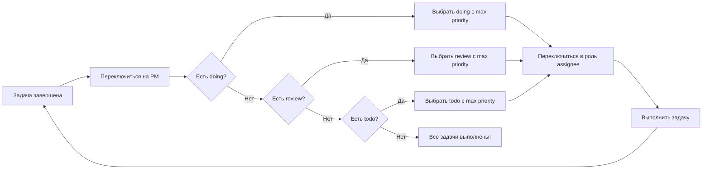
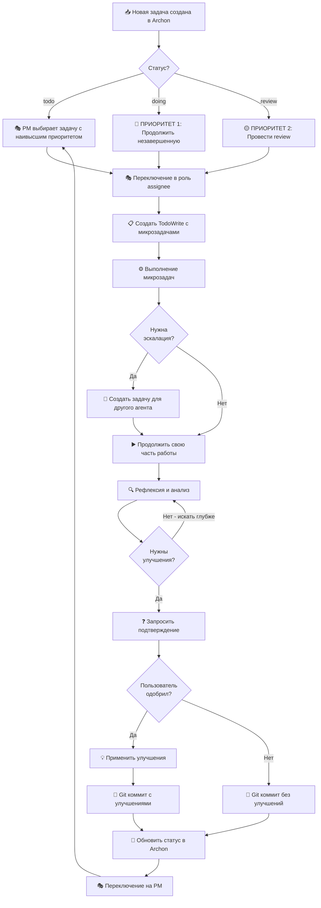
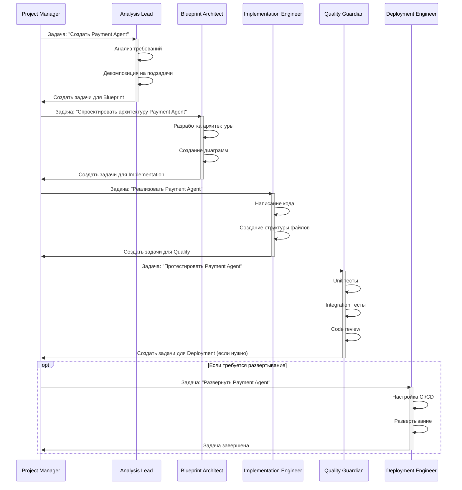
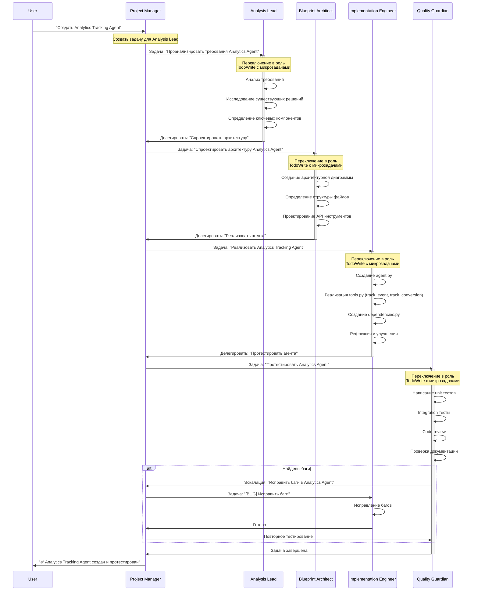

# COLLECTIVE_WORKFLOW.md - Коллективная работа агентов

## 🚀 QUICK REFERENCE CARD

**📋 Основные команды PM (копируй и используй):**

```python
# Выбрать следующую задачу с наивысшим приоритетом
next_task = await select_next_highest_priority_task(project_id)

# Делегировать задачу другому агенту
await delegate_task_to_agent(
    target_agent="Quality Guardian",
    task_title="Протестировать Agent",
    task_description="Детальное описание...",
    priority=80
)

# Создать эскалацию
await mcp__archon__manage_task(
    action="create",
    title="[Эскалация] Название",
    description="Причина...",
    assignee="Правильный Agent",
    priority=task_order
)

# Отобразить PM Dashboard
await pm_dashboard(project_id)
```

**🎯 7-Point Quick Checklist для PM:**
- ☑️ Проверил doing задачи (ПРИОРИТЕТ 1)
- ☑️ Проверил review задачи (ПРИОРИТЕТ 2)
- ☑️ Проверил блокеры и эскалации
- ☑️ Выбрал задачу с наивысшим task_order
- ☑️ Проверил зависимости
- ☑️ Переключился в роль assignee
- ☑️ Включил project_id в контекст

**📊 Приоритеты задач:**
```
🔴 ПРИОРИТЕТ 1: doing (незавершенная работа - может блокировать других)
🟡 ПРИОРИТЕТ 2: review (готовая работа - ожидает проверки)
🟢 ПРИОРИТЕТ 3: todo (новая работа - только если нет doing/review)
```

**🎭 Workflow в одной диаграмме:**



---

## Краткая справка

**Цель документа:** Описать систему коллективной работы множества агентов через централизованную координацию Archon Project Manager.

**Ключевые принципы:**
- Централизованная приоритизация через Project Manager
- Переключение между ролями агентов по задачам
- Эскалация и делегирование по цепочке компетенций
- Координация через Archon MCP Server

**📑 Навигация по документу:**
- [1. Роль Archon Project Manager](#1-роль-archon-project-manager)
- [2. Централизованная приоритизация](#2-централизованная-приоритизация-задач)
- [3. Паттерны координации](#3-паттерны-координации-агентов)
- [4. Workflow между агентами](#4-workflow-между-агентами)
- [5. Процедуры эскалации](#5-процедуры-эскалации)
- [6. Разрешение конфликтов](#6-разрешение-конфликтов)
- [7. Мониторинг и метрики](#7-мониторинг-и-метрики)
- [8. Best Practices](#8-best-practices)
- [9. Troubleshooting](#9-troubleshooting)
- [10. Примеры сценариев](#10-примеры-сценариев)
- [Глоссарий](#глоссарий)
- [FAQ](#faq-часто-задаваемые-вопросы)

---

## 1. Роль Archon Project Manager

### 1.1. Назначение и ответственность

**Archon Project Manager (PM)** - это координирующая роль, которую агент принимает для:

- **Централизованной приоритизации задач** - выбор следующей задачи среди ВСЕХ ролей
- **Оркестрации команды** - распределение задач по компетенциям
- **Мониторинга прогресса** - отслеживание doing/review задач
- **Эскалации блокеров** - выявление и решение блокирующих проблем

**Критически важно:** PM - это не отдельный агент, а роль, в которую переключается агент после завершения задачи.

### 1.2. Когда переключаться в роль PM

**ОБЯЗАТЕЛЬНЫЕ сценарии переключения:**

```python
# Сценарий 1: После завершения любой задачи
async def after_task_completion():
    # 1. Обновить статус задачи в Archon
    await mcp__archon__manage_task("update", task_id=task_id, status="done")

    # 2. АВТОМАТИЧЕСКИ переключиться на PM
    print("🎭 ПЕРЕКЛЮЧАЮСЯ В РОЛЬ ARCHON PROJECT MANAGER")

    # 3. Найти следующую задачу с наивысшим приоритетом
    next_task = await select_next_highest_priority_task()

# Сценарий 2: В начале новой сессии
async def session_start():
    # Переключиться на PM для анализа состояния проекта
    # Выбрать задачу с наивысшим приоритетом
    pass

# Сценарий 3: При обнаружении блокера
async def blocker_detected():
    # Переключиться на PM для эскалации и переприоритизации
    pass
```

### 1.3. Алгоритм работы Project Manager

**Полный алгоритм выбора задачи:**

```python
async def select_next_highest_priority_task(project_id: str) -> dict:
    """
    Выбрать задачу с наивысшим приоритетом среди ВСЕХ ролей.
    Вызывается ТОЛЬКО в роли Project Manager.

    Args:
        project_id: ID проекта для фильтрации задач

    Returns:
        dict: Выбранная задача с наивысшим приоритетом или None
    """

    # ПРИОРИТЕТ 1: Незавершенная работа (doing)
    doing_tasks = await mcp__archon__find_tasks(
        project_id=project_id,
        filter_by="status",
        filter_value="doing"
    )

    if doing_tasks:
        # Выбрать задачу с наивысшим task_order
        task = max(doing_tasks, key=lambda t: t["task_order"])
        print(f"🔴 ПРИОРИТЕТ 1: DOING задача - {task['title']}")
        print(f"   Assignee: {task['assignee']}, Priority: {task['task_order']}")
        return task

    # ПРИОРИТЕТ 2: Задачи на review
    review_tasks = await mcp__archon__find_tasks(
        project_id=project_id,
        filter_by="status",
        filter_value="review"
    )

    if review_tasks:
        task = max(review_tasks, key=lambda t: t["task_order"])
        print(f"🟡 ПРИОРИТЕТ 2: REVIEW задача - {task['title']}")
        print(f"   Assignee: {task['assignee']}, Priority: {task['task_order']}")
        return task

    # ПРИОРИТЕТ 3: Новые задачи (todo)
    todo_tasks = await mcp__archon__find_tasks(
        project_id=project_id,
        filter_by="status",
        filter_value="todo"
    )

    if todo_tasks:
        task = max(todo_tasks, key=lambda t: t["task_order"])
        print(f"🟢 ПРИОРИТЕТ 3: TODO задача - {task['title']}")
        print(f"   Assignee: {task['assignee']}, Priority: {task['task_order']}")
        return task

    # Нет задач для выполнения
    print("✅ Все задачи выполнены! Проект завершен.")
    return None
```

**Обоснование приоритетов:**

| Приоритет | Статус | Почему наивысший приоритет |
|-----------|--------|---------------------------|
| **1** | `doing` | Незавершенная работа может блокировать других агентов и весь проект |
| **2** | `review` | Готовая работа ожидает проверки, может блокировать следующие задачи в цепочке |
| **3** | `todo` | Новая работа, берется только когда нет doing и review |

### 1.4. Коммуникационные паттерны PM

**ПРАВИЛЬНЫЙ формат представления следующей задачи:**

```
Следующая задача: '[точное название из Archon]' (приоритет task_order: [число], [assignee]). Приступать?
```

**Примеры:**

✅ ПРАВИЛЬНО:
```
Следующая задача: 'Создать универсального Payment Integration Agent'
(приоритет task_order: 85, Archon Implementation Engineer). Приступать?
```

❌ НЕПРАВИЛЬНО:
```
Переходим к следующей задаче?
Продолжаем работу?
Какую задачу выполнять далі?
```

---

## 2. Централизованная приоритизация задач

### 2.1. Проблема децентрализованного подхода

**Старый неправильный подход:**

```python
# ❌ НЕПРАВИЛЬНО - каждый агент ищет задачи только для своей роли
async def find_my_tasks(my_role: str):
    tasks = await mcp__archon__find_tasks(
        filter_by="assignee",
        filter_value=my_role,  # Только для моей роли!
        filter_by="status",
        filter_value="todo"
    )
    # Проблема: может пропустить doing/review других ролей с высоким приоритетом
```

**Последствия:**
- Задачи с высоким приоритетом других ролей игнорируются
- doing/review задачи могут блокировать проект
- Неоптимальное использование ресурсов

### 2.2. Решение: Централизация через PM

**Правильный подход:**

```python
# ✅ ПРАВИЛЬНО - PM анализирует ВСЕ задачи независимо от ролей
async def centralized_prioritization(project_id: str):
    # Шаг 1: PM анализирует все doing/review задачи
    urgent_tasks = await get_doing_and_review_tasks(project_id)

    # Шаг 2: Если есть срочные - выбрать наивысший приоритет
    if urgent_tasks:
        task = max(urgent_tasks, key=lambda t: t["task_order"])
        # Переключиться в роль assignee задачи
        await switch_to_role(task["assignee"])
        return task

    # Шаг 3: Если нет срочных - выбрать todo с наивысшим task_order
    todo_tasks = await get_todo_tasks(project_id)
    if todo_tasks:
        task = max(todo_tasks, key=lambda t: t["task_order"])
        await switch_to_role(task["assignee"])
        return task
```

### 2.3. Правила фильтрации задач

**ОБЯЗАТЕЛЬНО фильтровать по project_id:**

```python
# ✅ ПРАВИЛЬНО - явная фильтрация по проекту
tasks = await mcp__archon__find_tasks(
    project_id="c75ef8e3-6f4d-4da2-9e81-8d38d04a341a",  # AI Agent Factory
    filter_by="status",
    filter_value="todo"
)

# ❌ НЕПРАВИЛЬНО - без project_id (получим задачи всех проектов!)
tasks = await mcp__archon__find_tasks(
    filter_by="status",
    filter_value="todo"
)
```

### 2.4. Сохранение контекста проекта

**Обязательный header в каждой отклике агента:**

```markdown
📌 PROJECT CONTEXT: AI Agent Factory (ID: c75ef8e3-6f4d-4da2-9e81-8d38d04a341a)
🎭 ROLE: Archon Implementation Engineer

[Содержимое ответа]
```

**Зачем нужен header:**
- После auto-compact агент не теряет project_id
- Пользователь всегда видит текущий контекст
- Легко восстановить контекст при необходимости

---

## 3. Паттерны координации агентов

### 3.1. Матриця компетенций агентов

**Основные роли и их зоны ответственности:**

| Роль | Компетенции | Типичные задачи |
|------|-------------|-----------------|
| **Analysis Lead** | Анализ требований, декомпозиция, исследование | "Проанализировать", "Исследовать", "Оценить" |
| **Blueprint Architect** | Проектирование архитектуры, дизайн систем | "Спроектировать", "Разработать архитектуру" |
| **Implementation Engineer** | Разработка, код, техническая реализация | "Реализовать", "Написать код", "Создать" |
| **Quality Guardian** | Тестирование, контроль качества, code review | "Протестировать", "Проверить", "Отревьювить" |
| **Deployment Engineer** | DevOps, CI/CD, развертывание | "Развернуть", "Настроить CI/CD" |

### 3.2. Делегирование задач между агентами

**Инструмент делегирования:**

```python
@agent.tool
async def delegate_task_to_agent(
    ctx: RunContext[AgentDependencies],
    target_agent: str,
    task_title: str,
    task_description: str,
    priority: int = 50,
    context_data: Dict[str, Any] = None
) -> str:
    """
    Делегировать задачу другому специализированному агенту через Archon.

    Args:
        target_agent: Название роли агента (например, "Quality Guardian")
        task_title: Краткое название задачи
        task_description: Детальное описание
        priority: Приоритет задачи (task_order), 0-100
        context_data: Дополнительный контекст для агента

    Returns:
        str: Подтверждение делегирования
    """
    try:
        # Карта ролей на assignee в Archon
        AGENT_ASSIGNEE_MAP = {
            "Analysis Lead": "Archon Analysis Lead",
            "Blueprint Architect": "Archon Blueprint Architect",
            "Implementation Engineer": "Archon Implementation Engineer",
            "Quality Guardian": "Archon Quality Guardian",
            "Deployment Engineer": "Archon Deployment Engineer"
        }

        # Создать задачу в Archon
        task_result = await mcp__archon__manage_task(
            action="create",
            project_id=ctx.deps.archon_project_id,
            title=task_title,
            description=f"{task_description}\n\n**Контекст от {ctx.deps.current_role}:**\n{json.dumps(context_data, indent=2)}",
            assignee=AGENT_ASSIGNEE_MAP.get(target_agent, "Archon Project Manager"),
            status="todo",
            feature=f"Делегирование от {target_agent}",
            task_order=priority
        )

        return f"✅ Задача успешно делегирована агенту {target_agent} (приоритет: {priority})"

    except Exception as e:
        return f"❌ Ошибка делегирования: {e}"
```

**Пример использования:**

```python
# Implementation Engineer обнаружил необходимость в тестировании
await delegate_task_to_agent(
    target_agent="Quality Guardian",
    task_title="Протестировать Payment Integration Agent",
    task_description="Выполнить полное тестирование нового Payment Agent:\n- Unit тесты\n- Integration тесты\n- E2E сценарии",
    priority=80,  # Высокий приоритет
    context_data={
        "agent_path": "agents/payment_integration_agent/",
        "created_by": "Implementation Engineer",
        "completion_date": "2025-10-09"
    }
)
```

### 3.3. Эскалация непрофильных задач

**Когда эскалировать:**

1. **Получил непрофильную задачу изначально** - создать задачу для правильного агента
2. **В процессе выполнения** обнаружил необходимость в непрофильной работе - эскалировать

**Алгоритм эскалации:**

```
ЭТАП 1: ОБНАРУЖЕНИЕ
├─ Задача выходит за рамки компетенций
└─ Определить правильного агента по ключевым словам

ЭТАП 2: СОЗДАНИЕ ЗАДАЧИ ЭСКАЛАЦИИ
├─ Создать задачу в Archon для нужного агента
├─ Указать контекст и причину эскалации
└─ Установить приоритет (обычно высокий)

ЭТАП 3: ПРОДОЛЖЕНИЕ СВОЕЙ РАБОТЫ
├─ Продолжить работу в рамках своих компетенций
└─ НЕ ждать выполнения эскалированной задачи (если не блокирует)

ЭТАП 4: УВЕДОМЛЕНИЕ
└─ Сообщить пользователю о созданной эскалации
```

**Примеры:**

**Пример 1: Эскалация в начале**
```python
# Quality Guardian получил задачу реализации
if task["title"].startswith("Реализовать"):
    # Это задача для Implementation Engineer!
    await delegate_task_to_agent(
        target_agent="Implementation Engineer",
        task_title=f"[Эскалация] {task['title']}",
        task_description=f"Задача эскалирована от Quality Guardian.\n\n{task['description']}",
        priority=task["task_order"]
    )
    # Обновить исходную задачу как done
    await mcp__archon__manage_task("update", task_id=task["id"], status="done")
```

**Пример 2: Эскалация в процессе**
```python
# Implementation Engineer работает над бэкенд API
# Обнаружил: нужен UI компонент для QR-сканера

await delegate_task_to_agent(
    target_agent="UI/UX Enhancement Agent",
    task_title="Создать UI компонент QR-сканера",
    task_description="Нужен React компонент для QR-сканирования.\n\nТребования:\n- Поддержка камеры\n- Preview видео\n- Обработка ошибок",
    priority=85,
    context_data={"parent_task": "QR Payment Integration"}
)

# Продолжить работу над бэкенд частью
print("✅ Создана эскалация для UI компонента")
print("▶️ Продолжаю работу над backend логикой QR-сканирования")
```

---

## 4. Workflow между агентами

### 4.1. Полный цикл выполнения задачи



### 4.2. Типичная цепочка делегирования

**Классический flow: Analysis → Blueprint → Implementation → Quality → Deployment**



**Пример реальной цепочки:**

```python
# 1. Analysis Lead создает задачи после анализа
await delegate_task_to_agent(
    "Blueprint Architect",
    "Спроектировать архитектуру Payment Agent",
    "На основе анализа требований спроектировать:\n- Структуру модулей\n- API endpoints\n- Интеграции с Stripe/PayPal",
    priority=90
)

# 2. Blueprint Architect создает задачи после проектирования
await delegate_task_to_agent(
    "Implementation Engineer",
    "Реализовать Payment Agent согласно архитектуре",
    "Реализовать:\n- agent.py\n- tools.py (stripe_payment, paypal_payment)\n- dependencies.py",
    priority=85
)

# 3. Implementation Engineer создает задачи после реализации
await delegate_task_to_agent(
    "Quality Guardian",
    "Протестировать Payment Agent",
    "Выполнить:\n- Unit тесты для всех инструментов\n- Integration тесты с mock API\n- Code review",
    priority=80
)

# 4. Quality Guardian может создать задачи для доработок
if bugs_found:
    await delegate_task_to_agent(
        "Implementation Engineer",
        "Исправить баги в Payment Agent",
        f"Обнаружено {len(bugs)} багов:\n{bugs_description}",
        priority=95  # Высокий приоритет!
    )
```

### 4.3. Параллельная работа агентов

**Когда возможна параллельная работа:**

- Разные независимые задачи (например, создание разных агентов)
- Разные модули одного проекта
- Исследование и реализация (Analysis может анализировать следующую задачу, пока Implementation реализует текущую)

**Ограничения:**

- Один физический агент (Claude) может работать только в одной роли одновременно
- Задачи обрабатываются последовательно через централизованную очередь PM
- Приоритеты определяют порядок выполнения

**Пример независимых задач:**

```python
# Эти задачи могут выполняться в любом порядке (PM выберет по приоритету)
tasks = [
    {
        "title": "Создать Payment Agent",
        "assignee": "Implementation Engineer",
        "task_order": 80
    },
    {
        "title": "Создать Analytics Agent",
        "assignee": "Implementation Engineer",
        "task_order": 75
    },
    {
        "title": "Обновить документацию",
        "assignee": "Quality Guardian",
        "task_order": 50
    }
]
# PM выберет "Создать Payment Agent" (task_order: 80)
```

---

## 5. Процедуры эскалации

### 5.1. Типы эскалаций

**Классификация причин эскалации:**

| Тип | Описание | Приоритет | Assignee |
|-----|----------|-----------|----------|
| **Непрофильная задача** | Задача не соответствует компетенциям агента | task_order исходной задачи | Правильный агент |
| **Блокер** | Задача заблокирована внешними факторами | 95-100 | Project Manager или специалист |
| **Технический долг** | Обнаружены проблемы, требующие рефакторинга | 40-60 | Implementation Engineer |
| **Баги** | Найдены ошибки в существующем коде | 85-95 | Implementation Engineer |
| **Недостающие зависимости** | Отсутствуют необходимые модули/API | 90-95 | Implementation Engineer или Deployment Engineer |

### 5.2. Шаблоны эскалации

**Шаблон 1: Непрофильная задача**

```python
await mcp__archon__manage_task(
    action="create",
    project_id=project_id,
    title=f"[Эскалация] {original_task['title']}",
    description=f"""
**Причина эскалации:** Задача не соответствует компетенциям {current_role}

**Исходная задача:** {original_task['title']}
**Исходный assignee:** {original_task['assignee']}

**Описание задачи:**
{original_task['description']}

**Рекомендуемый assignee:** {correct_assignee}
""",
    assignee=correct_assignee,
    status="todo",
    task_order=original_task["task_order"],
    feature="escalation"
)
```

**Шаблон 2: Блокер**

```python
await mcp__archon__manage_task(
    action="create",
    project_id=project_id,
    title=f"[БЛОКЕР] {blocker_description}",
    description=f"""
🚫 **КРИТИЧЕСКИЙ БЛОКЕР**

**Заблокированная задача:** {blocked_task['title']}
**Текущий исполнитель:** {current_role}

**Описание блокера:**
{blocker_details}

**Что нужно для разблокировки:**
{required_actions}

**Кто может разблокировать:** {recommended_assignee}

**Влияние:** Блокирует {affected_tasks_count} задач(и)
""",
    assignee="Archon Project Manager",  # PM координирует разблокировку
    status="todo",
    task_order=95,  # Высокий приоритет
    feature="blocker"
)

# Обновить заблокированную задачу
await mcp__archon__manage_task(
    action="update",
    task_id=blocked_task["id"],
    status="doing",
    description=blocked_task["description"] + f"\n\n🚫 БЛОКЕР: {blocker_description}\nОжидает: {required_actions}"
)
```

**Шаблон 3: Найденные баги**

```python
await mcp__archon__manage_task(
    action="create",
    project_id=project_id,
    title=f"[BUG] {bug_summary}",
    description=f"""
🐛 **Обнаружен баг в {component_name}**

**Обнаружил:** {current_role}
**Во время:** {current_task}

**Описание бага:**
{bug_description}

**Как воспроизвести:**
{reproduction_steps}

**Ожидаемое поведение:**
{expected_behavior}

**Фактическое поведение:**
{actual_behavior}

**Предполагаемая причина:**
{suspected_root_cause}

**Приоритет:** {bug_severity} (Critical/High/Medium/Low)
""",
    assignee="Archon Implementation Engineer",
    status="todo",
    task_order=90 if bug_severity == "Critical" else 70,
    feature="bug-fix"
)
```

### 5.3. Мониторинг эскалаций

**PM должен регулярно проверять:**

```python
async def monitor_escalations(project_id: str):
    """Мониторинг эскалаций и блокеров."""

    # Проверить блокеры
    doing_tasks = await mcp__archon__find_tasks(
        project_id=project_id,
        filter_by="status",
        filter_value="doing"
    )

    blocked_tasks = [t for t in doing_tasks if "БЛОКЕР" in t["description"]]

    if blocked_tasks:
        print(f"⚠️ ВНИМАНИЕ: {len(blocked_tasks)} заблокированных задач!")
        for task in blocked_tasks:
            print(f"   - {task['title']} (assignee: {task['assignee']})")

    # Проверить эскалации
    escalations = await mcp__archon__find_tasks(
        project_id=project_id,
        query="[Эскалация]"
    )

    if escalations:
        print(f"📣 {len(escalations)} активных эскалаций")
```

---

## 6. Разрешение конфликтов

### 6.1. Типы конфликтов

**Конфликты при коллективной работе:**

1. **Приоритетные конфликты** - несколько задач с одинаковым task_order
2. **Зависимости задач** - задача B требует завершения задачи A
3. **Конфликты компетенций** - неясно, какой агент должен выполнять задачу
4. **Конфликты ресурсов** - несколько задач требуют одинаковые файлы

### 6.2. Разрешение приоритетных конфликтов

**Правило при равных task_order:**

```python
async def resolve_priority_conflict(tasks_with_same_priority: List[dict]) -> dict:
    """
    Выбрать задачу при равных приоритетах.

    Критерии выбора (в порядке применения):
    1. Статус (doing > review > todo)
    2. Дата создания (старые задачи первыми)
    3. Assignee (по порядку: Analysis → Blueprint → Implementation → Quality → Deployment)
    """

    # Критерий 1: Статус
    status_priority = {"doing": 3, "review": 2, "todo": 1}
    tasks_sorted_by_status = sorted(
        tasks_with_same_priority,
        key=lambda t: status_priority.get(t["status"], 0),
        reverse=True
    )

    # Если есть doing/review - взять первую
    top_task = tasks_sorted_by_status[0]
    if top_task["status"] in ["doing", "review"]:
        return top_task

    # Критерий 2: Дата создания (старые первыми)
    tasks_sorted_by_date = sorted(
        tasks_sorted_by_status,
        key=lambda t: t["created_at"]
    )

    return tasks_sorted_by_date[0]
```

**Пример:**

```python
# Три задачи с task_order=80
tasks = [
    {"title": "Task A", "status": "todo", "created_at": "2025-10-09T10:00:00", "task_order": 80},
    {"title": "Task B", "status": "review", "created_at": "2025-10-09T11:00:00", "task_order": 80},
    {"title": "Task C", "status": "doing", "created_at": "2025-10-09T12:00:00", "task_order": 80}
]

# Результат: Task C (doing имеет наивысший приоритет)
selected = resolve_priority_conflict(tasks)
```

### 6.3. Управление зависимостями задач

**Способ 1: Явное указание в описании**

```python
await mcp__archon__manage_task(
    action="create",
    title="Протестировать Payment Agent",
    description="""
**Зависит от:** Создать Payment Agent (task_id: abc123)

Нельзя начать до завершения создания агента.

[Описание тестирования...]
""",
    assignee="Quality Guardian",
    status="todo",
    task_order=70
)
```

**Способ 2: PM проверяет зависимости**

```python
async def check_dependencies(task: dict) -> bool:
    """Проверить, можно ли начать задачу (все зависимости выполнены)."""

    # Извлечь зависимости из описания
    dependencies = extract_dependencies(task["description"])

    if not dependencies:
        return True  # Нет зависимостей

    # Проверить статус всех зависимостей
    for dep_id in dependencies:
        dep_task = await mcp__archon__find_tasks(task_id=dep_id)
        if dep_task["status"] != "done":
            print(f"⏸️ Задача '{task['title']}' ожидает завершения '{dep_task['title']}'")
            return False

    return True
```

### 6.4. Конфликты компетенций

**Ситуация:** Неясно, какой агент должен выполнять задачу.

**Решение: Таблица принятия решений**

| Задача содержит | Ключевые слова | Assignee |
|-----------------|----------------|----------|
| Анализ, исследование | "проанализировать", "исследовать", "оценить" | Analysis Lead |
| Архитектура | "спроектировать", "архитектура", "структура" | Blueprint Architect |
| Код, реализация | "создать", "реализовать", "написать код" | Implementation Engineer |
| Тестирование, проверка | "протестировать", "проверить", "отревьювить" | Quality Guardian |
| Развертывание | "развернуть", "CI/CD", "docker" | Deployment Engineer |

**Алгоритм PM для определения assignee:**

```python
def determine_assignee(task_title: str, task_description: str) -> str:
    """Определить наиболее подходящего агента для задачи."""

    text = (task_title + " " + task_description).lower()

    # Проверка ключевых слов
    if any(word in text for word in ["проанализировать", "исследовать", "анализ"]):
        return "Archon Analysis Lead"

    if any(word in text for word in ["архитектура", "спроектировать", "структура"]):
        return "Archon Blueprint Architect"

    if any(word in text for word in ["реализовать", "создать", "написать код", "разработать"]):
        return "Archon Implementation Engineer"

    if any(word in text for word in ["протестировать", "тест", "проверить", "review"]):
        return "Archon Quality Guardian"

    if any(word in text for word in ["развернуть", "deploy", "ci/cd", "docker"]):
        return "Archon Deployment Engineer"

    # По умолчанию - PM для дальнейшего анализа
    return "Archon Project Manager"
```

### 6.5. Конфликты ресурсов

**Ситуация:** Две задачи изменяют один и тот же файл.

**Решение:**

1. **Последовательное выполнение** - PM назначает более высокий приоритет одной задаче
2. **Разделение на подзадачи** - декомпозировать на независимые части
3. **Синхронизация через git** - использовать ветки и merge

**Пример:**

```python
# Задача 1: Добавить новый инструмент в payment_agent
task1 = {
    "title": "Добавить PayPal поддержку в Payment Agent",
    "file": "agents/payment_integration_agent/tools.py",
    "task_order": 80
}

# Задача 2: Рефакторинг структуры tools
task2 = {
    "title": "Рефакторинг tools.py Payment Agent",
    "file": "agents/payment_integration_agent/tools.py",
    "task_order": 75
}

# PM решение: Выполнить задачу 1 (выше приоритет), затем задачу 2
# Задача 2 будет учитывать изменения из задачи 1
```

---

## 7. Мониторинг и метрики

### 7.1. Ключевые метрики коллективной работы

**Метрики для отслеживания:**

```python
async def collect_team_metrics(project_id: str) -> dict:
    """Собрать метрики коллективной работы."""

    all_tasks = await mcp__archon__find_tasks(project_id=project_id)

    # Распределение задач по статусам
    status_distribution = {
        "todo": len([t for t in all_tasks if t["status"] == "todo"]),
        "doing": len([t for t in all_tasks if t["status"] == "doing"]),
        "review": len([t for t in all_tasks if t["status"] == "review"]),
        "done": len([t for t in all_tasks if t["status"] == "done"])
    }

    # Распределение по ролям
    role_distribution = {}
    for task in all_tasks:
        role = task["assignee"]
        role_distribution[role] = role_distribution.get(role, 0) + 1

    # Эскалации
    escalations = [t for t in all_tasks if "[Эскалация]" in t["title"]]

    # Блокеры
    blockers = [t for t in all_tasks if "БЛОКЕР" in t["description"]]

    # Средний приоритет активных задач
    active_tasks = [t for t in all_tasks if t["status"] in ["doing", "review", "todo"]]
    avg_priority = sum(t["task_order"] for t in active_tasks) / len(active_tasks) if active_tasks else 0

    return {
        "total_tasks": len(all_tasks),
        "status_distribution": status_distribution,
        "role_distribution": role_distribution,
        "escalations_count": len(escalations),
        "blockers_count": len(blockers),
        "average_priority": round(avg_priority, 2),
        "completion_rate": round(status_distribution["done"] / len(all_tasks) * 100, 2) if all_tasks else 0
    }
```

**Пример вывода метрик:**

```
📊 Метрики проекта AI Agent Factory

Всего задач: 45
Завершено: 32 (71.1%)

📋 Распределение по статусам:
  ✅ done: 32
  🟢 todo: 8
  🟡 review: 3
  🔴 doing: 2

👥 Распределение по ролям:
  Implementation Engineer: 20 задач
  Quality Guardian: 10 задач
  Blueprint Architect: 8 задач
  Analysis Lead: 5 задач
  Deployment Engineer: 2 задачи

⚠️ Эскалации: 2
🚫 Блокеры: 1

📈 Средний приоритет активных задач: 67.5
```

### 7.2. Dashboard для PM

**Быстрая проверка состояния проекта:**

```python
async def pm_dashboard(project_id: str):
    """Отобразить dashboard для Project Manager."""

    print("=" * 60)
    print("🎯 ARCHON PROJECT MANAGER DASHBOARD")
    print("=" * 60)

    # ПРИОРИТЕТ 1: Doing задачи
    doing_tasks = await mcp__archon__find_tasks(
        project_id=project_id,
        filter_by="status",
        filter_value="doing"
    )

    if doing_tasks:
        print("\n🔴 DOING ЗАДАЧИ (незавершенная работа):")
        for task in sorted(doing_tasks, key=lambda t: t["task_order"], reverse=True):
            print(f"   [{task['task_order']}] {task['title']} ({task['assignee']})")

    # ПРИОРИТЕТ 2: Review задачи
    review_tasks = await mcp__archon__find_tasks(
        project_id=project_id,
        filter_by="status",
        filter_value="review"
    )

    if review_tasks:
        print("\n🟡 REVIEW ЗАДАЧИ (ожидают проверки):")
        for task in sorted(review_tasks, key=lambda t: t["task_order"], reverse=True):
            print(f"   [{task['task_order']}] {task['title']} ({task['assignee']})")

    # ПРИОРИТЕТ 3: Todo задачи (топ-5)
    todo_tasks = await mcp__archon__find_tasks(
        project_id=project_id,
        filter_by="status",
        filter_value="todo"
    )

    if todo_tasks:
        top_todo = sorted(todo_tasks, key=lambda t: t["task_order"], reverse=True)[:5]
        print("\n🟢 TODO ЗАДАЧИ (топ-5 по приоритету):")
        for task in top_todo:
            print(f"   [{task['task_order']}] {task['title']} ({task['assignee']})")

    # Блокеры
    all_tasks = await mcp__archon__find_tasks(project_id=project_id)
    blockers = [t for t in all_tasks if "БЛОКЕР" in t.get("description", "")]

    if blockers:
        print("\n🚫 КРИТИЧЕСКИЕ БЛОКЕРЫ:")
        for task in blockers:
            print(f"   ⚠️ {task['title']} ({task['assignee']})")

    # Метрики
    metrics = await collect_team_metrics(project_id)
    print(f"\n📊 ПРОГРЕСС: {metrics['completion_rate']}% завершено ({metrics['status_distribution']['done']}/{metrics['total_tasks']})")

    print("=" * 60)
```

---

## 8. Best Practices

### 8.1. Правила для всех агентов

**✅ ВСЕГДА:**

1. **После завершения задачи** - переключиться на PM для выбора следующей
2. **Обновлять статус в Archon** - сразу после изменений
3. **Использовать project_id** - фильтровать задачи по проекту
4. **Указывать контекст** - включать PROJECT CONTEXT header в ответы
5. **Эскалировать непрофильные задачи** - создавать задачи для правильных агентов
6. **Следовать приоритетам** - doing > review > todo

**❌ НИКОГДА:**

1. **Не искать задачи только для своей роли** - PM анализирует ВСЕ роли
2. **Не пропускать doing/review** - они имеют наивысший приоритет
3. **Не работать без переключения в роль** - всегда читать промпт роли
4. **Не игнорировать блокеры** - эскалировать немедленно
5. **Не начинать задачу без проверки зависимостей** - убедиться что все готово

### 8.2. Checklист для PM перед выбором задачи

```
🎯 PM CHECKLIST:

☑️ Проверил doing задачи (ПРИОРИТЕТ 1)
☑️ Проверил review задачи (ПРИОРИТЕТ 2)
☑️ Проверил блокеры и эскалации
☑️ Выбрал задачу с наивысшим task_order
☑️ Проверил зависимости выбранной задачи
☑️ Определил правильную роль (assignee)
☑️ Переключился в роль для выполнения
☑️ Включил project_id в контекст
```

### 8.3. Коммуникация между агентами

**Правила передачи контекста:**

```python
# ПРАВИЛЬНО: Полный контекст при делегировании
await delegate_task_to_agent(
    target_agent="Quality Guardian",
    task_title="Протестировать Payment Agent",
    task_description="""
Выполнить полное тестирование Payment Integration Agent.

**Компоненты для тестирования:**
- tools.py: stripe_payment, paypal_payment
- dependencies.py: PaymentDependencies
- agent.py: основной flow

**Ожидаемое покрытие:** >80%

**Требования:**
- Unit тесты для каждого инструмента
- Mock для внешних API
- Integration тесты с реальными сценариями
""",
    priority=85,
    context_data={
        "agent_path": "agents/payment_integration_agent/",
        "created_by": "Archon Implementation Engineer",
        "related_docs": ["PAYMENT_SPEC.md"],
        "completion_date": "2025-10-09"
    }
)

# НЕПРАВИЛЬНО: Недостаточно контекста
await delegate_task_to_agent(
    "Quality Guardian",
    "Протестировать агент",  # Какой агент?
    "Написать тесты",  # Какие тесты? Для чего?
    priority=50
)
```

---

## 9. Troubleshooting

### 9.1. Типичные проблемы и решения

**Проблема 1: PM не находит задачи**

```python
# Симптом
tasks = await mcp__archon__find_tasks(
    filter_by="status",
    filter_value="todo"
)
# Результат: []

# Причина: Забыли указать project_id

# Решение:
tasks = await mcp__archon__find_tasks(
    project_id="c75ef8e3-6f4d-4da2-9e81-8d38d04a341a",  # Добавить!
    filter_by="status",
    filter_value="todo"
)
```

**Проблема 2: Потерян project_id после auto-compact**

```python
# Симптом: После auto-compact не помню project_id

# Решение:
async def recover_project_id():
    # Попробовать найти doing/review задачи
    doing_tasks = await mcp__archon__find_tasks(
        filter_by="status",
        filter_value="doing"
    )

    if doing_tasks:
        project_id = doing_tasks[0]["project_id"]
        print(f"🔄 Восстановлен project_id: {project_id}")
        return project_id

    # Если нет - спросить пользователя
    print("⚠️ Не могу восстановить project_id. Пожалуйста, укажите название или ID проекта.")
    return None
```

**Проблема 3: Задача постоянно в doing**

```python
# Симптом: Задача много дней в статусе "doing"

# Возможные причины:
# 1. Заблокирована - проверить описание на наличие "БЛОКЕР"
# 2. Слишком большая - нужно декомпозировать
# 3. Непрофильная - нужно эскалировать

# Решение PM:
async def analyze_stuck_task(task_id: str):
    task = await mcp__archon__find_tasks(task_id=task_id)

    # Проверка 1: Блокер?
    if "БЛОКЕР" in task["description"]:
        print(f"🚫 Задача заблокирована. Нужно разблокировать.")
        # Создать задачу для разблокировки

    # Проверка 2: Слишком большая?
    task_age_days = (datetime.now() - parse(task["updated_at"])).days
    if task_age_days > 2:
        print(f"⏰ Задача в doing {task_age_days} дней. Рекомендуется декомпозиция.")
        # Создать подзадачи

    # Проверка 3: Непрофильная?
    correct_assignee = determine_assignee(task["title"], task["description"])
    if correct_assignee != task["assignee"]:
        print(f"🔄 Задача назначена неправильно. Эскалировать на {correct_assignee}.")
```

**Проблема 4: Конфликт приоритетов**

```python
# Симптом: Несколько задач с task_order=100

# Решение: Использовать дополнительные критерии
selected_task = resolve_priority_conflict(tasks_with_same_priority)
```

### 9.2. Debugging workflow

**Включить детальное логирование:**

```python
async def debug_task_selection(project_id: str):
    """Детальное логирование процесса выбора задачи."""

    print("\n" + "="*60)
    print("🔍 DEBUG: Процесс выбора задачи")
    print("="*60)

    # Шаг 1: Doing задачи
    print("\n[1/3] Проверка DOING задач...")
    doing_tasks = await mcp__archon__find_tasks(
        project_id=project_id,
        filter_by="status",
        filter_value="doing"
    )
    print(f"   Найдено: {len(doing_tasks)}")
    for task in doing_tasks:
        print(f"   - [{task['task_order']}] {task['title']}")

    # Шаг 2: Review задачи
    print("\n[2/3] Проверка REVIEW задач...")
    review_tasks = await mcp__archon__find_tasks(
        project_id=project_id,
        filter_by="status",
        filter_value="review"
    )
    print(f"   Найдено: {len(review_tasks)}")
    for task in review_tasks:
        print(f"   - [{task['task_order']}] {task['title']}")

    # Шаг 3: Todo задачи
    print("\n[3/3] Проверка TODO задач...")
    todo_tasks = await mcp__archon__find_tasks(
        project_id=project_id,
        filter_by="status",
        filter_value="todo"
    )
    print(f"   Найдено: {len(todo_tasks)}")
    top_5 = sorted(todo_tasks, key=lambda t: t["task_order"], reverse=True)[:5]
    for task in top_5:
        print(f"   - [{task['task_order']}] {task['title']}")

    # Результат
    print("\n🎯 РЕЗУЛЬТАТ:")
    if doing_tasks:
        selected = max(doing_tasks, key=lambda t: t["task_order"])
        print(f"   Выбрана DOING: {selected['title']}")
    elif review_tasks:
        selected = max(review_tasks, key=lambda t: t["task_order"])
        print(f"   Выбрана REVIEW: {selected['title']}")
    elif todo_tasks:
        selected = max(todo_tasks, key=lambda t: t["task_order"])
        print(f"   Выбрана TODO: {selected['title']}")
    else:
        print("   ✅ Нет задач для выполнения")

    print("="*60 + "\n")
```

---

## 10. Примеры сценариев

### 10.1. Сценарий 1: Создание нового агента



### 10.2. Сценарий 2: Эскалация блокера

```python
# Ситуация: Implementation Engineer не может завершить задачу

# Шаг 1: Обнаружение блокера
print("⚠️ БЛОКЕР ОБНАРУЖЕН!")
print("Задача: 'Интеграция Payment Agent с внешним API'")
print("Причина: Отсутствуют API ключи для Stripe и PayPal")

# Шаг 2: Создание задачи-блокера
await mcp__archon__manage_task(
    action="create",
    project_id="c75ef8e3-6f4d-4da2-9e81-8d38d04a341a",
    title="[БЛОКЕР] Получить API ключи Stripe и PayPal",
    description="""
🚫 **КРИТИЧЕСКИЙ БЛОКЕР**

**Заблокированная задача:** Интеграция Payment Agent с внешним API
**Исполнитель:** Archon Implementation Engineer

**Описание:**
Для завершения интеграции Payment Agent с Stripe и PayPal необходимы:
1. Stripe API keys (publishable + secret)
2. PayPal Client ID + Secret

**Что нужно:**
- Зарегистрироваться в Stripe Dashboard
- Создать PayPal App
- Получить credentials
- Добавить в .env файл проекта

**Кто может разблокировать:** User или Deployment Engineer

**Влияние:** Блокирует 3 задачи (интеграция, тестирование, развертывание)
""",
    assignee="Archon Project Manager",
    status="todo",
    task_order=95,
    feature="blocker"
)

# Шаг 3: Обновить заблокированную задачу
await mcp__archon__manage_task(
    action="update",
    task_id="blocked-task-id",
    status="doing",
    description=original_description + """

🚫 БЛОКЕР: Отсутствуют API ключи Stripe и PayPal
Ожидает: Получение credentials от User/Deployment Engineer
Создана задача эскалации: [БЛОКЕР] Получить API ключи
"""
)

# Шаг 4: PM переключается на другую задачу
print("🎭 ПЕРЕКЛЮЧЕНИЕ НА PM")
next_task = await select_next_highest_priority_task(project_id)
print(f"▶️ Переключаюсь на задачу: {next_task['title']}")
```

### 10.3. Сценарий 3: Начало новой сессии

```python
# Ситуация: Агент стартует после длительного перерыва

async def session_start_workflow():
    """Workflow при начале новой сессии."""

    print("🚀 НАЧАЛО НОВОЙ СЕССИИ")
    print("="*60)

    # Шаг 1: Переключение на PM
    print("\n🎭 Переключаюсь в роль ARCHON PROJECT MANAGER")
    # (читать промпт PM...)

    # Шаг 2: Восстановление контекста проекта
    print("\n📋 Восстановление контекста проекта...")

    # Попробовать найти doing задачи
    doing_tasks = await mcp__archon__find_tasks(
        filter_by="status",
        filter_value="doing"
    )

    if doing_tasks:
        project_id = doing_tasks[0]["project_id"]
        project = await mcp__archon__find_projects(project_id=project_id)
        print(f"✅ Восстановлен проект: {project['title']}")
        print(f"📌 PROJECT CONTEXT: {project['title']} (ID: {project_id})")
    else:
        # Нет doing задач - спросить пользователя
        print("⚠️ Не найдено doing задач для восстановления контекста")
        print("Пожалуйста, укажите проект для работы")
        return

    # Шаг 3: Отобразить dashboard
    await pm_dashboard(project_id)

    # Шаг 4: Выбрать задачу с наивысшим приоритетом
    print("\n🎯 Выбор задачи с наивысшим приоритетом...")
    next_task = await select_next_highest_priority_task(project_id)

    if next_task:
        print(f"\n▶️ Следующая задача: '{next_task['title']}'")
        print(f"   Приоритет: {next_task['task_order']}")
        print(f"   Assignee: {next_task['assignee']}")
        print(f"   Статус: {next_task['status']}")

        # Шаг 5: Переключение в роль для выполнения
        role_keyword = extract_role_keyword(next_task['assignee'])
        print(f"\n🎭 Переключаюсь в роль {next_task['assignee']}")
        # (поиск и чтение промпта роли...)

        print("\n✅ Готов к выполнению задачи!")
    else:
        print("\n🎉 Все задачи выполнены! Проект завершен.")

    print("="*60)
```

---

## Заключение

Система коллективной работы агентов через Archon обеспечивает:

- **Централизованную координацию** через Project Manager
- **Оптимальную приоритизацию** задач независимо от ролей
- **Гибкую эскалацию** и делегирование по цепочке компетенций
- **Сохранение контекста** проекта через сессии
- **Эффективное разрешение конфликтов** и управление зависимостями

**Ключевые принципы:**
- PM анализирует ВСЕ задачи, а не только для одной роли
- doing/review задачи имеют наивысший приоритет
- Каждая роль имеет четкие компетенции
- Эскалация и делегирование - нормальная часть процесса
- Всегда включать project_id для фильтрации задач

**Следуя этим правилам, агенты работают как слаженная команда, эффективно выполняя даже самые сложные проекты!**

---

## Глоссарий

**Основные термины системы коллективной работы:**

| Термин | Определение |
|--------|-------------|
| **Project Manager (PM)** | Роль агента для централизованной координации всех задач проекта независимо от роли |
| **Archon MCP Server** | Система управления задачами, используется для создания, обновления и мониторинга задач |
| **Централизованная приоритизация** | Подход когда PM выбирает задачи среди ВСЕХ ролей, а не только для одной |
| **task_order** | Числовое значение приоритета задачи (0-100), где выше число = выше приоритет |
| **Делегирование** | Создание задачи для другого агента через `delegate_task_to_agent()` |
| **Эскалация** | Создание задачи для правильного агента когда текущая роль не подходит |
| **Блокер** | Задача, которая не может быть завершена из-за внешних факторов |
| **doing** | Статус задачи в процессе выполнения (ПРИОРИТЕТ 1) |
| **review** | Статус завершенной задачи, ожидающей проверки (ПРИОРИТЕТ 2) |
| **todo** | Статус новой задачи, готовой к выполнению (ПРИОРИТЕТ 3) |
| **done** | Статус полностью завершенной задачи |
| **assignee** | Роль агента, назначенная для выполнения задачи |
| **project_id** | Уникальный идентификатор проекта для фильтрации задач |
| **Цепочка делегирования** | Последовательность: Analysis → Blueprint → Implementation → Quality → Deployment |
| **Переключение роли** | Процесс чтения промпта роли и принятия контекста эксперта |
| **Компетенции** | Области ответственности каждой роли агента |
| **Конфликт приоритетов** | Ситуация когда несколько задач имеют одинаковый task_order |
| **Зависимости задач** | Ситуация когда задача B не может начаться пока не завершена задача A |
| **PM Dashboard** | Консольный интерфейс для быстрой проверки состояния проекта |
| **Метрики команды** | Статистика распределения задач по статусам и ролям |

---

## FAQ (Часто задаваемые вопросы)

### 1. Когда переключаться на роль PM?

**Ответ:** ВСЕГДА после завершения любой задачи. PM выбирает следующую задачу с наивысшим приоритетом среди ВСЕХ ролей.

**Примеры:**
- ✅ Завершил задачу как Implementation Engineer → переключаюсь на PM
- ✅ Начало новой сессии → сразу в роль PM для анализа состояния
- ✅ Обнаружен блокер → переключаюсь на PM для эскалации

### 2. Что делать если нет задач для моей роли?

**Ответ:** Это НЕПРАВИЛЬНЫЙ вопрос! PM не ищет задачи для конкретной роли. PM ищет задачу с наивысшим приоритетом среди ВСЕХ ролей, затем переключается в роль assignee этой задачи.

**Правильный подход:**
```python
# НЕ ПРАВИЛЬНО
my_tasks = await find_tasks(assignee="My Role")

# ПРАВИЛЬНО
next_task = await select_next_highest_priority_task(project_id)
# Переключиться в роль next_task["assignee"]
```

### 3. Как определить приоритет при делегировании задачи?

**Ответ:** Руководствуйтесь этими правилами:

| Тип задачи | task_order | Обоснование |
|------------|------------|-------------|
| Критические баги | 90-95 | Блокируют работу |
| Блокеры | 95-100 | Критическое влияние |
| Зависимости других задач | 80-90 | Другие ждут |
| Обычная работа | 50-70 | Стандартный приоритет |
| Технический долг | 40-60 | Можно отложить |
| Документация, улучшения | 30-50 | Низкий приоритет |

### 4. Можно ли выполнять несколько задач параллельно?

**Ответ:** НЕТ. Один физический агент (Claude) работает только в одной роли одновременно. Задачи выполняются последовательно через централизованную очередь PM. Приоритеты (doing > review > todo + task_order) определяют порядок.

**Но:** Можно создавать независимые задачи для разных агентов - PM распределит их оптимально.

### 5. Что делать если получил непрофильную задачу?

**Ответ:** НЕ выполнять! Эскалировать правильному агенту:

```python
# Шаг 1: Создать задачу для правильного агента
await delegate_task_to_agent(
    target_agent="Правильный Agent",
    task_title=f"[Эскалация] {task['title']}",
    task_description=f"Эскалирована от {current_role}...",
    priority=task["task_order"]
)

# Шаг 2: Закрыть исходную задачу
await mcp__archon__manage_task("update", task_id=task_id, status="done")

# Шаг 3: Сообщить пользователю
print(f"✅ Задача эскалирована на {target_agent}")
```

### 6. Как восстановить project_id после auto-compact?

**Ответ:** Попробовать найти doing/review задачи:

```python
async def recover_project_id():
    doing_tasks = await mcp__archon__find_tasks(
        filter_by="status", filter_value="doing"
    )
    if doing_tasks:
        return doing_tasks[0]["project_id"]

    # Если нет - спросить пользователя
    print("⚠️ Укажите project_id или название проекта")
```

### 7. Почему нельзя искать задачи без project_id?

**Ответ:** Без project_id получишь задачи ВСЕХ проектов в Archon, что приведет к:
- Выполнению задач других проектов
- Путанице в контексте
- Некорректным метрикам

**ВСЕГДА** указывай `project_id` в вызовах Archon MCP.

### 8. Как понять что задача нуждается в эскалации В ПРОЦЕССЕ работы?

**Ответ:** Признаки необходимости эскалации:

| Признак | Действие |
|---------|----------|
| Требуется работа вне компетенций | Делегировать специалисту |
| Обнаружены баги в чужом коде | Создать `[BUG]` задачу для Implementation Engineer |
| Нужна UI часть при работе с backend | Делегировать UI/UX Enhancement Agent |
| Отсутствуют credentials/API keys | Создать `[БЛОКЕР]` для PM или Deployment Engineer |
| Нужна архитектурная консультация | Делегировать Blueprint Architect |

**Важно:** Продолжай свою часть работы, не жди завершения эскалированной задачи (если она не блокирует).

### 9. Что делать если несколько задач с одинаковым task_order?

**Ответ:** PM применяет дополнительные критерии:

1. **Статус** (doing > review > todo)
2. **Дата создания** (старые задачи первыми)
3. **Assignee** (по цепочке: Analysis → Blueprint → Implementation → Quality → Deployment)

См. функцию `resolve_priority_conflict()` в [разделе 6.2](#62-разрешение-приоритетных-конфликтов).

### 10. Как PM координирует мікрозадачі (TodoWrite)?

**Ответ:** PM координирует только БОЛЬШИЕ задачи в Archon. Каждая большая задача декомпозируется на 3-7 микрозадач через TodoWrite TOOL.

**Связь:**
```
ARCHON (большие задачи) ──→ PM выбирает следующую
                              ↓
                         Агент переключается в роль
                              ↓
                         TodoWrite (3-7 микрозадач)
                              ↓
                         Выполнение микрозадач
                              ↓
                         Обновление Archon (done/review)
                              ↓
                         Возврат к PM
```

См. [MICROTASKS_GUIDE.md](./MICROTASKS_GUIDE.md) для деталей о TodoWrite.

### 11. Когда создавать задачу со статусом "review" вместо "done"?

**Ответ:** Используй "review" когда:
- Написан сложный код, требующий валидации
- Реализована критическая функциональность
- Изменена архитектура проекта
- Добавлены новые зависимости
- Нужна проверка от другого специалиста

**НЕ используй "review" для:**
- Простых фиксов
- Документации
- Микроизменений

### 12. Как PM определяет правильного assignee для задачи?

**Ответ:** По ключевым словам в названии и описании:

```python
def determine_assignee(task_title, task_description):
    text = (task_title + " " + task_description).lower()

    if "анализ" or "исследовать" in text:
        return "Analysis Lead"
    elif "архитектура" or "спроектировать" in text:
        return "Blueprint Architect"
    elif "реализовать" or "написать код" in text:
        return "Implementation Engineer"
    elif "протестировать" or "проверить" in text:
        return "Quality Guardian"
    elif "развернуть" or "ci/cd" in text:
        return "Deployment Engineer"
    else:
        return "Project Manager"  # Для дальнейшего анализа
```

См. [раздел 6.4](#64-конфликты-компетенций) для полной таблицы.

### 13. Сколько блокеров допустимо иметь одновременно?

**Ответ:**
- **0-1 блокер** - нормальное состояние проекта
- **2-3 блокера** - требует внимания PM, нужна приоритизация разблокировки
- **4+ блокеров** - критическая ситуация, PM должен переключиться на разрешение блокеров

**Действия PM при 4+ блокерах:**
1. Отобразить dashboard: `await pm_dashboard(project_id)`
2. Приоритизировать блокеры по влиянию
3. Создать задачи разблокировки с высоким приоритетом (95-100)
4. Делегировать разблокировку специалистам

### 14. Можно ли изменить task_order задачи после создания?

**Ответ:** ДА, через обновление задачи:

```python
await mcp__archon__manage_task(
    action="update",
    task_id="task-id",
    task_order=95  # Новый приоритет
)
```

**Когда изменять:**
- Обнаружен критический баг → повысить до 90-95
- Появилась блокировка других задач → повысить
- Задача больше не актуальна → понизить
- Изменились бизнес-приоритеты → корректировать

### 15. Как проверить успешность работы PM?

**Ответ:** Метрики успешности:

| Метрика | Хорошее значение | Плохое значение |
|---------|------------------|-----------------|
| **Блокеры** | 0-1 | 4+ |
| **Doing задач** | 1-3 | 5+ (много параллельной работы) |
| **Review задач** | 0-2 | 5+ (bottleneck в проверке) |
| **Completion rate** | >70% | <50% |
| **Эскалации** | 1-2 на 10 задач | 5+ на 10 задач |

**Проверка:**
```python
metrics = await collect_team_metrics(project_id)
print(f"Блокеров: {metrics['blockers_count']}")  # Должно быть 0-1
print(f"Completion: {metrics['completion_rate']}%")  # Должно быть >70%
```

---

## Связь с другими документами

**COLLECTIVE_WORKFLOW.md связан с:**

- **[MICROTASKS_GUIDE.md](./MICROTASKS_GUIDE.md)** - Как PM координирует микрозадачи через TodoWrite
- **[02_workflow_rules.md](./.claude/rules/02_workflow_rules.md)** - Правила занурения в роль и гибкие статусы
- **[03_task_management.md](./.claude/rules/03_task_management.md)** - Двухуровневая система Archon + TodoWrite
- **[01_role_switching.md](./.claude/rules/01_role_switching.md)** - Обязательное переключение в роль перед задачей

**Приоритет документов при конфликтах:**
1. Проектные правила (.claude/rules/)
2. COLLECTIVE_WORKFLOW.md (этот документ)
3. Общие правила (CLAUDE.md)

---

## Метрики успешности PM

**📊 Как измерить эффективность централизованной координации:**

### Количественные метрики

```python
async def calculate_pm_effectiveness(project_id: str) -> dict:
    """Рассчитать метрики эффективности PM."""

    all_tasks = await mcp__archon__find_tasks(project_id=project_id)

    # 1. Процент задач без блокеров
    total_tasks = len(all_tasks)
    blocked_tasks = len([t for t in all_tasks if "БЛОКЕР" in t.get("description", "")])
    blocker_free_rate = (total_tasks - blocked_tasks) / total_tasks * 100

    # 2. Средняя скорость разрешения эскалаций (если есть created_at и updated_at)
    escalations = [t for t in all_tasks if "[Эскалация]" in t["title"] and t["status"] == "done"]
    # ... расчет времени ...

    # 3. Баланс нагрузки между ролями
    role_distribution = {}
    for task in all_tasks:
        role = task["assignee"]
        role_distribution[role] = role_distribution.get(role, 0) + 1

    # Коэффициент вариации (0 = идеальный баланс, >0.5 = дисбаланс)
    import statistics
    cv = statistics.stdev(role_distribution.values()) / statistics.mean(role_distribution.values())

    return {
        "blocker_free_rate": round(blocker_free_rate, 2),
        "role_balance_cv": round(cv, 2),
        "total_escalations": len([t for t in all_tasks if "[Эскалация]" in t["title"]]),
        "completion_rate": metrics["completion_rate"]
    }
```

### Качественные индикаторы

**✅ PM работает ХОРОШО если:**
- Задачи выполняются в порядке приоритета
- Блокеры разрешаются быстро (<1 дня)
- Эскалации минимальны и оправданы
- Нагрузка между ролями сбалансирована

**❌ PM работает ПЛОХО если:**
- Много задач застревают в doing (>3 дней)
- Эскалаций больше 30% от всех задач
- Большинство задач имеют одинаковый task_order
- Один агент перегружен, другие простаивают

---

**Версия документа:** 2.0 (с улучшениями после рефлексии)
**Дата последнего обновления:** 2025-10-09
**Автор:** Archon Quality Guardian
