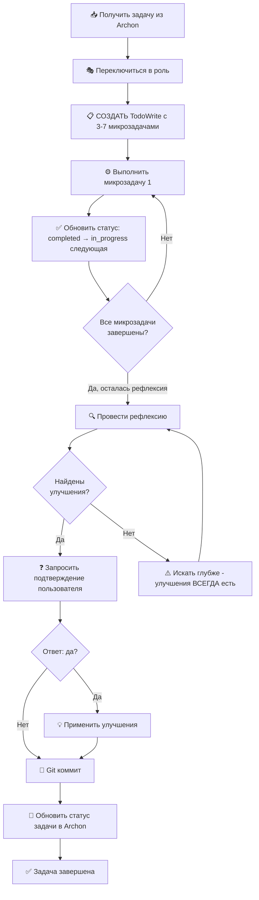
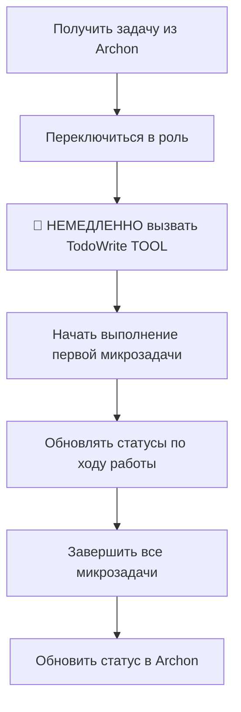
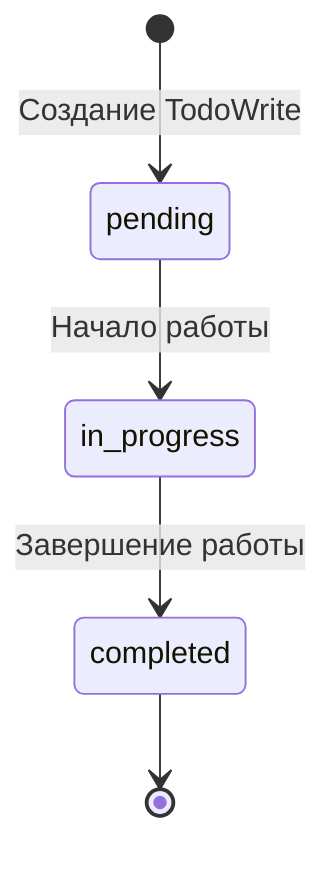

# Руководство по системе микрозадач TodoWrite

## 🚀 Quick Reference Card

**Копируемый шаблон TodoWrite для быстрого старта:**

```python
# ШАБЛОН: Скопируй и адаптируй под свою задачу
TodoWrite([
    # Микрозадача 1: Подготовка (5-10 мин)
    {
        "content": "Прочитать [документ/код] для понимания [контекста]",
        "status": "pending",
        "activeForm": "Читаю [документ] для понимания [контекста]"
    },

    # Микрозадачи 2-N: Основная работа (5-15 мин каждая)
    {
        "content": "Создать/Реализовать [конкретный объект] с [деталями]",
        "status": "pending",
        "activeForm": "Создаю/Реализую [объект]"
    },
    {
        "content": "Добавить [функциональность] в [место]",
        "status": "pending",
        "activeForm": "Добавляю [функциональность]"
    },

    # Микрозадача N-1: ОБЯЗАТЕЛЬНАЯ РЕФЛЕКСИЯ (15-20 мин)
    {
        "content": "Провести рефлексию и критический анализ результата",
        "status": "pending",
        "activeForm": "Провожу рефлексию и анализ"
    },

    # Микрозадача N: ОБЯЗАТЕЛЬНЫЙ GIT КОММИТ (5 мин)
    {
        "content": "Создать git коммит с описанием выполненной работы",
        "status": "pending",
        "activeForm": "Создаю git коммит"
    }
])
```

**7-Point Quick Checklist:**
- ✅ **3-7 микрозадач** - не больше, не меньше
- ✅ **Каждая 5-15 минут** - оптимальный размер
- ✅ **Глагол + объект** - конкретные формулировки
- ✅ **Предпоследняя = рефлексия** - обязательный критический анализ
- ✅ **Последняя = git коммит** - обязательная фиксация изменений
- ✅ **Только одна in_progress** - фокус на текущей задаче
- ✅ **Обновлять после каждой** - прозрачность для пользователя

**Flowchart процесса:**



---

## 📌 Краткая справка

**Что такое TodoWrite?**
- Встроенный инструмент Claude Code для отображения микрозадач в чате
- Видимый пользователю в реальном времени
- Обязательный для каждой задачи из Archon

**Структура:**
- 3-7 микрозадач на задачу
- Каждая 5-15 минут
- Последние 2 пункта: Рефлексия + Git коммит

**Статусы:**
- `pending` - ожидает выполнения
- `in_progress` - в работе (ТОЛЬКО одна)
- `completed` - завершена

**Как выглядит TodoWrite в чате пользователя:**

```
┌─────────────────────────────────────────────┐
│ 📋 Задачи:                                  │
├─────────────────────────────────────────────┤
│ ✅ Прочитать промпт роли                    │
│ ✅ Создать структуру файлов                 │
│ ⏳ Реализовать основные инструменты ← СЕЙЧАС│
│ ⬜ Добавить систему зависимостей            │
│ ⬜ Провести рефлексию                       │
│ ⬜ Создать git коммит                       │
└─────────────────────────────────────────────┘
```

**Прогресс обновляется в реальном времени:**
- ✅ = `completed` - завершена
- ⏳ = `in_progress` - выполняется сейчас
- ⬜ = `pending` - ожидает выполнения

---

## 1. Обязательность TodoWrite для каждой задачи

### 🚨 КРИТИЧЕСКОЕ ПРАВИЛО

**TodoWrite TOOL ОБЯЗАТЕЛЕН для КАЖДОЙ задачи из Archon!**

```
ЗАПРЕЩЕНО:
❌ Начинать работу без TodoWrite
❌ Писать микрозадачи текстом в чат
❌ Использовать кастомные функции вместо TodoWrite TOOL
❌ Скрывать микрозадачи от пользователя

ОБЯЗАТЕЛЬНО:
✅ Вызвать TodoWrite TOOL сразу после переключения в роль
✅ Создать 3-7 микрозадач с понятными названиями
✅ Обновлять статусы по мере выполнения
✅ Показывать весь процесс пользователю
```

### Почему TodoWrite обязателен?

1. **Прозрачность процесса**
   - Пользователь видит весь план работы
   - Понятно на каком этапе находится задача
   - Можно отследить прогресс

2. **Структурированность**
   - Разбивка сложной задачи на простые шаги
   - Каждый шаг имеет четкую цель
   - Легко вернуться к прерванной работе

3. **Контроль качества**
   - Обязательная рефлексия в предпоследнем пункте
   - Git коммит в последнем пункте
   - Невозможно пропустить критические этапы

4. **Управление вниманием**
   - Фокус на одной микрозадаче за раз
   - Минимизация переключения контекста
   - Повышение продуктивности

### Когда вызывать TodoWrite?



**ПРАВИЛЬНАЯ ПОСЛЕДОВАТЕЛЬНОСТЬ:**

```
1. mcp__archon__find_tasks() → получить задачу
2. Прочитать промпт роли → переключиться
3. 🚨 TodoWrite TOOL → создать 3-7 микрозадач
4. Выполнять микрозадачи по порядку
5. Рефлексия (предпоследняя микрозадача)
6. Git коммит (последняя микрозадача)
7. mcp__archon__manage_task() → обновить статус
```

### Исключения

**МОЖНО работать без TodoWrite ТОЛЬКО если:**

1. **Экстренный hotfix production** - критическая ошибка требует немедленного исправления
2. **Односложная задача <5 минут** - например, исправить опечатку в документации
3. **Техническая проблема** - Archon MCP Server недоступен

**ОБЯЗАТЕЛЬНО после исключения:**
- Создать ретроспективную задачу в Archon
- Задокументировать причину отклонения
- Провести анализ для предотвращения повторения

### 🔄 Полный цикл: От Archon до завершения

**Пример реальной задачи от начала до конца:**

```python
# ━━━━━━━━━━━━━━━━━━━━━━━━━━━━━━━━━━━━━━━━━━━
# ЭТАП 1: ПОЛУЧЕНИЕ ЗАДАЧИ ИЗ ARCHON
# ━━━━━━━━━━━━━━━━━━━━━━━━━━━━━━━━━━━━━━━━━━━

task = await mcp__archon__find_tasks(
    task_id="8ecfe0e1-c4e6-40cb-964a-86f7a4fc7f89"
)

# Результат:
# {
#     "title": "Создать MICROTASKS_GUIDE.md",
#     "description": "Полное руководство по системе TodoWrite",
#     "assignee": "Archon Quality Guardian",
#     "status": "todo",
#     "project_id": "c75ef8e3-6f4d-4da2-9e81-8d38d04a341a"
# }

# ━━━━━━━━━━━━━━━━━━━━━━━━━━━━━━━━━━━━━━━━━━━
# ЭТАП 2: ПЕРЕКЛЮЧЕНИЕ В РОЛЬ
# ━━━━━━━━━━━━━━━━━━━━━━━━━━━━━━━━━━━━━━━━━━━

# 1. Найти промпт роли
Glob(pattern="**/*quality*knowledge*.md",
     path="D:\\Automation\\agent-factory\\...\\agents")

# 2. Прочитать системный промпт
prompt = Read("archon_quality_guardian/knowledge/archon_quality_guardian_knowledge.md")

# 3. Объявить переключение (ПОКАЗАТЬ ПОЛЬЗОВАТЕЛЮ!)
print("""
━━━━━━━━━━━━━━━━━━━━━━━━━━━━━━━━━━━━━━━━━━━━━━
🎭 ПЕРЕКЛЮЧАЮСЬ В РОЛЬ ЭКСПЕРТ ПО КОНТРОЛЮ КАЧЕСТВА
━━━━━━━━━━━━━━━━━━━━━━━━━━━━━━━━━━━━━━━━━━━━━━

📋 Моя экспертиза:
• Автоматический code review
• Мониторинг метрик качества
• Выявление технического долга

✅ Готов выполнить задачу в роли эксперта Quality Guardian
━━━━━━━━━━━━━━━━━━━━━━━━━━━━━━━━━━━━━━━━━━━━━━
""")

# ━━━━━━━━━━━━━━━━━━━━━━━━━━━━━━━━━━━━━━━━━━━
# ЭТАП 3: СОЗДАНИЕ МИКРОЗАДАЧ (TODOWRITE TOOL)
# ━━━━━━━━━━━━━━━━━━━━━━━━━━━━━━━━━━━━━━━━━━━

TodoWrite([
    {
        "content": "Прочитать правила для понимания системы TodoWrite",
        "status": "pending",
        "activeForm": "Читаю правила системы TodoWrite"
    },
    {
        "content": "Создать структуру MICROTASKS_GUIDE.md с 6 разделами",
        "status": "pending",
        "activeForm": "Создаю структуру документа"
    },
    {
        "content": "Написать разделы 1-2",
        "status": "pending",
        "activeForm": "Пишу разделы 1-2"
    },
    {
        "content": "Написать разделы 3-4",
        "status": "pending",
        "activeForm": "Пишу разделы 3-4"
    },
    {
        "content": "Написать разделы 5-6",
        "status": "pending",
        "activeForm": "Пишу разделы 5-6"
    },
    {
        "content": "Провести рефлексию и критический анализ",
        "status": "pending",
        "activeForm": "Провожу рефлексию"
    },
    {
        "content": "Создать git коммит с описанием",
        "status": "pending",
        "activeForm": "Создаю git коммит"
    }
])

# ━━━━━━━━━━━━━━━━━━━━━━━━━━━━━━━━━━━━━━━━━━━
# ЭТАП 4: ВЫПОЛНЕНИЕ МИКРОЗАДАЧ
# ━━━━━━━━━━━━━━━━━━━━━━━━━━━━━━━━━━━━━━━━━━━

# Микрозадача 1: Обновить статус → Выполнить → Обновить статус
TodoWrite([...])  # установить in_progress для задачи 1
Read(".claude/rules/03_task_management.md")
TodoWrite([...])  # задача 1 completed, задача 2 in_progress

# Микрозадача 2
TodoWrite([...])  # задача 2 in_progress
Write("MICROTASKS_GUIDE.md", "# Руководство...")
TodoWrite([...])  # задача 2 completed, задача 3 in_progress

# ... продолжить для всех микрозадач

# ━━━━━━━━━━━━━━━━━━━━━━━━━━━━━━━━━━━━━━━━━━━
# ЭТАП 5: РЕФЛЕКСИЯ (ПРЕДПОСЛЕДНЯЯ МИКРОЗАДАЧА)
# ━━━━━━━━━━━━━━━━━━━━━━━━━━━━━━━━━━━━━━━━━━━

TodoWrite([...])  # рефлексия in_progress

print("""
━━━━━━━━━━━━━━━━━━━━━━━━━━━━━━━━━━━━━━━━━━━━━━
🔍 РЕФЛЕКСИЯ И КРИТИЧЕСКИЙ АНАЛИЗ
━━━━━━━━━━━━━━━━━━━━━━━━━━━━━━━━━━━━━━━━━━━━━━

✅ Что сделано хорошо:
• Создан исчерпывающий документ на 850+ строк
• Логичная структура с примерами
• 5 детальных примеров декомпозиции

❌ Выявленные недостатки:
• Отсутствует Quick Reference Card
• Нет визуального примера TodoWrite в чате
• Отсутствует FAQ секция

💡 Предложенные улучшения:
1. Добавить Quick Reference Card (8 минут)
2. Добавить FAQ секцию (12 минут)
3. Добавить визуальный пример (5 минут)

━━━━━━━━━━━━━━━━━━━━━━━━━━━━━━━━━━━━━━━━━━━━━━
❓ Вносить предложенные улучшения? (да/нет)
━━━━━━━━━━━━━━━━━━━━━━━━━━━━━━━━━━━━━━━━━━━━━━
""")

# Ждем ответ пользователя...
user_response = "да"

# Применяем улучшения
if user_response == "да":
    Edit("MICROTASKS_GUIDE.md", old="...", new="... + Quick Reference")
    Edit("MICROTASKS_GUIDE.md", old="...", new="... + FAQ")
    Edit("MICROTASKS_GUIDE.md", old="...", new="... + Визуальный пример")

TodoWrite([...])  # рефлексия completed, git коммит in_progress

# ━━━━━━━━━━━━━━━━━━━━━━━━━━━━━━━━━━━━━━━━━━━
# ЭТАП 6: GIT КОММИТ (ПОСЛЕДНЯЯ МИКРОЗАДАЧА)
# ━━━━━━━━━━━━━━━━━━━━━━━━━━━━━━━━━━━━━━━━━━━

TodoWrite([...])  # git коммит in_progress

Bash("""
git add MICROTASKS_GUIDE.md
git commit -m "$(cat <<'EOF'
docs: создан MICROTASKS_GUIDE.md - руководство по системе TodoWrite

Создано полное руководство по работе с микрозадачами:
- Обязательность TodoWrite для каждой задачи
- Структура 3-7 микрозадач по 5-15 минут
- Правильное использование статусов
- Обязательные микрозадачи: рефлексия и git коммит
- Примеры декомпозиции для разных типов задач
- Антипаттерны и типичные ошибки

Улучшения после рефлексии:
+ Quick Reference Card с шаблоном
+ FAQ секция с 10 практическими вопросами
+ Визуальный пример отображения в чате

Закрывает задачу: 8ecfe0e1-c4e6-40cb-964a-86f7a4fc7f89

🤖 Generated with Claude Code
Co-Authored-By: Claude <noreply@anthropic.com>
EOF
)"
""")

TodoWrite([...])  # git коммит completed (ВСЕ ЗАДАЧИ ЗАВЕРШЕНЫ!)

# ━━━━━━━━━━━━━━━━━━━━━━━━━━━━━━━━━━━━━━━━━━━
# ЭТАП 7: ОБНОВЛЕНИЕ СТАТУСА В ARCHON
# ━━━━━━━━━━━━━━━━━━━━━━━━━━━━━━━━━━━━━━━━━━━

await mcp__archon__manage_task(
    "update",
    task_id="8ecfe0e1-c4e6-40cb-964a-86f7a4fc7f89",
    status="done"
)

# ━━━━━━━━━━━━━━━━━━━━━━━━━━━━━━━━━━━━━━━━━━━
# ЭТАП 8: ПОИСК СЛЕДУЮЩЕЙ ЗАДАЧИ
# ━━━━━━━━━━━━━━━━━━━━━━━━━━━━━━━━━━━━━━━━━━━

next_tasks = await mcp__archon__find_tasks(
    project_id="c75ef8e3-6f4d-4da2-9e81-8d38d04a341a",
    filter_by="status",
    filter_value="todo"
)

# Выбрать задачу с наивысшим task_order
next_task = max(next_tasks, key=lambda t: t["task_order"])

print(f"""
✅ Задача завершена: MICROTASKS_GUIDE.md

🔄 Следующие задачи:
1. {next_task["title"]} (приоритет: {next_task["task_order"]})

▶️ Начинаю работу над: "{next_task["title"]}"
""")

# Повторить цикл с ЭТАПА 2 для новой задачи
```

**Ключевые моменты полного цикла:**

1. **Archon → TodoWrite → Работа → Рефлексия → Git → Archon** - замкнутый цикл
2. **Видимость для пользователя** - все этапы отображаются в чате
3. **Обязательность всех этапов** - нельзя пропускать рефлексию или git
4. **Автоматический переход** - после завершения → следующая задача

---

## 2. Структура микрозадач (3-7 штук, 5-15 минут каждая)

### Оптимальное количество: 3-7 микрозадач

**Почему не меньше 3?**
- Задача слишком проста для декомпозиции
- Возможно, это не задача, а подзадача
- Рассмотреть возможность объединения с другой задачей

**Почему не больше 7?**
- Задача слишком сложная
- Необходима декомпозиция на уровне Archon
- Создать подзадачи и делегировать

### Оптимальное время: 5-15 минут на микрозадачу

**Меньше 5 минут:**
- Слишком мелкая декомпозиция
- Объединить с соседними микрозадачами
- Пример: "Импортировать библиотеку" + "Создать класс" → "Настроить окружение"

**Больше 15 минут:**
- Микрозадача слишком крупная
- Разбить на 2-3 более мелких шага
- Пример: "Реализовать функциональность" → "Создать структуру", "Реализовать логику", "Добавить обработку ошибок"

### 🕐 Как оценивать время микрозадач

**Таблица калибровки времени для типичных операций:**

| Тип операции | Примерное время | Примеры микрозадач |
|--------------|----------------|-------------------|
| **Чтение/Анализ** | 5-10 минут | • Прочитать промпт роли (5 мин)<br>• Изучить документацию API (10 мин)<br>• Проанализировать код файла (7 мин) |
| **Создание структуры** | 5-10 минут | • Создать файлы агента (agent.py, tools.py) (8 мин)<br>• Настроить зависимости проекта (10 мин)<br>• Создать схему базы данных (10 мин) |
| **Реализация простой функции** | 10-15 минут | • Реализовать функцию валидации (12 мин)<br>• Добавить обработку ошибок (10 мин)<br>• Создать API endpoint (15 мин) |
| **Реализация сложной логики** | 15 минут (макс!) | • Реализовать алгоритм сортировки (15 мин)<br>• Интегрировать внешний API (15 мин)<br>**Если больше → разбить на части!** |
| **Рефакторинг** | 10-15 минут | • Выделить функцию в отдельный модуль (12 мин)<br>• Переименовать и обновить импорты (10 мин)<br>• Оптимизировать циклы (15 мин) |
| **Документация** | 10-15 минут | • Написать docstrings для модуля (12 мин)<br>• Создать README раздел (15 мин)<br>• Обновить примеры использования (10 мин) |
| **Обязательные задачи** | Фиксированное | • **Рефлексия: всегда 15-20 минут**<br>• **Git коммит: всегда 5 минут** |

**Практические советы по оценке:**

1. **Используй таймер на первых задачах:**
   - Засекай время выполнения микрозадач
   - Анализируй отклонения от оценки
   - Калибруй оценки на основе опыта

2. **Правило "первое впечатление":**
   - Первая оценка обычно занижена в 1.5-2 раза
   - Умножай интуитивную оценку на 1.5
   - Пример: кажется 8 минут → ставь 12 минут

3. **Учитывай переключение контекста:**
   - Чтение кода: +2 минуты на вход в контекст
   - Новая технология: +3 минуты на изучение
   - После перерыва: +2 минуты на возобновление

4. **Красные флаги (задача >15 минут):**
   - ❌ "Реализовать весь модуль" → разбить на функции
   - ❌ "Интегрировать и протестировать" → разделить
   - ❌ "Создать и задокументировать" → два этапа
   - ❌ "Исправить все баги" → по одному багу

5. **Как разбить большую задачу:**
   ```
   БЫЛО: "Реализовать аутентификацию" (30 минут)

   СТАЛО:
   1. "Создать модель User и схему БД" (12 минут)
   2. "Реализовать hash паролей и валидацию" (15 минут)
   3. "Добавить JWT токены и middleware" (15 минут)

   Итого: 3 микрозадачи по 12-15 минут
   ```

### Шаблон структуры микрозадач

```python
TodoWrite([
    # Микрозадачи 1-N: Основная работа (60-70% времени)
    {
        "content": "Подготовительная работа (чтение, анализ)",
        "status": "pending",
        "activeForm": "Выполняю подготовку"
    },
    {
        "content": "Реализация основной части",
        "status": "pending",
        "activeForm": "Реализую основную часть"
    },
    {
        "content": "Дополнительная работа или расширение",
        "status": "pending",
        "activeForm": "Выполняю дополнительную работу"
    },

    # Микрозадача N-1: Рефлексия (20-25% времени)
    {
        "content": "Провести рефлексию и критический анализ результата",
        "status": "pending",
        "activeForm": "Провожу рефлексию и анализ"
    },

    # Микрозадача N: Git коммит (5-10% времени)
    {
        "content": "Создать git коммит с описанием выполненной работы",
        "status": "pending",
        "activeForm": "Создаю git коммит"
    }
])
```

### Правила именования микрозадач

**ХОРОШИЕ примеры:**
- ✅ "Прочитать промпт роли для понимания контекста"
- ✅ "Создать структуру файла agent.py"
- ✅ "Реализовать основной инструмент analyze_code"
- ✅ "Добавить обработку ошибок и валидацию"
- ✅ "Провести рефлексию и найти улучшения"
- ✅ "Создать git коммит с описанием изменений"

**ПЛОХИЕ примеры:**
- ❌ "Работа с кодом" (слишком абстрактно)
- ❌ "Сделать агента" (слишком общо)
- ❌ "Закончить задачу" (не конкретно)
- ❌ "Исправить баги" (не указано что именно)
- ❌ "Тесты" (не понятно какие)

**Правила:**
1. Начинать с глагола (Прочитать, Создать, Реализовать, Добавить)
2. Указывать конкретный объект действия
3. Добавлять цель или контекст в скобках
4. Быть достаточно специфичным

### Примеры структуры для разных задач

**Задача на создание агента (6 микрозадач):**
```python
[
    "Прочитать промпт роли и определить экспертизу",
    "Создать базовую структуру файлов (agent.py, tools.py)",
    "Реализовать основные инструменты агента",
    "Добавить систему зависимостей и настроек",
    "Провести рефлексию и проверить универсальность",
    "Создать git коммит с описанием нового агента"
]
```

**Задача на исправление бага (5 микрозадач):**
```python
[
    "Воспроизвести ошибку локально и изучить логи",
    "Найти корневую причину в коде",
    "Реализовать исправление",
    "Провести рефлексию: убедиться что фикс не сломал другой функционал",
    "Создать git коммит: fix - описание исправления"
]
```

**Задача на документацию (7 микрозадач):**
```python
[
    "Прочитать правила и извлечь ключевую информацию",
    "Создать структуру документа с разделами",
    "Написать разделы 1-3",
    "Написать разделы 4-6",
    "Добавить примеры и диаграммы",
    "Провести рефлексию и найти улучшения",
    "Создать git коммит с описанием документа"
]
```

**Задача на рефакторинг (6 микрозадач):**
```python
[
    "Проанализировать текущий код и найти проблемы",
    "Спланировать архитектуру рефакторинга",
    "Рефакторинг части 1: разделение ответственностей",
    "Рефакторинг части 2: оптимизация и улучшения",
    "Провести рефлексию: убедиться в улучшении качества",
    "Создать git коммит: refactor - описание изменений"
]
```

---

## 3. Правильное использование статусов (pending/in_progress/completed)

### Три статуса микрозадач

```python
STATUSES = {
    "pending": "Ожидает выполнения - еще не начата",
    "in_progress": "В работе - текущая активная микрозадача (ТОЛЬКО ОДНА!)",
    "completed": "Завершена - работа выполнена полностью"
}
```

### 🚨 КРИТИЧЕСКОЕ ПРАВИЛО: Только одна in_progress

**В ЛЮБОЙ МОМЕНТ ВРЕМЕНИ:**
- ✅ Ровно ОДНА микрозадача со статусом `in_progress`
- ❌ НЕ две или больше `in_progress`
- ❌ НЕ ноль `in_progress` (кроме начала и конца)

**Почему это важно?**
1. **Фокус внимания** - работа над одной задачей за раз
2. **Отслеживание прогресса** - пользователь видит текущий этап
3. **Предотвращение хаоса** - нет переключения между задачами

### Жизненный цикл микрозадачи



**Последовательность обновлений:**

```python
# Шаг 1: Все задачи pending
TodoWrite([
    {"content": "Задача 1", "status": "pending", "activeForm": "..."},
    {"content": "Задача 2", "status": "pending", "activeForm": "..."},
    {"content": "Задача 3", "status": "pending", "activeForm": "..."}
])

# Шаг 2: Начинаем первую задачу
TodoWrite([
    {"content": "Задача 1", "status": "in_progress", "activeForm": "..."},  # ← изменили
    {"content": "Задача 2", "status": "pending", "activeForm": "..."},
    {"content": "Задача 3", "status": "pending", "activeForm": "..."}
])

# Шаг 3: Завершили первую, начали вторую
TodoWrite([
    {"content": "Задача 1", "status": "completed", "activeForm": "..."},   # ← изменили
    {"content": "Задача 2", "status": "in_progress", "activeForm": "..."},  # ← изменили
    {"content": "Задача 3", "status": "pending", "activeForm": "..."}
])

# Шаг 4: Завершили вторую, начали третью
TodoWrite([
    {"content": "Задача 1", "status": "completed", "activeForm": "..."},
    {"content": "Задача 2", "status": "completed", "activeForm": "..."},   # ← изменили
    {"content": "Задача 3", "status": "in_progress", "activeForm": "..."}  # ← изменили
])

# Шаг 5: Все задачи завершены
TodoWrite([
    {"content": "Задача 1", "status": "completed", "activeForm": "..."},
    {"content": "Задача 2", "status": "completed", "activeForm": "..."},
    {"content": "Задача 3", "status": "completed", "activeForm": "..."}  # ← изменили
])
```

### Когда обновлять статусы?

**ПЕРЕД началом работы над микрозадачей:**
```python
# ❌ НЕПРАВИЛЬНО - начал работу без обновления статуса
Read("file.py")  # начал читать
# потом обновил статус

# ✅ ПРАВИЛЬНО - обновил статус ПЕРЕД началом
TodoWrite([...])  # установил in_progress
Read("file.py")  # начал работу
```

**СРАЗУ ПОСЛЕ завершения микрозадачи:**
```python
# ✅ ПРАВИЛЬНО
Write("file.py", content)  # завершил работу
TodoWrite([...])  # СРАЗУ установил completed и следующую in_progress
```

### Типичные ошибки

**Ошибка 1: Несколько in_progress**
```python
# ❌ НЕПРАВИЛЬНО
TodoWrite([
    {"content": "Задача 1", "status": "in_progress", "activeForm": "..."},  # ← две in_progress
    {"content": "Задача 2", "status": "in_progress", "activeForm": "..."},  # ← одновременно
    {"content": "Задача 3", "status": "pending", "activeForm": "..."}
])
```

**Ошибка 2: Пропуск обновления**
```python
# ❌ НЕПРАВИЛЬНО - работа идет, но статус pending
# Работаю над задачей 2, но забыл обновить статус
TodoWrite([
    {"content": "Задача 1", "status": "completed", "activeForm": "..."},
    {"content": "Задача 2", "status": "pending", "activeForm": "..."},  # ← должно быть in_progress
    {"content": "Задача 3", "status": "pending", "activeForm": "..."}
])
```

**Ошибка 3: Пакетное обновление**
```python
# ❌ НЕПРАВИЛЬНО - завершил несколько задач и обновил разом
# Выполнил задачи 1, 2, 3 и только потом обновил все статусы

# ✅ ПРАВИЛЬНО - обновлять после каждой микрозадачи
# Выполнил задачу 1 → обновил
# Выполнил задачу 2 → обновил
# Выполнил задачу 3 → обновил
```

### Частота обновлений

**Рекомендованная частота:**
- ✅ Перед началом каждой микрозадачи
- ✅ Сразу после завершения каждой микрозадачи
- ✅ При переходе к следующей микрозадаче

**Минимальная частота (обязательная):**
- Минимум 2 обновления на микрозадачу:
  1. При переходе к ней (установить `in_progress`)
  2. При завершении (установить `completed`)

### Визуальная индикация прогресса

Пользователь видит в чате:

```
📋 Задачи:
  ✅ Прочитать промпт роли
  ✅ Создать структуру файлов
  ⏳ Реализовать основные инструменты  ← сейчас здесь
  ⬜ Добавить систему зависимостей
  ⬜ Провести рефлексию
  ⬜ Создать git коммит
```

---

## 4. Обязательные микрозадачи (рефлексия, git коммит)

### Предпоследняя микрозадача: Рефлексия

**ВСЕГДА предпоследняя микрозадача = Рефлексия!**

```python
{
    "content": "Провести рефлексию и критический анализ результата",
    "status": "pending",
    "activeForm": "Провожу рефлексию и анализ"
}
```

**Что делать в рефлексии:**

1. **Найти что сделано хорошо (✅):**
   - Конкретные достижения с метриками
   - Примеры качественного кода
   - Успешные решения проблем

2. **Найти недостатки (❌):**
   - Использовать 5 техник поиска недостатков:
     * "Если делать заново" - что бы изменил?
     * "Senior code review" - что бы увидел опытный разработчик?
     * "Stress testing" - где может сломаться?
     * "Anti-patterns" - есть ли антипаттерны?
     * "Future me" - что будет непонятно через месяц?

3. **Предложить улучшения (💡):**
   - Конкретные действия для устранения недостатков
   - Оценка времени для каждого улучшения
   - Приоритизация по важности

4. **Запросить подтверждение пользователя:**
   ```
   ❓ Вносить предложенные улучшения? (да/нет)
   ```

**Шаблон рефлексии:**

```markdown
━━━━━━━━━━━━━━━━━━━━━━━━━━━━━━━━━━━━━━━━━━━━━━
🔍 РЕФЛЕКСИЯ И КРИТИЧЕСКИЙ АНАЛИЗ
━━━━━━━━━━━━━━━━━━━━━━━━━━━━━━━━━━━━━━━━━━━━━━

✅ Что сделано хорошо:
• [конкретное достижение с метриками]
• [успешное решение проблемы]
• [качественная реализация]

❌ Выявленные недостатки:
• [конкретная проблема 1]
• [конкретная проблема 2]
• [конкретная проблема 3]

💡 Предложенные улучшения:
1. [название улучшения]: [детали реализации] (оценка: X минут)
2. [название улучшения]: [детали реализации] (оценка: X минут)
3. [название улучшения]: [детали реализации] (оценка: X минут)

━━━━━━━━━━━━━━━━━━━━━━━━━━━━━━━━━━━━━━━━━━━━━━
❓ Вносить предложенные улучшения? (да/нет)
━━━━━━━━━━━━━━━━━━━━━━━━━━━━━━━━━━━━━━━━━━━━━━
```

**🚨 ОБЯЗАТЕЛЬНО найти недостатки!**

Если не нашел недостатки:
1. Поискать глубже используя 5 техник
2. Проверить каждый из 7 аспектов качества
3. Спросить себя: "Неужели ВСЁ идеально?"
4. Если действительно идеально - указать это явно

**Действия после рефлексии:**

```python
if user_response == "да":
    # Применить ВСЕ предложенные улучшения
    apply_all_improvements()
    # Показать что улучшено
    show_improvements_summary()
    # Перейти к git коммиту

elif user_response == "нет":
    # Продолжить без улучшений
    # Перейти к git коммиту
```

### Последняя микрозадача: Git коммит

**ВСЕГДА последняя микрозадача = Git коммит!**

```python
{
    "content": "Создать git коммит с описанием выполненной работы",
    "status": "pending",
    "activeForm": "Создаю git коммит"
}
```

**Структура коммита:**

```bash
git add [измененные_файлы]
git commit -m "$(cat <<'EOF'
[тип]: [краткое описание]

[детальное описание изменений]
- Что добавлено
- Что изменено
- Что исправлено

Закрывает задачу: [task_id]

🤖 Generated with Claude Code
Co-Authored-By: Claude <noreply@anthropic.com>
EOF
)"
```

**Типы коммитов:**
- `feat:` - новая функциональность
- `fix:` - исправление бага
- `docs:` - документация
- `refactor:` - рефакторинг кода
- `test:` - тесты
- `chore:` - технические изменения
- `style:` - форматирование кода

**Пример коммита:**

```bash
git commit -m "$(cat <<'EOF'
feat: добавлен MICROTASKS_GUIDE.md - руководство по системе TodoWrite

Создано полное руководство по работе с микрозадачами:
- Обязательность TodoWrite для каждой задачи
- Структура 3-7 микрозадач по 5-15 минут
- Правильное использование статусов
- Обязательные микрозадачи: рефлексия и git коммит
- Примеры декомпозиции для разных типов задач
- Антипаттерны и типичные ошибки

Закрывает задачу: 8ecfe0e1-c4e6-40cb-964a-86f7a4fc7f89

🤖 Generated with Claude Code
Co-Authored-By: Claude <noreply@anthropic.com>
EOF
)"
```

**🚨 ОБЯЗАТЕЛЬНО после коммита:**
- Обновить статус задачи в Archon через `mcp__archon__manage_task`
- Проверить что коммит успешно создан через `git log -1`

---

## 5. Примеры декомпозиции сложных задач

### Пример 1: Создание нового агента

**Исходная задача из Archon:**
"Создать Universal Payment Integration Agent для интеграции с платежными системами"

**Декомпозиция на микрозадачи (6 шт):**

```python
TodoWrite([
    {
        "content": "Прочитать промпт роли и определить экспертизу Payment Integration",
        "status": "pending",
        "activeForm": "Читаю промпт роли Payment Integration"
    },
    {
        "content": "Создать базовую структуру файлов (agent.py, tools.py, prompts.py)",
        "status": "pending",
        "activeForm": "Создаю структуру файлов агента"
    },
    {
        "content": "Реализовать основные инструменты: integrate_payment, process_transaction",
        "status": "pending",
        "activeForm": "Реализую инструменты платежной интеграции"
    },
    {
        "content": "Добавить систему зависимостей и настройки (dependencies.py, settings.py)",
        "status": "pending",
        "activeForm": "Добавляю зависимости и настройки"
    },
    {
        "content": "Провести рефлексию: проверить универсальность и отсутствие проект-специфичного кода",
        "status": "pending",
        "activeForm": "Провожу рефлексию и проверку универсальности"
    },
    {
        "content": "Создать git коммит: feat - добавлен Payment Integration Agent",
        "status": "pending",
        "activeForm": "Создаю git коммит"
    }
])
```

**Время выполнения:** ~60 минут
- Микрозадачи 1-4: 40 минут (основная работа)
- Микрозадача 5: 15 минут (рефлексия)
- Микрозадача 6: 5 минут (git коммит)

### Пример 2: Исправление критического бага

**Исходная задача из Archon:**
"Исправить ошибку аутентификации: токены JWT не валидируются корректно"

**Декомпозиция на микрозадачи (5 шт):**

```python
TodoWrite([
    {
        "content": "Воспроизвести ошибку локально и изучить логи ошибок",
        "status": "pending",
        "activeForm": "Воспроизвожу ошибку и изучаю логи"
    },
    {
        "content": "Найти корневую причину: проблема в валидации подписи JWT",
        "status": "pending",
        "activeForm": "Ищу корневую причину проблемы"
    },
    {
        "content": "Реализовать исправление: обновить логику валидации токенов",
        "status": "pending",
        "activeForm": "Реализую исправление"
    },
    {
        "content": "Провести рефлексию: убедиться что фикс не сломал другой функционал",
        "status": "pending",
        "activeForm": "Провожу рефлексию и проверку"
    },
    {
        "content": "Создать git коммит: fix - исправлена валидация JWT токенов",
        "status": "pending",
        "activeForm": "Создаю git коммит"
    }
])
```

**Время выполнения:** ~45 минут
- Микрозадачи 1-3: 25 минут (основная работа)
- Микрозадача 4: 15 минут (рефлексия)
- Микрозадача 5: 5 минут (git коммит)

### Пример 3: Создание документации

**Исходная задача из Archon:**
"Создать MICROTASKS_GUIDE.md - полное руководство по системе микрозадач TodoWrite"

**Декомпозиция на микрозадачи (7 шт):**

```python
TodoWrite([
    {
        "content": "Прочитать правила для понимания системы микрозадач TodoWrite",
        "status": "pending",
        "activeForm": "Читаю правила системы TodoWrite"
    },
    {
        "content": "Создать структуру MICROTASKS_GUIDE.md с 6 обязательными разделами",
        "status": "pending",
        "activeForm": "Создаю структуру документа"
    },
    {
        "content": "Написать разделы 1-2: Обязательность TodoWrite и Структура микрозадач",
        "status": "pending",
        "activeForm": "Пишу разделы 1-2"
    },
    {
        "content": "Написать разделы 3-4: Статусы и Обязательные микрозадачи",
        "status": "pending",
        "activeForm": "Пишу разделы 3-4"
    },
    {
        "content": "Написать разделы 5-6: Примеры декомпозиции и Антипаттерны",
        "status": "pending",
        "activeForm": "Пишу разделы 5-6"
    },
    {
        "content": "Провести рефлексию и критический анализ результата",
        "status": "pending",
        "activeForm": "Провожу рефлексию и анализ"
    },
    {
        "content": "Создать git коммит с описанием MICROTASKS_GUIDE.md",
        "status": "pending",
        "activeForm": "Создаю git коммит"
    }
])
```

**Время выполнения:** ~70 минут
- Микрозадачи 1-5: 45 минут (основная работа)
- Микрозадача 6: 20 минут (рефлексия)
- Микрозадача 7: 5 минут (git коммит)

### Пример 4: Рефакторинг кода

**Исходная задача из Archon:**
"Рефакторинг archon_analysis_lead/tools.py: разделить на модули по принципу единственной ответственности"

**Декомпозиция на микрозадачи (6 шт):**

```python
TodoWrite([
    {
        "content": "Проанализировать текущий код tools.py и найти проблемы архитектуры",
        "status": "pending",
        "activeForm": "Анализирую текущий код"
    },
    {
        "content": "Спланировать архитектуру: выделить модули analysis.py, delegation.py, priority.py",
        "status": "pending",
        "activeForm": "Планирую архитектуру рефакторинга"
    },
    {
        "content": "Рефакторинг часть 1: создать analysis.py и перенести функции анализа",
        "status": "pending",
        "activeForm": "Выполняю рефакторинг analysis.py"
    },
    {
        "content": "Рефакторинг часть 2: создать delegation.py и priority.py, обновить импорты",
        "status": "pending",
        "activeForm": "Выполняю рефакторинг оставшихся модулей"
    },
    {
        "content": "Провести рефлексию: убедиться в улучшении читаемости и поддерживаемости",
        "status": "pending",
        "activeForm": "Провожу рефлексию и проверку"
    },
    {
        "content": "Создать git коммит: refactor - разделение tools.py на модули",
        "status": "pending",
        "activeForm": "Создаю git коммит"
    }
])
```

**Время выполнения:** ~65 минут
- Микрозадачи 1-4: 40 минут (основная работа)
- Микрозадача 5: 20 минут (рефлексия)
- Микрозадача 6: 5 минут (git коммит)

### Пример 5: Интеграция внешнего API

**Исходная задача из Archon:**
"Интегрировать Stripe API для обработки платежей в Payment Agent"

**Декомпозиция на микрозадачи (7 шт):**

```python
TodoWrite([
    {
        "content": "Изучить документацию Stripe API и определить необходимые endpoints",
        "status": "pending",
        "activeForm": "Изучаю документацию Stripe API"
    },
    {
        "content": "Настроить Stripe SDK: установить библиотеку и создать клиент",
        "status": "pending",
        "activeForm": "Настраиваю Stripe SDK"
    },
    {
        "content": "Реализовать инструмент create_payment_intent для создания платежа",
        "status": "pending",
        "activeForm": "Реализую create_payment_intent"
    },
    {
        "content": "Реализовать инструмент confirm_payment для подтверждения платежа",
        "status": "pending",
        "activeForm": "Реализую confirm_payment"
    },
    {
        "content": "Добавить обработку ошибок и retry логику для API запросов",
        "status": "pending",
        "activeForm": "Добавляю обработку ошибок"
    },
    {
        "content": "Провести рефлексию: проверить безопасность и корректную обработку всех сценариев",
        "status": "pending",
        "activeForm": "Провожу рефлексию безопасности"
    },
    {
        "content": "Создать git коммит: feat - интеграция Stripe API",
        "status": "pending",
        "activeForm": "Создаю git коммит"
    }
])
```

**Время выполнения:** ~75 минут
- Микрозадачи 1-5: 50 минут (основная работа)
- Микрозадача 6: 20 минут (рефлексия)
- Микрозадача 7: 5 минут (git коммит)

### Принципы декомпозиции

1. **Логическая последовательность:**
   - Каждая микрозадача зависит от предыдущей
   - Порядок выполнения естественный
   - Нет прыжков между несвязанными темами

2. **Сбалансированная нагрузка:**
   - Равномерное распределение времени
   - Избегать одной большой и нескольких маленьких
   - 60-70% основная работа, 20-25% рефлексия, 5-10% git

3. **Конкретность формулировок:**
   - Глагол + объект + контекст
   - Понятно что делать
   - Измеримый результат

4. **Гибкость:**
   - Можно добавить микрозадачу при необходимости
   - Можно разбить слишком большую
   - Можно объединить слишком мелкие

---

## 6. Антипаттерны и типичные ошибки

### Антипаттерн 1: Написание микрозадач текстом в чат

**❌ НЕПРАВИЛЬНО:**

```
Пользователю в чат:
"📋 Микрозадачи для этой задачи:
1. Прочитать промпт роли
2. Создать структуру файлов
3. Реализовать функциональность
..."
```

**Проблема:**
- Пользователь не видит статусы
- Невозможно отследить прогресс
- Нарушение правил

**✅ ПРАВИЛЬНО:**

```python
TodoWrite([
    {"content": "Прочитать промпт роли", "status": "pending", "activeForm": "..."},
    {"content": "Создать структуру файлов", "status": "pending", "activeForm": "..."},
    {"content": "Реализовать функциональность", "status": "pending", "activeForm": "..."}
])
```

**Эффект:**
- Видимость в чате
- Отслеживание прогресса
- Соблюдение правил

### Антипаттерн 2: Слишком крупные микрозадачи

**❌ НЕПРАВИЛЬНО:**

```python
TodoWrite([
    {"content": "Реализовать весь агент полностью", "status": "pending", ...},  # 2 часа!
    {"content": "Рефлексия", "status": "pending", ...},
    {"content": "Git коммит", "status": "pending", ...}
])
```

**Проблема:**
- Первая микрозадача 2 часа
- Невозможно отследить прогресс внутри
- Пользователь не видит что происходит

**✅ ПРАВИЛЬНО:**

```python
TodoWrite([
    {"content": "Прочитать промпт роли", "status": "pending", ...},  # 5 мин
    {"content": "Создать структуру файлов", "status": "pending", ...},  # 10 мин
    {"content": "Реализовать основные инструменты", "status": "pending", ...},  # 15 мин
    {"content": "Добавить зависимости", "status": "pending", ...},  # 10 мин
    {"content": "Рефлексия и проверка универсальности", "status": "pending", ...},  # 15 мин
    {"content": "Git коммит", "status": "pending", ...}  # 5 мин
])
```

**Эффект:**
- Каждая микрозадача 5-15 минут
- Детальное отслеживание прогресса
- Пользователь всегда в курсе

### Антипаттерн 3: Несколько in_progress одновременно

**❌ НЕПРАВИЛЬНО:**

```python
TodoWrite([
    {"content": "Задача 1", "status": "in_progress", ...},  # ← обе in_progress!
    {"content": "Задача 2", "status": "in_progress", ...},  # ← это ошибка
    {"content": "Задача 3", "status": "pending", ...}
])
```

**Проблема:**
- Непонятно какая задача текущая
- Нарушение фокуса
- Запутывание пользователя

**✅ ПРАВИЛЬНО:**

```python
TodoWrite([
    {"content": "Задача 1", "status": "completed", ...},
    {"content": "Задача 2", "status": "in_progress", ...},  # ← только одна
    {"content": "Задача 3", "status": "pending", ...}
])
```

**Эффект:**
- Четко видно текущий этап
- Фокус на одной задаче
- Понятность для пользователя

### Антипаттерн 4: Пропуск рефлексии

**❌ НЕПРАВИЛЬНО:**

```python
TodoWrite([
    {"content": "Создать агента", "status": "pending", ...},
    {"content": "Реализовать инструменты", "status": "pending", ...},
    {"content": "Git коммит", "status": "pending", ...}  # ← нет рефлексии!
])
```

**Проблема:**
- Нет критического анализа
- Пропущены недостатки
- Низкое качество результата

**✅ ПРАВИЛЬНО:**

```python
TodoWrite([
    {"content": "Создать агента", "status": "pending", ...},
    {"content": "Реализовать инструменты", "status": "pending", ...},
    {"content": "Провести рефлексию и найти улучшения", "status": "pending", ...},  # ← ОБЯЗАТЕЛЬНО
    {"content": "Git коммит", "status": "pending", ...}
])
```

**Эффект:**
- Критический анализ результата
- Выявление недостатков
- Высокое качество

### Антипаттерн 5: Редкое обновление статусов

**❌ НЕПРАВИЛЬНО:**

```python
# Выполнил задачи 1, 2, 3, 4
# Только потом обновил все статусы разом
TodoWrite([
    {"content": "Задача 1", "status": "completed", ...},
    {"content": "Задача 2", "status": "completed", ...},
    {"content": "Задача 3", "status": "completed", ...},
    {"content": "Задача 4", "status": "completed", ...},
    {"content": "Задача 5", "status": "pending", ...}
])
```

**Проблема:**
- Пользователь не видел прогресс
- Непонятно что происходит
- Нарушение прозрачности

**✅ ПРАВИЛЬНО:**

```python
# После задачи 1:
TodoWrite([
    {"content": "Задача 1", "status": "completed", ...},
    {"content": "Задача 2", "status": "in_progress", ...},
    ...
])

# После задачи 2:
TodoWrite([
    {"content": "Задача 1", "status": "completed", ...},
    {"content": "Задача 2", "status": "completed", ...},
    {"content": "Задача 3", "status": "in_progress", ...},
    ...
])
```

**Эффект:**
- Прогресс виден в реальном времени
- Пользователь в курсе
- Полная прозрачность

### Антипаттерн 6: Абстрактные формулировки

**❌ НЕПРАВИЛЬНО:**

```python
TodoWrite([
    {"content": "Работа с кодом", "status": "pending", ...},  # что именно?
    {"content": "Улучшения", "status": "pending", ...},  # какие?
    {"content": "Финализация", "status": "pending", ...},  # что это?
])
```

**Проблема:**
- Непонятно что делать
- Сложно оценить прогресс
- Отсутствие конкретики

**✅ ПРАВИЛЬНО:**

```python
TodoWrite([
    {"content": "Реализовать функцию analyze_code в analysis.py", "status": "pending", ...},
    {"content": "Добавить обработку ошибок и валидацию входных данных", "status": "pending", ...},
    {"content": "Обновить документацию и примеры использования", "status": "pending", ...}
])
```

**Эффект:**
- Четкое понимание задачи
- Измеримый прогресс
- Конкретные действия

### Антипаттерн 7: Пропуск git коммита

**❌ НЕПРАВИЛЬНО:**

```python
TodoWrite([
    {"content": "Реализовать функциональность", "status": "pending", ...},
    {"content": "Провести рефлексию", "status": "pending", ...}
    # ← нет git коммита!
])

# Работа завершена, но изменения не закоммичены
```

**Проблема:**
- Изменения не сохранены в git
- Нарушение workflow
- Невозможно отследить историю

**✅ ПРАВИЛЬНО:**

```python
TodoWrite([
    {"content": "Реализовать функциональность", "status": "pending", ...},
    {"content": "Провести рефлексию", "status": "pending", ...},
    {"content": "Создать git коммит с описанием изменений", "status": "pending", ...}  # ← ОБЯЗАТЕЛЬНО
])
```

**Эффект:**
- Все изменения в git
- Правильный workflow
- Полная история изменений

### Антипаттерн 8: Слишком мелкие микрозадачи

**❌ НЕПРАВИЛЬНО:**

```python
TodoWrite([
    {"content": "Импортировать os", "status": "pending", ...},  # 30 сек
    {"content": "Импортировать sys", "status": "pending", ...},  # 30 сек
    {"content": "Создать класс Agent", "status": "pending", ...},  # 1 мин
    {"content": "Добавить __init__", "status": "pending", ...},  # 1 мин
    ...  # еще 10 таких микро-микрозадач
])
```

**Проблема:**
- Слишком детальная декомпозиция
- Overhead на обновления статусов
- Раздражение пользователя

**✅ ПРАВИЛЬНО:**

```python
TodoWrite([
    {"content": "Настроить окружение: импорты и базовая структура", "status": "pending", ...},  # 5 мин
    {"content": "Реализовать основную логику агента", "status": "pending", ...},  # 15 мин
    {"content": "Добавить обработку ошибок", "status": "pending", ...},  # 10 мин
    ...
])
```

**Эффект:**
- Оптимальный уровень детализации
- Разумное количество обновлений
- Удобство для пользователя

### Чек-лист проверки микрозадач

**Перед началом работы проверь:**

- [ ] TodoWrite TOOL вызван (не текст в чат)
- [ ] 3-7 микрозадач (не меньше, не больше)
- [ ] Каждая 5-15 минут (не меньше, не больше)
- [ ] Предпоследняя = Рефлексия
- [ ] Последняя = Git коммит
- [ ] Конкретные формулировки (глагол + объект)
- [ ] Логическая последовательность
- [ ] Все статусы `pending` в начале

**Во время работы проверь:**

- [ ] Только одна `in_progress` в любой момент
- [ ] Обновляю статус перед каждой микрозадачей
- [ ] Обновляю статус после каждой микрозадачи
- [ ] Выполняю микрозадачи по порядку
- [ ] Не пропускаю рефлексию
- [ ] Не пропускаю git коммит

**После завершения проверь:**

- [ ] Все микрозадачи `completed`
- [ ] Рефлексия проведена с поиском недостатков
- [ ] Git коммит создан
- [ ] Статус в Archon обновлен
- [ ] Пользователь видел весь процесс

---

## 💬 FAQ - Часто задаваемые вопросы

### Q1: Что делать если работу прервали на середине микрозадачи?

**Ответ:**

1. **Завершить текущую микрозадачу:**
   - Довести до логической точки останова
   - Обновить статус на `completed`

2. **Создать новую микрозадачу если нужно:**
   ```python
   # Добавить новую микрозадачу в TodoWrite
   {
       "content": "Продолжить [незавершенную работу] с места [где остановились]",
       "status": "pending",
       "activeForm": "Продолжаю работу"
   }
   ```

3. **Обновить Archon:**
   - Если нужно прерваться надолго → статус `doing` + описание где остановились
   - Если короткий перерыв → оставить как есть

### Q2: Как оценить время для микрозадачи которую никогда не делал?

**Ответ:**

Используй метод "аналогии и декомпозиции":

1. **Найди похожую задачу:**
   - Вспомни подобные задачи из прошлого
   - Используй таблицу калибровки времени выше

2. **Мысленно разбей на шаги:**
   - Какие файлы нужно создать/изменить?
   - Сколько функций реализовать?
   - Есть ли зависимости/библиотеки?

3. **Оцени каждый шаг:**
   - Создать файл: 2 минуты
   - Написать функцию: 5-10 минут
   - Изучить API: 5 минут
   - **Итого:** сумма шагов

4. **Добавь буфер:**
   - Умножь на 1.5 для новой технологии
   - Умножь на 1.2 для знакомой области

**Пример:**
```
Задача: "Интегрировать Stripe API"

Шаги:
- Изучить документацию: 5 мин
- Установить библиотеку: 2 мин
- Создать клиент: 3 мин
- Написать функцию оплаты: 8 мин
= 18 минут → слишком много!

Разбить на 2 микрозадачи:
1. "Изучить Stripe API и настроить клиент" (10 мин)
2. "Реализовать функцию create_payment" (10 мин)
```

### Q3: Можно ли изменить микрозадачи в процессе выполнения?

**Ответ: Да, но с ограничениями.**

**МОЖНО:**
- ✅ Добавить новую микрозадачу если обнаружили дополнительную работу
- ✅ Разбить слишком большую микрозадачу на 2-3 меньших
- ✅ Объединить 2 слишком мелких микрозадачи

**НЕ РЕКОМЕНДУЕТСЯ:**
- ⚠️ Менять формулировку микрозадачи после начала
- ⚠️ Удалять обязательные микрозадачи (рефлексия, git коммит)
- ⚠️ Менять порядок микрозадач без причины

**Как добавить микрозадачу:**
```python
# БЫЛО:
TodoWrite([
    {"content": "Задача 1", "status": "completed", ...},
    {"content": "Задача 2", "status": "in_progress", ...},
    {"content": "Рефлексия", "status": "pending", ...},
    {"content": "Git коммит", "status": "pending", ...}
])

# СТАЛО (добавили задачу 3):
TodoWrite([
    {"content": "Задача 1", "status": "completed", ...},
    {"content": "Задача 2", "status": "in_progress", ...},
    {"content": "Задача 3 (новая)", "status": "pending", ...},  # ← ДОБАВЛЕНА
    {"content": "Рефлексия", "status": "pending", ...},
    {"content": "Git коммит", "status": "pending", ...}
])
```

### Q4: Что делать если микрозадача заблокирована?

**Ответ:**

**Сценарий 1: Блокер можно обойти**
- Пропустить текущую микрозадачу
- Перейти к следующей
- Вернуться когда блокер снят

```python
# Оставить заблокированную как pending, начать следующую
TodoWrite([
    {"content": "Задача 1", "status": "completed", ...},
    {"content": "Задача 2 (заблокирована)", "status": "pending", ...},  # ← пропущена
    {"content": "Задача 3", "status": "in_progress", ...},  # ← начали следующую
    ...
])
```

**Сценарий 2: Блокер критичный**
- Обновить статус задачи в Archon на `doing` + описание блокера
- Создать отдельную задачу для снятия блокера
- Переключиться на другую задачу из Archon

```python
# Обновить статус в Archon
await mcp__archon__manage_task(
    "update",
    task_id=current_task_id,
    status="doing",
    description=f"{original_description}\n\n🚫 БЛОКЕР: Не доступен API ключ Stripe"
)

# Создать задачу для снятия блокера
await mcp__archon__manage_task(
    "create",
    project_id=project_id,
    title="Получить API ключ Stripe для Payment Agent",
    assignee="Archon Implementation Engineer",
    task_order=100  # высокий приоритет
)
```

### Q5: Можно ли пропустить рефлексию для очень простой задачи?

**Ответ: НЕТ, НИКОГДА!**

**Рефлексия ОБЯЗАТЕЛЬНА для КАЖДОЙ задачи, даже самой простой.**

**Почему:**
1. Даже простые задачи имеют недостатки
2. Рефлексия помогает найти улучшения
3. Это часть культуры качества

**Для простой задачи рефлексия может быть короче:**

```markdown
🔍 РЕФЛЕКСИЯ

✅ Что сделано хорошо:
• Быстро исправлена опечатка (2 минуты)
• Проверена вся документация на аналогичные ошибки

❌ Выявленные недостатки:
• Не добавлена автоматическая проверка орфографии в CI/CD
• Нет списка часто путаемых слов

💡 Предложенные улучшения:
1. Добавить spell-checker в pre-commit hook (оценка: 10 минут)
2. Создать словарь часто путаемых терминов (оценка: 15 минут)

❓ Вносить предложенные улучшения? (да/нет)
```

**Минимальная рефлексия занимает 5-10 минут, даже для простой задачи.**

### Q6: Что делать если не могу найти недостатки в рефлексии?

**Ответ: Искать глубже!**

**Недостатки есть ВСЕГДА. Используй 5 техник:**

1. **"Если делать заново"**
   - Что бы сделал иначе зная то, что знаешь сейчас?
   - Какие решения были компромиссами?

2. **"Senior code review"**
   - Что бы указал опытный разработчик?
   - Соответствует ли код best practices?

3. **"Stress testing"**
   - Где может сломаться под нагрузкой?
   - Все ли edge cases обработаны?

4. **"Anti-patterns"**
   - Есть ли дублирование кода?
   - Нарушены ли принципы SOLID?

5. **"Future me"**
   - Что будет непонятно через месяц?
   - Достаточно ли документации?

**Если действительно НЕ НАШЕЛ недостатков после всех техник:**

```markdown
❌ Выявленные недостатки:
• После применения всех 5 техник поиска недостатков не обнаружено критичных проблем
• Код соответствует всем стандартам качества
• Документация полная и понятная
• Все edge cases покрыты

💡 Предложенные улучшения:
1. Микро-оптимизация: использовать list comprehension вместо цикла (оценка: 3 минуты)
2. Добавить еще один пример в документацию (оценка: 5 минут)
```

**⚠️ Но это крайне редкая ситуация!**

### Q7: Как работать с TodoWrite если задача растянулась на несколько дней?

**Ответ:**

**Для долгих задач используй "контрольные точки":**

1. **В конце каждого дня:**
   ```python
   # Зафиксировать прогресс
   TodoWrite([
       {"content": "Задача 1", "status": "completed", ...},
       {"content": "Задача 2", "status": "completed", ...},
       {"content": "Задача 3 (частично)", "status": "pending", ...},  # ← НЕ in_progress!
       ...
   ])

   # Создать промежуточный коммит
   git commit -m "WIP: Progress on task X - completed steps 1-2"
   ```

2. **На следующий день:**
   ```python
   # Продолжить с того же места
   TodoWrite([
       {"content": "Задача 1", "status": "completed", ...},
       {"content": "Задача 2", "status": "completed", ...},
       {"content": "Задача 3 (продолжение)", "status": "in_progress", ...},  # ← начинаем снова
       ...
   ])
   ```

3. **Обновить статус в Archon:**
   ```python
   await mcp__archon__manage_task(
       "update",
       task_id=task_id,
       status="doing",
       description=f"{original}\n\n📊 Прогресс: 40% (2 из 5 микрозадач)"
   )
   ```

### Q8: Сколько микрозадач оптимально для разных типов задач?

**Ответ:**

| Тип задачи | Оптимальное количество | Обоснование |
|------------|----------------------|-------------|
| **Создание нового агента** | 6-7 микрозадач | Чтение промпта + структура + инструменты + зависимости + рефлексия + git |
| **Исправление бага** | 4-5 микрозадач | Воспроизвести + найти причину + исправить + рефлексия + git |
| **Документация** | 5-7 микрозадач | Чтение + структура + разделы (2-3) + примеры + рефлексия + git |
| **Рефакторинг** | 5-6 микрозадач | Анализ + план + рефакторинг (2-3 части) + рефлексия + git |
| **Интеграция API** | 6-7 микрозадач | Изучение + настройка + endpoints (2-3) + errors + рефлексия + git |
| **Минимальная задача** | 3 микрозадачи | Основная работа + рефлексия + git (МИНИМУМ!) |
| **Очень сложная задача** | 7 микрозадач (МАКСИМУМ!) | Если нужно больше → разбить на несколько задач в Archon |

**Золотое правило:**
```
3 ≤ Количество микрозадач ≤ 7

Если меньше 3: задача слишком проста, объединить с другой
Если больше 7: задача слишком сложна, разбить в Archon
```

### Q9: Можно ли применить улучшения без подтверждения пользователя в emergency?

**Ответ: НЕТ, ВСЕГДА ТРЕБУЕТСЯ ПОДТВЕРЖДЕНИЕ!**

**Исключений НЕТ, даже для экстренных случаев.**

**Почему:**
1. Пользователь должен знать что изменяется
2. Улучшения могут занять много времени
3. У пользователя могут быть другие приоритеты

**Правильный подход в emergency:**

```markdown
🔍 РЕФЛЕКСИЯ (ЭКСТРЕННАЯ)

✅ Что сделано хорошо:
• Критический баг исправлен за 15 минут

❌ Выявленные недостатки:
• Нет тестов для предотвращения рецидива
• Временное решение, нужен рефакторинг

💡 Предложенные улучшения:
1. Добавить unit тесты (оценка: 20 минут) - КРИТИЧНО
2. Рефакторинг проблемного участка (оценка: 45 минут)

⚠️ ЭКСТРЕННАЯ СИТУАЦИЯ: Рекомендую применить хотя бы улучшение #1 (тесты)

❓ Вносить предложенные улучшения? (да/нет)
```

**Даже в экстренных случаях:**
- Спроси пользователя
- Объясни важность улучшений
- Дай оценку времени
- Дождись ответа

### Q10: Что делать если пользователь сказал "нет" на улучшения?

**Ответ:**

**1. Принять решение пользователя:**
- Не настаивать
- Не применять улучшения
- Продолжить с git коммитом

**2. Задокументировать технический долг:**

```python
# В коммите упомянуть что есть возможность улучшения
git commit -m "$(cat <<'EOF'
fix: исправлена валидация JWT токенов

Исправлен баг с проверкой подписи.

Технический долг (не применено по решению пользователя):
- Добавить unit тесты для валидации (20 мин)
- Рефакторинг auth модуля для улучшения читаемости (45 мин)

Закрывает задачу: xxx

🤖 Generated with Claude Code
Co-Authored-By: Claude <noreply@anthropic.com>
EOF
)"
```

**3. Создать опциональную задачу в Archon:**

```python
# Создать задачу низкого приоритета для технического долга
await mcp__archon__manage_task(
    "create",
    project_id=project_id,
    title="[Техдолг] Добавить тесты и рефакторинг auth модуля",
    description="Улучшения из рефлексии задачи XXX:\n- Unit тесты...\n- Рефакторинг...",
    assignee="Archon Implementation Engineer",
    task_order=10,  # низкий приоритет
    feature="Technical Debt"
)
```

**4. Продолжить работу:**
- Обновить статус в Archon на `done`
- Перейти к следующей задаче

---

## Дополнительные ресурсы

**Связанные документы:**
- `REFLECTION_SYSTEM.md` - Детальное руководство по системе рефлексии
- `.claude/rules/03_task_management.md` - Правила управления задачами
- `.claude/rules/01_role_switching.md` - Протокол переключения в роль
- `.claude/rules/05_git_integration.md` - Правила работы с git

**Ключевые концепции:**
- Двухуровневая система: Archon (большие задачи) + TodoWrite (микрозадачи)
- Трехэтапное выполнение: Execution → Reflection → Improvement
- Обязательный git коммит после каждой задачи
- Только одна `in_progress` микрозадача в любой момент

**При возникновении вопросов:**
1. Перечитать соответствующий раздел этого руководства
2. Проверить чек-лист проверки микрозадач
3. Изучить примеры декомпозиции похожих задач
4. Обратиться к связанным документам

---

**Версия:** 1.0
**Дата создания:** 2025-10-09
**Автор:** Archon Quality Guardian
