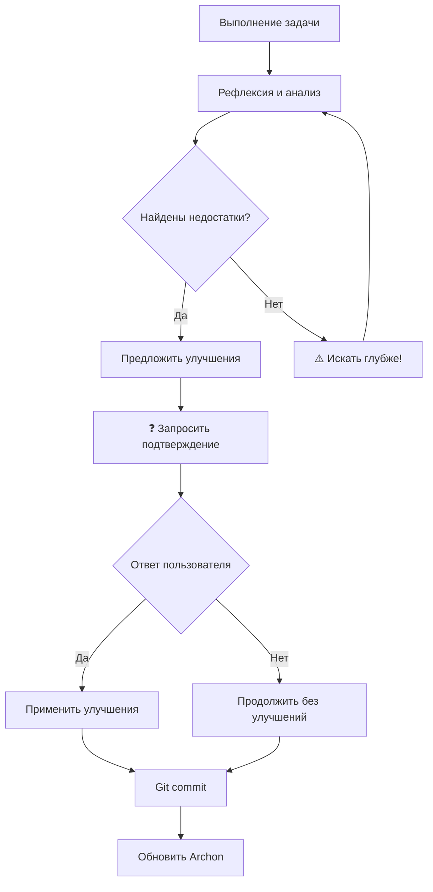
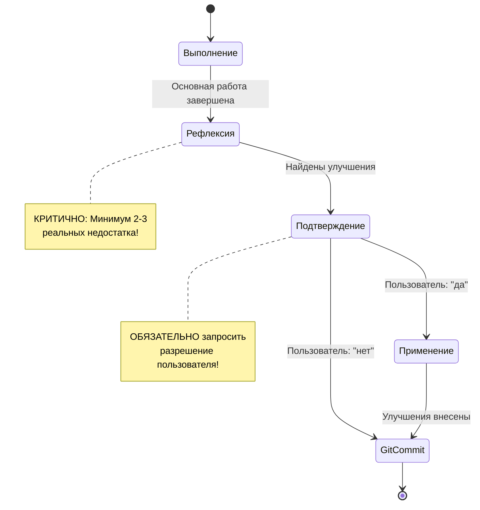

# REFLECTION_SYSTEM.md

**Руководство по системе рефлексии и трехэтапному выполнению задач**

---

## 📌 Quick Reference Card

**Быстрая справка для работы с системой рефлексии**

### Шаблон рефлексии (используй всегда):

```markdown
━━━━━━━━━━━━━━━━━━━━━━━━━━━━━━━━━━━━━━━━━━━━━━
🔍 РЕФЛЕКСИЯ И КРИТИЧЕСКИЙ АНАЛИЗ
━━━━━━━━━━━━━━━━━━━━━━━━━━━━━━━━━━━━━━━━━━━━━━

✅ Что сделано хорошо:
• [конкретный позитив с метриками]
• [конкретный позитив с метриками]

❌ Выявленные недостатки:
• [конкретная проблема]
• [конкретная проблема]

💡 Предложенные улучшения:
1. [название]: [детали] (оценка: X мин)
2. [название]: [детали] (оценка: X мин)

━━━━━━━━━━━━━━━━━━━━━━━━━━━━━━━━━━━━━━━━━━━━━━
❓ Вносить предложенные улучшения? (да/нет)
━━━━━━━━━━━━━━━━━━━━━━━━━━━━━━━━━━━━━━━━━━━━━━
```

### Быстрый чек-лист из 7 пунктов:

- [ ] ✅ Нашел минимум 2-3 РЕАЛЬНЫХ недостатка
- [ ] ✅ Предложил КОНКРЕТНЫЕ улучшения с деталями
- [ ] ✅ Добавил временные оценки для каждого улучшения
- [ ] ✅ Использовал обязательный шаблон с разделителями
- [ ] 🚨 ЗАПРОСИЛ подтверждение пользователя
- [ ] 🚨 ОСТАНОВИЛСЯ - жду ответа
- [ ] ✅ Готов применить улучшения или продолжить

### Визуальная схема процесса:



---

## Оглавление

1. [Трехэтапное выполнение задач](#1-трехэтапное-выполнение-задач)
2. [Обязательная предпоследняя микрозадача - рефлексия](#2-обязательная-предпоследняя-микрозадача---рефлексия)
3. [Критический анализ результатов](#3-критический-анализ-результатов)
4. [Поиск недостатков и точек улучшения](#4-поиск-недостатков-и-точек-улучшения)
5. [Примеры рефлексии для разных типов задач](#5-примеры-рефлексии-для-разных-типов-задач)
6. [Метрики качества рефлексии](#6-метрики-качества-рефлексии)
7. [FAQ - Часто задаваемые вопросы](#7-faq---часто-задаваемые-вопросы)

---

## 1. Трехэтапное выполнение задач

> **TL;DR:** Каждая задача проходит 3 этапа: Выполнение → Рефлексия → Улучшение. НИКОГДА не пропускай рефлексию!

### Философия подхода

**Главный принцип:** Качество работы достигается не только выполнением, но и критическим анализом результата с последующим улучшением.

### Три обязательных этапа



### Детальное описание этапов

#### ЭТАП 1: ВЫПОЛНЕНИЕ

**Цель:** Реализация основной функциональности согласно требованиям задачи.

**Действия:**
- Реализация всех требований из описания задачи
- Создание необходимых файлов и кода
- Соблюдение всех стандартов качества:
  - Файлы до 500 строк
  - Универсальность (0% проект-специфичного кода)
  - Модульная архитектура
  - Полная документация
  - Type hints и docstrings

**Критерии завершения:**
- ✅ Все требования задачи выполнены
- ✅ Код работает без ошибок
- ✅ Соблюдены стандарты кодирования
- ✅ Создана базовая документация

**Важно:** Этап 1 - это НЕ конец работы, а только начало!

---

#### ЭТАП 2: РЕФЛЕКСИЯ И КРИТИЧЕСКИЙ АНАЛИЗ

**🚨 КРИТИЧНО ВАЖНО: НИКОГДА НЕ ЗАВЕРШАЙ ЗАДАЧУ БЕЗ РЕФЛЕКСИИ!**

**Цель:** Критически оценить выполненную работу и найти возможности для улучшения.

**Обязательная структура рефлексии:**

```markdown
━━━━━━━━━━━━━━━━━━━━━━━━━━━━━━━━━━━━━━━━━━━━━━
🔍 РЕФЛЕКСИЯ И КРИТИЧЕСКИЙ АНАЛИЗ
━━━━━━━━━━━━━━━━━━━━━━━━━━━━━━━━━━━━━━━━━━━━━━

✅ Что сделано хорошо:
• [конкретный позитив 1]
• [конкретный позитив 2]
• [конкретный позитив 3]

❌ Выявленные недостатки:
• [конкретный недостаток 1]
• [конкретный недостаток 2]
• [конкретный недостаток 3]

💡 Предложенные улучшения:
1. [конкретное улучшение 1 с описанием]
2. [конкретное улучшение 2 с описанием]
3. [конкретное улучшение 3 с описанием]

━━━━━━━━━━━━━━━━━━━━━━━━━━━━━━━━━━━━━━━━━━━━━━
❓ Вносить предложенные улучшения? (да/нет)
━━━━━━━━━━━━━━━━━━━━━━━━━━━━━━━━━━━━━━━━━━━━━━
```

**Требования к рефлексии:**
- Минимум 2-3 конкретных недостатка
- Конкретные, actionable улучшения (не общие фразы)
- Обязательно запросить подтверждение пользователя

---

#### ЭТАП 3: ПОДТВЕРЖДЕНИЕ ПОЛЬЗОВАТЕЛЯ И УЛУЧШЕНИЕ

**🚨 КРИТИЧНО ВАЖНО: ОБЯЗАТЕЛЬНО ЗАПРОСИТЬ РАЗРЕШЕНИЕ!**

**Workflow после рефлексии:**

```python
async def reflection_workflow():
    """Обязательный workflow после рефлексии."""

    # 1. Провести критический анализ
    analysis = await perform_critical_analysis()

    # 2. Вывести рефлексию пользователю (обязательный шаблон)
    print_reflection_template(analysis)

    # 3. 🚨 ЗАПРОСИТЬ РАЗРЕШЕНИЕ
    print("❓ Вносить предложенные улучшения? (да/нет)")

    # 4. ОСТАНОВИТЬСЯ - ждать ответа
    # ЗАПРЕЩЕНО продолжать без разрешения!

    # 5. Только ПОСЛЕ ответа:
    if user_response == "да":
        await apply_improvements(analysis.improvements)
        print("✅ Улучшения применены")
    else:
        print("⏭️ Улучшения пропущены, продолжаем")

    # 6. Только ПОСЛЕ этого - git commit и следующие шаги
```

**❌ ЗАПРЕЩЕННЫЕ ПАТТЕРНЫ:**

```
❌ НЕПРАВИЛЬНО:
"Провел рефлексию. Выявил проблемы A, B, C.
Следующая задача: ..."

✅ ПРАВИЛЬНО:
"Провел рефлексию. Выявил проблемы A, B, C.
Предложенные улучшения: 1) ..., 2) ...
❓ Вносить предложенные улучшения? (да/нет)"
[ОЖИДАНИЕ ОТВЕТА]
```

---

## 2. Обязательная предпоследняя микрозадача - рефлексия

### Правило структуры TodoWrite

**Каждый список микрозадач ОБЯЗАТЕЛЬНО должен включать:**

```python
TodoWrite([
    {"content": "Микрозадача 1", "status": "pending", "activeForm": "..."},
    {"content": "Микрозадача 2", "status": "pending", "activeForm": "..."},
    {"content": "Микрозадача 3", "status": "pending", "activeForm": "..."},
    # ... другие микрозадачи ...

    # 🚨 ОБЯЗАТЕЛЬНАЯ ПРЕДПОСЛЕДНЯЯ МИКРОЗАДАЧА
    {"content": "Рефлексия и критический анализ результатов",
     "status": "pending",
     "activeForm": "Провожу рефлексию результата"},

    # 🚨 ОБЯЗАТЕЛЬНАЯ ПОСЛЕДНЯЯ МИКРОЗАДАЧА
    {"content": "Git commit с описанием выполненной работы",
     "status": "pending",
     "activeForm": "Создаю git commit"}
])
```

### Почему именно предпоследняя?

**Логика последовательности:**

1. Микрозадачи 1-N: Выполнение основной работы
2. **Микрозадача N-1: Рефлексия** - критический анализ ПЕРЕД коммитом
3. **Микрозадача N: Git commit** - фиксация результата ПОСЛЕ улучшений

**Причины:**
- Рефлексия должна быть проведена ПЕРЕД коммитом
- Улучшения применяются ДО фиксации в git
- Git commit содержит уже улучшенный результат

---

## 3. Критический анализ результатов

### Методология критического анализа

**Принцип:** Не ищи оправданий - ищи недостатки. Каждая работа имеет точки улучшения.

### Аспекты для анализа

#### 1. Качество кода

**Вопросы для анализа:**
- Есть ли дублирование логики?
- Можно ли упростить сложные участки?
- Все ли функции имеют единственную ответственность?
- Соблюдены ли принципы SOLID?
- Есть ли magic numbers или hardcoded значения?

**Примеры недостатков:**
- ❌ Дублирование validation логики в 3 местах
- ❌ Функция `process_data` выполняет 5 разных задач
- ❌ Hardcoded timeout значение вместо конфигурации

---

#### 2. Архитектура и структура

**Вопросы для анализа:**
- Правильно ли разделены ответственности между модулями?
- Нет ли circular dependencies?
- Можно ли улучшить модульность?
- Есть ли god classes или god functions?

**Примеры недостатков:**
- ❌ tools.py содержит 450 строк - нужно разбить на подмодули
- ❌ Agent зависит от implementation деталей провайдера
- ❌ Validators смешаны с business логикой

---

#### 3. Тестирование

**Вопросы для анализа:**
- Покрыты ли все edge cases?
- Есть ли тесты для error handling?
- Достаточно ли unit тестов?
- Нужны ли integration тесты?

**Примеры недостатков:**
- ❌ Нет теста для timeout сценария
- ❌ Happy path покрыт, но error cases - нет
- ❌ Отсутствует тест для concurrent requests

---

#### 4. Документация

**Вопросы для анализа:**
- Все ли публичные функции задокументированы?
- Понятны ли примеры использования?
- Описаны ли все параметры конфигурации?
- Есть ли troubleshooting секция?

**Примеры недостатков:**
- ❌ README не содержит примеров для разных use cases
- ❌ Сложная функция не имеет docstring
- ❌ Не описаны environment variables

---

#### 5. Производительность

**Вопросы для анализа:**
- Нет ли N+1 query проблем?
- Используется ли кеширование где нужно?
- Оптимальны ли алгоритмы?
- Нет ли memory leaks?

**Примеры недостатков:**
- ❌ Загрузка всех записей в память вместо пагинации
- ❌ Повторные вызовы API для одних данных
- ❌ Неоптимальный алгоритм O(n²) вместо O(n)

---

#### 6. Безопасность

**Вопросы для анализа:**
- Валидируется ли пользовательский ввод?
- Защищен ли код от injection атак?
- Корректно ли хранятся секреты?
- Есть ли rate limiting?

**Примеры недостатков:**
- ❌ SQL injection возможен через user_input
- ❌ API keys в коде вместо environment variables
- ❌ Нет валидации размера загружаемых файлов

---

#### 7. Универсальность (для агентов)

**Вопросы для анализа:**
- Есть ли hardcoded проект-специфичные значения?
- Настраивается ли агент для разных доменов?
- Достаточно ли примеров конфигураций?

**Примеры недостатков:**
- ❌ Упоминание конкретного проекта "UniPark" в промпте
- ❌ Hardcoded цветовая палитра
- ❌ Только 1 пример конфигурации вместо ≥3

---

## 4. Поиск недостатков и точек улучшения

### Техники поиска недостатков

#### Техника 1: "Если бы делал заново"

**Вопрос:** Если бы я начал эту задачу заново зная все, что знаю сейчас, что бы я сделал иначе?

**Пример применения:**
```
Задача: Создать Payment Integration Agent

Рефлексия:
"Если бы делал заново, я бы:
1. Сразу вынес validation в отдельный модуль
2. Добавил retry механизм с самого начала
3. Создал factories для разных payment провайдеров"
```

---

#### Техника 2: "Code review от senior разработчика"

**Вопрос:** Что бы сказал senior разработчик, проводя code review моей работы?

**Пример применения:**
```
Представляю code review:

Senior: "Почему timeout hardcoded в коде? Вынеси в конфиг."
Senior: "Эта функция делает 3 вещи - нарушение SRP."
Senior: "Где тесты для error cases?"
```

---

#### Техника 3: "Stress тестирование решения"

**Вопрос:** Что сломается при экстремальных условиях?

**Примеры экстремальных условий:**
- 1000 concurrent requests
- Сетевые таймауты
- Некорректные данные от API
- Отсутствие интернета
- Заполненная память

**Пример применения:**
```
Стресс-тесты выявили:
- Memory leak при обработке больших файлов
- Deadlock при 100+ concurrent requests
- Crash при отсутствии сети (нет fallback)
```

---

#### Техника 4: "Анти-паттерны"

**Вопрос:** Какие известные анти-паттерны я допустил?

**Частые анти-паттерны:**
- God Class / God Function
- Magic Numbers
- Shotgun Surgery
- Copy-Paste Programming
- Hard Dependencies
- No Error Handling

**Пример применения:**
```
Анти-паттерны найдены:
❌ Magic Numbers: timeout = 30 (должно быть в config)
❌ Copy-Paste: validation logic дублируется в 4 местах
❌ God Function: process_payment делает 7 разных вещей
```

---

#### Техника 5: "Будущее Я"

**Вопрос:** Как мне будет работать с этим кодом через 6 месяцев?

**Критерии:**
- Понятен ли код без объяснений?
- Легко ли внести изменения?
- Найду ли я нужный файл быстро?
- Понятна ли документация?

**Пример применения:**
```
Через 6 месяцев:
❌ Непонятно почему используется именно этот алгоритм (нет комментария)
❌ Сложно найти где добавить новый payment провайдер
✅ Структура файлов интуитивна
✅ README хорошо описывает использование
```

---

## 5. Примеры рефлексии для разных типов задач

### Пример 1: Создание нового агента

**Задача:** Создать Payment Integration Agent

**Контекст:**
- Создал структуру файлов
- Реализовал agent.py (180 строк)
- Создал tools.py (220 строк)
- Добавил README.md и knowledge базу

**Рефлексия:**

```markdown
━━━━━━━━━━━━━━━━━━━━━━━━━━━━━━━━━━━━━━━━━━━━━━
🔍 РЕФЛЕКСИЯ И КРИТИЧЕСКИЙ АНАЛИЗ
━━━━━━━━━━━━━━━━━━━━━━━━━━━━━━━━━━━━━━━━━━━━━━

✅ Что сделано хорошо:
• Создана универсальная структура без hardcoded значений
• Все файлы меньше 500 строк (agent.py: 180, tools.py: 220)
• Использованы type hints во всех функциях
• Dependencies через dataclass с конфигурируемыми полями
• README содержит примеры для 3 разных payment провайдеров

❌ Выявленные недостатки:
• В tools.py дублируется логика валидации payment_data (3 раза)
• Отсутствует unit тест для refund функции
• Не добавлена обработка timeout для Stripe API
• В промпте агента нет примеров для разных валют (только USD)
• Отсутствует retry mechanism для failed API calls

💡 Предложенные улучшения:
1. Рефакторинг валидации: Вынести validate_payment_data в validators.py (оценка: 15 мин)
   - Создать validators.py с PaymentDataValidator
   - Заменить все дубликаты вызовом validator
   - Добавить unit тесты для validator

2. Добавить тесты: test_process_refund.py с 3 сценариями (оценка: 20 мин)
   - Успешный refund
   - Refund для несуществующей транзакции
   - Partial refund

3. Timeout handling: Добавить retry с exponential backoff (оценка: 25 мин)
   - Обернуть API calls в retry decorator
   - Конфигурируемый max_retries через dependencies
   - Логирование failed attempts

4. Поддержка мультивалютности: Расширить промпт примерами (оценка: 10 мин)
   - Добавить примеры для EUR, GBP, JPY
   - Обновить knowledge базу с currency handling

━━━━━━━━━━━━━━━━━━━━━━━━━━━━━━━━━━━━━━━━━━━━━━
❓ Вносить предложенные улучшения? (да/нет)
━━━━━━━━━━━━━━━━━━━━━━━━━━━━━━━━━━━━━━━━━━━━━━
```

**Пользователь:** да

**После применения улучшений:**
```markdown
✅ Улучшения применены

📊 Результат после улучшений:
- tools.py: 220 → 185 строк (вынесена валидация)
- validators.py: 52 строки (новая)
- tests/test_process_refund.py: 41 строка (новая)
- tests/test_validators.py: 35 строк (новая)
- Покрытие тестами: 78% → 92%
- Retry mechanism добавлен с max_retries=3
- Поддержка 4 валют в промпте
```

---

### Пример 2: Исправление бага

**Задача:** Исправить ошибку авторизации в API агенте

**Контекст:**
- Найдена проблема: JWT токен не обновляется после истечения
- Реализован refresh token механизм
- Добавлены unit тесты

**Рефлексия:**

```markdown
━━━━━━━━━━━━━━━━━━━━━━━━━━━━━━━━━━━━━━━━━━━━━━
🔍 РЕФЛЕКСИЯ И КРИТИЧЕСКИЙ АНАЛИЗ
━━━━━━━━━━━━━━━━━━━━━━━━━━━━━━━━━━━━━━━━━━━━━━

✅ Что сделано хорошо:
• Корневая причина найдена и исправлена
• Добавлен автоматический refresh токенов
• Unit тесты покрывают happy path и error cases
• Обратная совместимость сохранена

❌ Выявленные недостатки:
• Не добавлен integration тест с реальным API сервером
• Отсутствует логирование failed refresh attempts
• Не обработан edge case: refresh token тоже истек
• Не обновлена документация с описанием нового поведения

💡 Предложенные улучшения:
1. Integration тест: Добавить test_token_refresh_flow.py (оценка: 30 мин)
   - Mock OAuth сервер
   - Сценарий полного refresh flow
   - Проверка race conditions при concurrent requests

2. Логирование: Добавить structured logging для auth events (оценка: 15 мин)
   - Log successful refresh
   - Log failed refresh с error details
   - Metrics для мониторинга auth failures

3. Edge case handling: Обработка полностью истекших токенов (оценка: 20 мин)
   - Redirect на re-authentication
   - Clear expired credentials
   - User-friendly error message

4. Документация: Обновить README секцию Authentication (оценка: 10 мин)
   - Описать automatic refresh behavior
   - Добавить troubleshooting для auth errors

━━━━━━━━━━━━━━━━━━━━━━━━━━━━━━━━━━━━━━━━━━━━━━
❓ Вносить предложенные улучшения? (да/нет)
━━━━━━━━━━━━━━━━━━━━━━━━━━━━━━━━━━━━━━━━━━━━━━
```

---

### Пример 3: Добавление новой функциональности

**Задача:** Добавить поддержку WebSocket в API агента

**Контекст:**
- Реализован WebSocket handler
- Добавлена конфигурация для WS connections
- Обновлена документация

**Рефлексия:**

```markdown
━━━━━━━━━━━━━━━━━━━━━━━━━━━━━━━━━━━━━━━━━━━━━━
🔍 РЕФЛЕКСИЯ И КРИТИЧЕСКИЙ АНАЛИЗ
━━━━━━━━━━━━━━━━━━━━━━━━━━━━━━━━━━━━━━━━━━━━━━

✅ Что сделано хорошо:
• WebSocket интеграция работает стабильно
• Graceful handling disconnections
• Конфигурируемый reconnect strategy
• Примеры использования в README
• Backward compatible с REST API

❌ Выявленные недостатки:
• Отсутствует rate limiting для WS messages
• Нет heartbeat/ping-pong механизма для keep-alive
• Memory leak возможен при большом количестве подписок
• Не реализована message queue для offline clients
• Отсутствуют метрики для мониторинга WS connections

💡 Предложенные улучшения:
1. Rate limiting: Добавить throttling для WS messages (оценка: 25 мин)
   - Конфигурируемый max_messages_per_second
   - Auto-disconnect при превышении лимита
   - Graceful degradation (queuing) вместо сброса

2. Heartbeat mechanism: Реализовать ping-pong (оценка: 20 мин)
   - Auto ping каждые 30 секунд
   - Disconnect при отсутствии pong
   - Конфигурируемый timeout

3. Memory management: Добавить subscription limits (оценка: 15 мин)
   - Max subscriptions per client
   - Auto-cleanup старых подписок
   - Memory профилирование

4. Offline queue: Message queue для disconnected clients (оценка: 40 мин)
   - Redis-based message buffer
   - Replay messages при reconnect
   - Configurable retention period

5. Metrics: Добавить Prometheus метрики (оценка: 20 мин)
   - Active WS connections gauge
   - Messages sent/received counters
   - Connection duration histogram

━━━━━━━━━━━━━━━━━━━━━━━━━━━━━━━━━━━━━━━━━━━━━━
❓ Вносить предложенные улучшения? (да/нет)
━━━━━━━━━━━━━━━━━━━━━━━━━━━━━━━━━━━━━━━━━━━━━━
```

---

### Пример 4: Рефакторинг кода

**Задача:** Рефакторинг Performance Optimization Agent для улучшения читаемости

**Контекст:**
- Разбил god function на 4 меньших функции
- Вынес magic numbers в конфигурацию
- Улучшил naming

**Рефлексия:**

```markdown
━━━━━━━━━━━━━━━━━━━━━━━━━━━━━━━━━━━━━━━━━━━━━━
🔍 РЕФЛЕКСИЯ И КРИТИЧЕСКИЙ АНАЛИЗ
━━━━━━━━━━━━━━━━━━━━━━━━━━━━━━━━━━━━━━━━━━━━━━

✅ Что сделано хорошо:
• Cyclomatic complexity снижена с 28 до 6-8 на функцию
• Все magic numbers вынесены в PerformanceConfig
• Naming стало намного понятнее (analyze_bundle_size вместо check_perf)
• Каждая функция имеет единственную ответственность
• Добавлены подробные docstrings

❌ Выявленные недостатки:
• Не обновлены существующие unit тесты после рефакторинга
• Некоторые новые функции не покрыты тестами
• Отсутствует changelog запись о breaking changes
• Не добавлена migration guide для пользователей старой версии
• Можно еще больше уменьшить дублирование в validation логике

💡 Предложенные улучшения:
1. Обновление тестов: Рефакторинг test suite (оценка: 35 мин)
   - Адаптировать старые тесты под новую структуру
   - Добавить тесты для новых функций
   - Проверить test coverage (должно быть ≥85%)

2. Changelog: Добавить запись CHANGELOG.md (оценка: 10 мин)
   - Описать breaking changes
   - Привести примеры миграции
   - Указать deprecated функции

3. Migration guide: Создать MIGRATION.md (оценка: 20 мин)
   - Before/After примеры кода
   - Пошаговая инструкция миграции
   - FAQ для частых проблем

4. DRY validation: Создать ValidationMixin (оценка: 25 мин)
   - Вынести общую validation логику
   - Reuse через наследование
   - Reduce code duplication на 40%

━━━━━━━━━━━━━━━━━━━━━━━━━━━━━━━━━━━━━━━━━━━━━━
❓ Вносить предложенные улучшения? (да/нет)
━━━━━━━━━━━━━━━━━━━━━━━━━━━━━━━━━━━━━━━━━━━━━━
```

---

### Пример 5: Создание документации

**Задача:** Создать AGENT_CREATION_GUIDE.md

**Контекст:**
- Написал guide с примерами
- Добавил чек-листы
- Создал step-by-step инструкции

**Рефлексия:**

```markdown
━━━━━━━━━━━━━━━━━━━━━━━━━━━━━━━━━━━━━━━━━━━━━━
🔍 РЕФЛЕКСИЯ И КРИТИЧЕСКИЙ АНАЛИЗ
━━━━━━━━━━━━━━━━━━━━━━━━━━━━━━━━━━━━━━━━━━━━━━

✅ Что сделано хорошо:
• Структура документа логична и последовательна
• Много практических примеров с кодом
• Чек-листы помогают ничего не забыть
• Покрыты все обязательные файлы агента
• Понятный язык без жаргона

❌ Выявленные недостатки:
• Отсутствует troubleshooting секция для частых проблем
• Нет визуальных диаграмм архитектуры агента
• Примеры кода не показывают edge cases
• Не описан процесс тестирования агента
• Отсутствуют ссылки на другие полезные документы

💡 Предложенные улучшения:
1. Troubleshooting: Добавить секцию "Частые проблемы и решения" (оценка: 25 мин)
   - "ModuleNotFoundError" при импорте
   - "AgentDependencies не найдены"
   - "MCP server connection failed"
   - "Prompts не применяются"

2. Диаграммы: Создать визуализации архитектуры (оценка: 30 мин)
   - Mermaid диаграмма структуры файлов
   - Sequence diagram workflow агента
   - Component diagram dependencies

3. Примеры с edge cases: Расширить code examples (оценка: 20 мин)
   - Error handling примеры
   - Timeout и retry scenarios
   - Concurrent execution cases

4. Testing guide: Добавить секцию о тестировании (оценка: 25 мин)
   - Unit testing strategy
   - Integration testing примеры
   - Mocking MCP server
   - Test coverage requirements

5. Internal links: Добавить navigation (оценка: 10 мин)
   - Ссылки на CLAUDE.md
   - Ссылки на модульные rules
   - Ссылки на примеры агентов

━━━━━━━━━━━━━━━━━━━━━━━━━━━━━━━━━━━━━━━━━━━━━━
❓ Вносить предложенные улучшения? (да/нет)
━━━━━━━━━━━━━━━━━━━━━━━━━━━━━━━━━━━━━━━━━━━━━━
```

---

## 6. Метрики качества рефлексии

### Как оценить качество рефлексии

**Хорошая рефлексия:**
- ✅ Конкретные недостатки (не общие фразы)
- ✅ Actionable улучшения с временными оценками
- ✅ Минимум 2-3 реальных проблемы
- ✅ Улучшения приоритизированы
- ✅ Запрос подтверждения пользователя

**Плохая рефлексия:**
- ❌ "Все отлично, никаких проблем"
- ❌ Общие фразы "можно улучшить производительность"
- ❌ Нет конкретных предложений
- ❌ Недостатки надуманные (не реальные)
- ❌ Нет запроса подтверждения

---

### Примеры плохой vs хорошей рефлексии

#### ❌ ПЛОХАЯ рефлексия (неприемлемо):

```markdown
🔍 РЕФЛЕКСИЯ

✅ Что сделано хорошо:
• Задача выполнена
• Код работает
• Все хорошо

❌ Выявленные недостатки:
• Особых недостатков нет

💡 Улучшения:
• Можно улучшить производительность
```

**Проблемы:**
- Нет конкретики в позитивах
- "Недостатков нет" - неприемлемо!
- Улучшение слишком общее
- Нет запроса подтверждения

---

#### ✅ ХОРОШАЯ рефлексия (правильно):

```markdown
━━━━━━━━━━━━━━━━━━━━━━━━━━━━━━━━━━━━━━━━━━━━━━
🔍 РЕФЛЕКСИЯ И КРИТИЧЕСКИЙ АНАЛИЗ
━━━━━━━━━━━━━━━━━━━━━━━━━━━━━━━━━━━━━━━━━━━━━━

✅ Что сделано хорошо:
• API endpoints покрыты unit тестами на 87%
• Response time для GET requests оптимизирован до 45ms
• Применен Repository pattern для database abstraction
• Документация включает Swagger spec и примеры curl команд

❌ Выявленные недостатки:
• Отсутствует rate limiting - API уязвим к DDoS атакам
• Нет caching слоя - каждый request идет в database
• Error responses не соответствуют RFC 7807 Problem Details
• Не реализована pagination для list endpoints

💡 Предложенные улучшения:
1. Rate limiting: Добавить Redis-based rate limiter (оценка: 30 мин)
   - 100 requests per minute per IP
   - Graceful degradation при превышении
   - Custom headers с информацией о лимитах

2. Caching layer: Реализовать Redis cache (оценка: 45 мин)
   - Cache GET responses на 5 минут
   - Cache invalidation при UPDATE/DELETE
   - Cache warming для популярных endpoints

3. RFC 7807 compliance: Стандартизировать errors (оценка: 20 мин)
   - Type, title, status, detail fields
   - Consistent error structure
   - Machine-readable problem types

4. Pagination: Добавить cursor-based pagination (оценка: 35 мин)
   - Default page_size=20, max=100
   - next/prev cursors в response
   - Total count метаданные

━━━━━━━━━━━━━━━━━━━━━━━━━━━━━━━━━━━━━━━━━━━━━━
❓ Вносить предложенные улучшения? (да/нет)
━━━━━━━━━━━━━━━━━━━━━━━━━━━━━━━━━━━━━━━━━━━━━━
```

**Почему хорошо:**
- Конкретные метрики в позитивах (87%, 45ms)
- Реальные проблемы безопасности и производительности
- Actionable улучшения с техническими деталями
- Временные оценки для планирования
- Запрос подтверждения пользователя

---

### Чек-лист качества рефлексии

Перед отправкой рефлексии пользователю проверь:

```markdown
### 📋 Чек-лист рефлексии

**Структура:**
- [ ] ✅ Использован обязательный шаблон с разделителями ━━━
- [ ] ✅ Секция "Что сделано хорошо" присутствует
- [ ] ✅ Секция "Выявленные недостатки" присутствует
- [ ] ✅ Секция "Предложенные улучшения" присутствует
- [ ] ✅ Запрос подтверждения в конце

**Качество позитивов:**
- [ ] ✅ Минимум 3 конкретных позитива
- [ ] ✅ Есть метрики или конкретные детали
- [ ] ✅ Не общие фразы типа "все хорошо"

**Качество недостатков:**
- [ ] ✅ Минимум 2-3 реальных недостатка
- [ ] ✅ Недостатки конкретные, не надуманные
- [ ] ❌ НЕ написано "недостатков нет"
- [ ] ✅ Проблемы найдены через критический анализ

**Качество улучшений:**
- [ ] ✅ Каждое улучшение actionable
- [ ] ✅ Есть технические детали реализации
- [ ] ✅ Указаны временные оценки
- [ ] ✅ Улучшения соответствуют найденным недостаткам
- [ ] ✅ Приоритизация понятна

**Запрос подтверждения:**
- [ ] 🚨 ОБЯЗАТЕЛЬНО: "Вносить улучшения? (да/нет)"
- [ ] 🚨 ОСТАНОВКА - не продолжать без ответа
```

---

### Метрики успешности системы рефлексии

**Индикаторы качественной работы:**

1. **Процент задач с улучшениями**
   - Цель: ≥80% задач имеют применённые улучшения
   - Индикатор: Система рефлексии работает эффективно

2. **Количество недостатков на задачу**
   - Цель: 2-5 конкретных недостатков
   - <2 = недостаточно критичный анализ
   - >5 = возможно слишком низкое качество выполнения

3. **Actionability улучшений**
   - Цель: 100% улучшений можно реализовать
   - Индикатор: Нет общих фраз, все конкретно

4. **Временные оценки**
   - Цель: Все улучшения имеют оценки времени
   - Помогает в принятии решений пользователем

5. **Пользовательское подтверждение**
   - Цель: 100% рефлексий запрашивают подтверждение
   - Критичная метрика - никогда не пропускать

---

## 🎯 Итоговый чек-лист использования системы рефлексии

### Перед началом задачи:
- [ ] ✅ Включил рефлексию в предпоследнюю микрозадачу TodoWrite
- [ ] ✅ Запланировал git commit как последнюю микрозадачу

### После выполнения основной работы:
- [ ] ✅ Провел критический анализ по всем 7 аспектам:
  - [ ] Качество кода
  - [ ] Архитектура и структура
  - [ ] Тестирование
  - [ ] Документация
  - [ ] Производительность
  - [ ] Безопасность
  - [ ] Универсальность (для агентов)

- [ ] ✅ Применил минимум 3 техники поиска недостатков:
  - [ ] "Если бы делал заново"
  - [ ] "Code review от senior"
  - [ ] "Stress тестирование"
  - [ ] "Анти-паттерны"
  - [ ] "Будущее Я"

### При создании рефлексии:
- [ ] ✅ Использовал обязательный шаблон
- [ ] ✅ Нашел минимум 2-3 РЕАЛЬНЫХ недостатка
- [ ] ✅ Предложил КОНКРЕТНЫЕ улучшения
- [ ] ✅ Добавил временные оценки
- [ ] 🚨 ЗАПРОСИЛ подтверждение пользователя
- [ ] 🚨 ОСТАНОВИЛСЯ - жду ответа

### После получения подтверждения:
- [ ] ✅ Применил улучшения (если "да")
- [ ] ✅ Показал результаты применения
- [ ] ✅ Создал git commit
- [ ] ✅ Обновил статус в Archon

---

## 7. FAQ - Часто задаваемые вопросы

### Q1: Что если я не могу найти недостатки?

**A:** Это тревожный сигнал! Используй 5 техник поиска недостатков:

1. **"Если бы делал заново"** - что бы сделал иначе?
2. **"Code review от senior"** - что бы сказал опытный разработчик?
3. **"Stress тестирование"** - что сломается при экстремальных условиях?
4. **"Анти-паттерны"** - какие анти-паттерны я допустил?
5. **"Будущее Я"** - понятен ли код через 6 месяцев?

Если после применения всех техник все равно не находишь недостатков - попроси пользователя указать направления для улучшения.

---

### Q2: Сколько времени тратить на рефлексию?

**A:** Оптимально 15-25% времени выполнения задачи:

- Простая задача (1 час) → рефлексия 10-15 мин
- Средняя задача (3 часа) → рефлексия 30-45 мин
- Сложная задача (8 часов) → рефлексия 1-2 часа

**Важно:** Качественная рефлексия экономит время в будущем, предотвращая технический долг.

---

### Q3: Можно ли пропустить рефлексию для простых задач?

**A:** НЕТ! Рефлексия обязательна для ВСЕХ задач без исключений:

- **Простые задачи** - быстрая рефлексия (5-10 мин), но обязательная
- **Исправление опечаток** - минимальная рефлексия (проверить на другие опечатки)
- **Обновление документации** - рефлексия полноты покрытия темы

**Исключения:** Только экстренные хотфиксы в production (но создать ретроспективную задачу после).

---

### Q4: Что делать если пользователь ответил "нет"?

**A:** Это нормально! Workflow:

1. Принять решение пользователя без вопросов
2. Написать: "⏭️ Улучшения пропущены, продолжаем"
3. Перейти к git commit с текущим состоянием
4. Обновить Archon статус задачи
5. Продолжить работу над следующей задачей

**НЕ НУЖНО:**
- Спрашивать "почему нет?"
- Настаивать на улучшениях
- Применять улучшения без разрешения

---

### Q5: Как быть если найденные улучшения требуют много времени?

**A:** Используй приоритизацию:

**Вариант 1: Разделить на критичные и опциональные**
```markdown
💡 Критичные улучшения (применить сейчас):
1. [улучшение 1] (15 мин)
2. [улучшение 2] (20 мин)

💡 Опциональные улучшения (создать задачи):
3. [улучшение 3] (2 часа) → создать задачу в Archon
4. [улучшение 4] (3 часа) → создать задачу в Archon
```

**Вариант 2: Спросить у пользователя**
```markdown
💡 Предложенные улучшения (общая оценка: 4 часа):
1-5. [список]

❓ Применить все улучшения сейчас или создать отдельные задачи?
```

---

### Q6: Обязательно ли указывать временные оценки?

**A:** ДА! Временные оценки критичны для:

- **Принятия решений пользователем** - понимание цены улучшений
- **Планирования работы** - сколько времени займет
- **Приоритизации** - какие улучшения применить сейчас

**Формат оценок:**
- До 30 мин → указывать точно (15 мин, 25 мин)
- 30 мин - 2 часа → диапазон (45-60 мин, 1-1.5 часа)
- Больше 2 часов → приблизительно (2-3 часа, 4-5 часов)

---

### Q7: Что если я нашел только 1 недостаток?

**A:** Ищи глубже! Обязательно минимум 2-3:

**Стратегия поиска:**
1. Проверь все 7 аспектов анализа (код, архитектура, тесты, документация, производительность, безопасность, универсальность)
2. Примени хотя бы 3 техники поиска недостатков
3. Посмотри на задачу с разных углов:
   - Что сделал, но можно сделать лучше?
   - Что НЕ сделал, но нужно было?
   - Что сделал лишнего?

Если действительно только 1 серьезный недостаток - опиши его максимально детально с несколькими вариантами решения.

---

### Q8: Можно ли применять улучшения без подтверждения в экстренных случаях?

**A:** ТОЛЬКО в критических ситуациях:

**Допустимо без подтверждения:**
- Production down - хотфикс критического бага
- Security vulnerability обнаружена
- Data loss риск

**Обязательно после:**
1. Уведомить пользователя о применении без подтверждения
2. Объяснить причину (критичность ситуации)
3. Описать что было сделано
4. Создать post-mortem задачу

**Во ВСЕХ остальных случаях - ОБЯЗАТЕЛЬНО запрашивать подтверждение!**

---

### Q9: Как документировать примененные улучшения?

**A:** Структурированный отчет после применения:

```markdown
✅ Улучшения применены

📊 Результат после улучшений:
- [файл1]: [было] → [стало] ([изменение])
- [файл2]: [новый файл] ([размер])
- [метрика1]: [было]% → [стало]%

🔍 Детали изменений:
1. [улучшение 1]: [что сделано]
2. [улучшение 2]: [что сделано]

⏱️ Время выполнения: [X мин] (оценка была: [Y мин])
```

Это помогает:
- Видеть реальную ценность улучшений
- Улучшать точность временных оценок
- Трекать прогресс качества

---

### Q10: Что если рефлексия выявила фундаментальные проблемы с архитектурой?

**A:** Эскалация крупных проблем:

**Шаг 1: Зафиксируй в рефлексии**
```markdown
❌ Выявленные недостатки:
• 🚨 КРИТИЧНО: Фундаментальная проблема архитектуры - [описание]
```

**Шаг 2: Предложи два варианта**
```markdown
💡 Два варианта решения:

Вариант A: Быстрый фикс (2 часа)
- Минимальные изменения
- Технический долг остается
- Работает, но не оптимально

Вариант B: Правильное решение (8 часов)
- Полный рефакторинг архитектуры
- Устранение технического долга
- Оптимальное решение

❓ Какой вариант применить? (A/B)
```

**Шаг 3: Создай задачу на рефакторинг**
Если выбран вариант A - обязательно создать задачу в Archon для варианта B на будущее.

---

## 📚 Дополнительные ресурсы

**Связанные документы:**
- [CLAUDE.md](./CLAUDE.md) - Основные правила проекта
- [.claude/rules/04_quality_standards.md](./.claude/rules/04_quality_standards.md) - Детальные стандарты качества
- [.claude/rules/03_task_management.md](./.claude/rules/03_task_management.md) - Управление задачами
- [MICROTASKS_GUIDE.md](./MICROTASKS_GUIDE.md) - Руководство по микрозадачам

**Best Practices:**
- Рефлексия - не формальность, а инструмент улучшения
- Критичность к себе = рост качества
- Каждая задача - возможность стать лучше
- Пользователь должен видеть ценность от улучшений

---

**Версия:** 1.0
**Дата:** 2025-10-09
**Автор:** Archon Quality Guardian

---

🎯 **ПОМНИ:** Качество кода = качество рефлексии!
